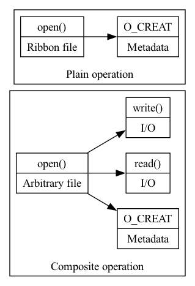

# Syscalls in PLEDGE

The syscalls that we wrap around in the `PLEDGE` tool always imply something towards the filesystem, the goal of this document is to provide a sort of framework or general guideline for how `PLEDGE` deals with operations.

NOTE: In `PLEDGE` we have a data structure that holds the paths that the user accessed along with their access mode.

# I/O Syscall attributes

We are going to classify I/O syscalls by 2 types of attributes:

- Read or Write data

- Read or Write metadata

    We will later build up on this idea to explain operations and the way workflows might use these operations

## Read or Write data

We classify operations as Read or Write data operations if they only deal with the data of the file and don't concern themselves with the metadata e.g. `write()`.

## Read or Write metadata

We classify operations as Read or Write metadata operations if they only deal with the metadata of the file e.g. `stat()`.

## Permissions

There is an important distinction to be made here and it's that permissions are not operations; For example, it might seem like having an operation like `unlink()`, which removes a file is a write operation on the file and you would not be wrong (technically), but it does not do `write()` or modify the contents of the file, it needs _write_ permission (and _execute_ actually to `stat()` the file) but all it actually changes is the metadata.

Even then, the paths in `PLEDGE` inherit the permission needed for the operation with no distinction between metadata and data operations, except for `stat()`, which gets its own flag.

<!-- This is an old comment but im keeping it because I like it... :)-->

<!-- wait... an I/O operation read, is not the same as a read permissino, one lets me do the other, but we are talking about 2 different things, so why are giving the same name to 2 different things (I know why but please entertain my mental exercise)-->

# Grouping workflows

The syscalls that deal with data and metadata operations can be grouped into 2 categories depending on their usage in the workflows; Plain operations and Composite operations. We argue that any operation can be plain or composite, it just depends on the goal of the workflow, we call this the duality of operations.

## Plain operations in workflows

Plain operations in a workflow are those that the workflow (and by definition, the user) see as an end to itself.

<!-- Wait does this mean that we could only possibly know this by either A. Knowing the user intentions or B. We deduce the users intentions from what we trace in the workflow-->

## Composite operations

Composite operations in a workflow are those that are always related or (might?) lead to other operations.

## Example of a plain operation

A `write()` to a log file of the workflow.

## Examples of composites operations

An example is a `stat()`, a user doing a `stat()` on a file or directory is more than likely trying to find something and if it's not there, create it.

## Duality of operations

An `open()` that is used to start I/O work on a file is composite because it leads to other operations, but an argument can be made that an `open()` used just to create empty marker files, IS a plain operation, because, once it's done with creating the files, it served it's purpose, we see this in `poncho`. <!-- poncho does this to signal it made the tarball-->

An example that reinforces this idea of the duality of operations is in `git`, which does *not* let you check in empty directories, so its common practice to make an empty file inside the directory we wish to check-in; Here `open()` with the `O_CREAT` and no `write()` or modifications to the file is an end to itself.

<!-- ![Duality of operations] -->
<!-- (./images/syscalls/duality.png) -->

# Operations

Now we will go over the operations we deal with in `PLEDGE`, what attributes they have and how does `PLEDGE` deal with them internally.

## Open

The `open()` syscall is one of the main calls, if not THE main call, for starting work on files (and, by definition, the filesystem). What it does is it takes a path, flags and a mode.
The flags are `O_RDONLY`, `O_WRONLY` and `O_RDRW`, `O_RDONLY | O_WRONLY != O_RDWR` by design.
The flags can also contain the file creation flags, which are different types of flags
that change the behaviour of `open()`.
For example, one of the (aptly named) file creation flags is `O_CREAT`, which creates a file if it does not exist, and we can also pass it a mode (which are the permissions for the file) that basically specify the permissions for the file, but there's a detail here, the mode applies to future accesses only, a call to open with `O_CREAT` in `O_RDONLY` can return
e a `RW` file descriptor and this is accepted behaviour by the kernel.

### Attributes

This operation is a read write *metadata* operation. We don't really ever do anything to the file, we either create it, which is a metadata operation or get a file descriptor that allows us to perform I/O on it, which is a metadata operation because we are working with the i-nodes and v-nodes. <!-- HOMEWORK: read more on v-nodes-->

### How does PLEDGE deal with this operation?

For `open()` if we are tracing, the path gets saved in the data structure and the permissions are extracted from the flags passed to `open()`.

If we are enforcing, we compare the path of the `open()` call to the path we have in our data structure and we extract the permissions from the `open()` call and verify against the permissions we have in the contract for that file, if they don't match the call fails.

## Read

The `read()` syscall reads n count of bytes into a buffer provided by the user, it returns the number of bytes actually read, since it might read less than the user asked.

### Attributes

This operation is a read *data* operation.

### How does PLEDGE deal with this operation?

For `read()`, if we are tracing the file descriptor that gets passed to the function gets resolved and then we save it in our data structure and the 'R' permission gets added for that path.
If the path is associated with an `'W'` operation already then when we get a write we will upgrade the access to `'+'` which is just Read and Write access.
If we are enforcing, the file descriptor gets resolved and verified against permissions saved in the contract for that path, if the permissions don't match the call fails.

## Write

The `write()` syscall write n count of bytes from the buffer into the file descriptor pointed to by fd, it returns the number of bytes actually written, because it might be less than the user asked.
`write()` has a peculiarity; A successful write operation does not mean that what we wrote is on the disk physically just yet, this is due to buffering that the kernel does.

### Attributes

This operation is a write *data* operation.

### How does PLEDGE deal with this operation?

For `write()`, if we are tracing, the file descriptor gets resolved and then we save it in our data structure and the `'W'` permission gets added for that path.
If the path is associated with an `'R'` operation already then when we get a write we will upgrade the access to `'+'` which is just Read and Write access.
If we are enforcing, the file descriptor gets resolved and verified against permissions saved in the contract for that path, if the permissions don't match the call fails.

## Stat

The family of `stat()` operations is particular in that it does not 'touch' the filesystem in the sense that `open()`, `read()`, `write()`, `close()` and `mmap()` do; It is a truly pure (in theory) metadata operation, the information about the file is drawn from its i-node.

### Attributes

This operation is a read *metadata* operation, however, we do not treat it the same way we do `read()`, nor do we give the path `'R'` permissions. `stat()` being an operation used to get information about a file or directory let's us dintinguish different behaviours in a users program, they might sometimes try to `stat()` things just to see if they are available but not really use them (like the CPU topology) or they might stat them to actually create a file.

### How does PLEDGE deal with this operation?

In `PLEDGE`, when we catch a `stat()` operation in the tracer we save the path and add an `'S'` permission.

So in `PLEDGE` the idea is that `stat()` is not something that has permissions associated with the path in the sense of being allowed to _read_ or _write_, it is more like something we did; "We got _this information_ out of _this file_", and with that maybe in the tracing we do not see the `stat()` lead to a read or write, but the goal is that if the enforcer knows a path has a `stat()` associated with it, and a `read()` or `write()` happens to it, we could in theory update this path to reflect that an actual I/O operation was fulfilled.

<!-- -->

<!-- -->
