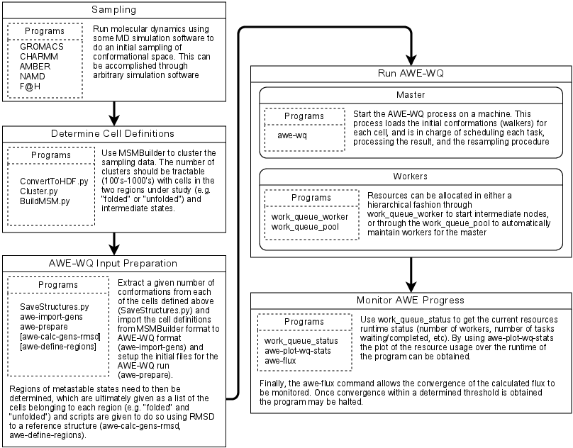
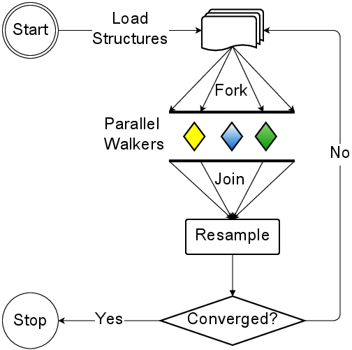
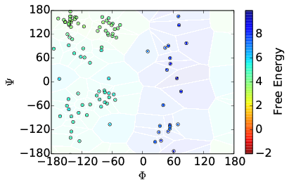
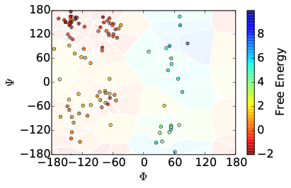

# AWE User's Manual

## Overview

Accelerated Weighted Ensemble or AWE package provides a Python library for
adaptive sampling of molecular dynamics. The framework decomposes the
resampling computations and the molecular dynamics simulations into tasks that
are dispatched for execution on resources allocated from clusters, clouds,
grids, or any idle machines.

AWE uses Work Queue, which is part of the Cooperating Computing Tools
(CCTools) package, for dispatching jobs for execution on allocated resources.
Documentation on downloading, installing, and using Work Queue can be found
[here](../work_queue/index.md).

## Software Requirements

AWE currently uses the GROMACS molecular dynamics simulation package. So it
requires an installation of GROMACS 4.5 or above and its installed location
added to PATH. It also requires the GROMACS XTC library for operation.

The software requirements of AWE are summarized below along with how AWE finds
and accesses them:

Software| Version| Must be present in environment variable  
---|---|---  
[Python](http://python.org)| 2.6 or 2.7| PATH and PYTHONPATH  
[GROMACS](http://www.gromacs.org)| 4.5 or higher| PATH  
[GROMACS XTC Library](http://www.gromacs.org/Developer_Zone/Programming_Guide/XTC_Library)| 1.1 or higher| C_INCLUDE_PATH and LD_LIBRARY_PATH  
[Numpy](http://www.numpy.org)| 1.5 or higher| PYTHONPATH  
[Prody](http://www.csb.pitt.edu/prody)| 0.9.4 or higher| PYTHONPATH  
[GNU Scientific Library](http://www.gnu.org/software/gsl/)| 1.15 or higher| C_INCLUDE_PATH and LD_LIBRARY_PATH  
[Matplotlib](http://matplotlib.org)| 1.1.0 or higher| PYTHONPATH  
  
## Building and Installing AWE

Download the CCTools source package from this [web
page](http://ccl.cse.nd.edu/software/download) and install using the steps
[here](http://ccl.cse.nd.edu/software/manuals/install.html).

First, determine the location where AWE is to be installed. For example:

```sh
$ export AWE_INSTALL_PATH=$HOME/awe
```

Compile and install AWE in the location pointed by `$AWE_INSTALL_PATH` using:

```sh
$ cd cctools-xxx-src
$ cd apps/awe
$ ./configure --prefix $AWE_INSTALL_PATH
$ make install
```

Next, set `PATH` to include the installed AWE binaries:

```sh
$ export PATH=${AWE_INSTALL_PATH}/bin:${PATH}
```

Finally, set PYTHONPATH to include the installed AWE Python modules:

```sh
export PYTHONPATH=${AWE_INSTALL_PATH}/lib/python2.6/site-packages:${PYTHONPATH}
```

Note that the AWE Python modules will be built for the version of Python accessible
in your installed environment. The installation script creates a directory
(under `$AWE_INSTALL_PATH/lib`) named with the version of Python for which the
modules are built and copies the modules to this directory. So if your
environment has a Python version different from 2.6, replace the version
string accordingly when setting `PYTHONPATH`.

You can check if AWE was correctly installed by running:

```sh
$ awe-verify
```

## Running AWE

### Introduction

The general workflow for running AWE-WQ is outlined below. Three preprocessing
steps are required before AWE-WQ can be executed: first, a sample the
conformational space; second, cluster the results from the sampling procedure;
third, define cell regions and import file formats. There are numerous options
and ways to accomplish the sampling step. Different programs, such as GROMACS,
NAMD, CHARMM, or AMBER may be used to run the simulations. Clustering may be
done using the [MSMBuilder](http://msmbuilder.org) program. Finally use the
`SaveStructures.py` command from MSMBuilder to extract conformations from each
of the clusters, as well as the `awe-import-gens` and `awe-prepare` scripts
from AWE-WQ to import convert to AWE-WQ file formats. If desired, the
`awe-calc-gens-rmsd` will compute the RMSD of the cluster centers to a
reference structure and `awe-define-regions` can be used to determine the
regions cells belong to based on RMSD. 

AWE-WQ uses a Master/Worker model to execute tasks on remote machines. A task
is comprised of several files: The cell definitions, the starting
conformation, requisite MD software, assignment program, and a script that
executes the task. The AWE-WQ execution flowchart is illustrated below:


### Tutorial

Within the `tutorial` directory of the source code we provide several input
files for you to follow along. Checkout the sourcecode using:

```sh
$ git clone https://github.com/cooperative-computing-lab/awe.git awe.git
$ cd awe.git
```

The tutorial is also stored as an IPython notebook file which you can start
using:

```sh
$ cd tutorial
$ ipython notebook
```

The following files are provided:

  * `XTC.tar.bz2`: MD trajectory files for Alanine Dipeptide
  * `native.pdb`: Conformation of the "native" structure
  * `AtomIndices.dat`: atoms to use

#### Sampling

Sampling has already been done and the files are stored in `XTC.tar.bz2`
Extract the trajectory files: `% tar xf XTC.tar.bz2` The directory structure
is `XTC/RUN#/frame0.xtc`, where `#` is the trajectory number.

#### Determine Cell Definitions

The sampling data is imported into MSMBuilder using the `ConvertDataToHDF.py`
command, paramterized with a PDB file containing the system coordinates and
the path to the MD data:

```sh
$ ConvertDataToHDF.py -s native.pdb -i XTC
```

The next step defines the cells. Conformations are clustered with a hybrid
k-centers/k-medoids algorithm using the RMSD between atoms as the distance
metric. The AtomIndices.dat defines the atoms to consider when computing the
distance between conformations. Using a subset (such as all non-hydrogens)
prevents too fine a granularity from overfitting the data. Finally, we will
cluster the data into 100 cells.

```sh
$ Cluster.py rmsd -a AtomIndices.dat hybrid -k 100
```

By inspecting the implied timescales (not shown) we build a Markov State Model
at lagtime 10.

```sh
$ BuildMSM.py -l 10
```

#### AWE-WQ Input Preparation

Extract a given number of conformations from each of the cells defined above
(`SaveStructures.py`) and import the cell definitions from MSMBuilder format
to AWE-WQ format (`awe-import-gens`) and setup the initial files for the AWE-
WQ run (`awe-prepare`). Regions of metastable states need to then be
determined, which are ultimately given as a list of the cells belonging to
each region (e.g. ”folded” and ”unfolded”) and scripts are given to do so
using RMSD to a reference structure (`awe-calc-gens-rmsd`, `awe-define-regions`).

Since we plan to maintain 10 simulations in the cells, so we need to extract
conformations from the states using MSMBuilder. `% SaveStructures.py -c 10 -f
pdb -S sep -o Walkers` In order to run AWE-WQ we must then import the cell
definitions which were written by MSMBuilder to `Gens.lh5`. When building the
Markiov State Model using `BuildMSM.py`, several of the clusters may be
prunned. This information is stored in `Data/Mapping.dat` and needs to be
included when importing to AWE-WQ. The following command will output the cell
definitions to `cells.dat`: 

```sh
$ awe-import-gens -g Data/Gens.lh5 -o cells.dat -m Data/Mapping.dat
```

In order to compute reaction rates we need to specify regions of metastable
states. AWE-WQ provides some commands to assist with this process: awe-calc-
gens-rmsd and awe-define-regions. We use awe-calc-gens-rmsd to compute the
RMSD of each cell to some reference conformation such as the native state.

```sh
$ awe-calc-gens-rmsd \
-r native.pdb \
-n AtomIndices.dat \
-g Data/Gens.lh5 \
-o native-rmsd.dat
```

By plotting the distribution of values we can classify
conformations with RMSD ≤ 2.3 Å as folded and those with RMSD ≥ 2.5 Å as
unfolded. The two output files `folded.dat` and `unfolded.dat` now contain the
integer indices of the states belonging to these regions. 

```sh
$ awe-define-regions -i native-rmsd.dat -c 0.23 -O ’<=’ -o folded.dat
$ awe-define-regions -i native-rmsd.dat -c 0.25 -O ’>=’ -o unfolded.dat
```

We can now prepare for AWE-WQ by checking dependencies and populating the
directory with other necessary files by running awe-prepare. This will create
two directories named `awe-generic-data` and `awe-instance-data`. `awe-generic-data` will contain files that all AWE runs will require, such as the
task executables and Gromacs forcefield files. `awe-instance-data` will
contain files that are particular to a protein system such as the state
definitions, initial protein coordinates, etc.

```sh
$ awe-prepare

Checking for compatible python...OK
Checking for executable work_queue_status...OK
Checking for executable pdb2gmx...OK
Checking for executable grompp...OK
Checking for executable mdrun...OK
Checking for executable awe-assign...OK
Checking for compatible Gromacs...OK
Checking for python module work_queue...OK
Checking for python module numpy...OK
Checking for python module prody...OK
Checking for python module pylab...OK
Checking for python module trax...OK
Checking for python module awe...OK
Decompressing awe-generic-data.tar.bz2
Decompressing awe-instance-data.tar.bz2
Copying example
Copying binaries
Copying Gromacs forcefield files
```

#### Running AWE-WQ

There are two components to consider when running AWE-WQ: the manager process
and the resources. The manager is the driver of the algorithm, managing task
definitions, scheduling, processing, and the resampling procedure. In order to
run the walkers, resources must be allocated.

**Master:** Start the AWE-WQ process on a machine. This process loads the
initial conformations (walk- ers) for each cell, and is in charge of
scheduling each task, processing the result, and the resampling procedure.
This runs AWE-WQ maintaining 10 walkers in 100 cells, whose definition is
provided in cells.dat with initial weights in Data/Populations.dat. The
coordinates for the walkers are found in the Walkers directory. The metastable
regions are provided in folded.dat and unfolded.dat as a list of cell id
numbers belonging to each region. Finally, we give a name to the manager (“awe-
wq”) to that workers can easily locate the host and port.

```sh
$ awe-wq -N 10 -C 100 -c cells.dat -w Data/Populations.dat -W Walkers -r folded.dat unfolded.dat -n awe-wq
```

**Workers** Resources can be allocated either directly using work_queue_worker
to run tasks locally. To run jobs on UGE or CONDOR use ` sge_submit_workers`
and `condor_submit_workers`. Additionally, resources can be managed
automatically using `work_queue_factory`. Using `work_queue_worker` also
allows the worker to operate as a ”Foreman”, enabling the hierarchical
distribution of tasks. Since the manager has started we can start a worker
locally.

```sh
$ work_queue_worker -a -N awe-wq
```

#### Monitoring AWE-WQ Progress

Use `work_queue_status` to get the current resources runtime status (number of
workers, number of tasks waiting/completed, etc). By using `awe-plot-wq-stats`
the plot of the resource usage over the runtime of the program can be
obtained. In this case, I've submitted several workers to UGE.

```sh
$ work_queue_status
PROJECT           HOST PORT WAITING BUSY COMPLETE WORKERS
awe-wq  fah.crc.nd.edu 1024     133   36    57547      36
...
```

The `awe-flux` command allows the convergence of the calculated flux to be
monitored. Once convergence within a determined threshold is obtained the
program may be halted.

Additionally, other analyses are appropriate. For instance, the energy surface
for Alanine Dipeptide can be visualized as a function of its dihedral angles.
As such, we can plot, as shown below, the cell coordinates and the initial
estimation of the weights as well as computed weights after several iterations
of AWE-WQ.

Before | After  
---|---  
 |   
  
##  Running AWE on Different Protein Systems

You can run AWE to sample a different protein system by following the steps
below:

  1. Sample the conformations space of the protein using ensemble simulations, replica exchange, etc. 
  2. Cluster the data to obtain the cell definitions.
  3. Extract the conformations from each cluster as individual walkers.

Specifically, these steps translate to the following:

  1. Describe the topology of the system in `topol.pdb`. 
  2. Prepare the state definitions and list them in `cells.dat`
  3. Select the subset of atoms from the cell definitions `cells.dat` and list them in `CellIndices.dat`
  4. Select the subset of atoms from the walker topology file `topol.pdb` and list them in `StructureIndices.dat`
  5. Define the initial coordinates for the walkers in `State$i-$j.pdb` where `i` is the index of the cell and `j` is the index of the walker.
  6. Specify the parameters for the walker simulation by GROMACS in `sim.mdp`. 


## For More Information

For the latest information about AWE, please visit our [web
site](http://ccl.cse.nd.edu/software/awe) and subscribe to our [mailing
list](http://ccl.cse.nd.edu/software/help.shtml).

AWE is Copyright (C) 2022 The University of Notre Dame. This software is
distributed under the GNU General Public License. See the file COPYING for
details.


**Last Updated August 2019**

