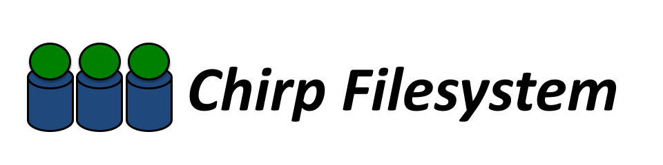

# Chirp User's Manual

## Overview

Chirp is a system for performing input and output across the Internet. Using
Chirp, an ordinary user can share storage space and data with friends and
colleagues without requiring any sort of administrator privileges anywhere.

Chirp is like a distributed filesystem (such as NFS) except that it can be run
over wide area networks and requires no special privileges on either the
client or the server end. Chirp allows the end user to set up fine-grained
access control so that data can be shared (or not shared) with the right
people.

Chirp is also like a file transfer system (such as FTP) that provides
streaming point-to-point data transfer over the Internet. However, Chirp also
provides fine-grained Unix-like data access suitable for direct access by
ordinary programs.

Chirp also includes several advanced features for authentication tickets,
space allocation, and more. However, each of these features must be explicitly
enabled, so you don't have to worry about them if all you want is simple
storage access. Read on below for more details.

## Getting Started

### Installing

See the [Installation Instructions](../install) for the Cooperative Computing Tools package.  Then, Make sure to set your `PATH` appropriately.

### Running a Chirp Server

Running a Chirp server is easy. You may run a Chirp server as any ordinary
user, and you do **not** need to install the software or even run the programs
as root. To run a Chirp server, you must do three things: pick a storage
directory, run the server, and then adjust the access control.

- **Pick a storage directory.** The Chirp server will only allow access to the
  directory that you choose. It could be a scratch directory, your home
  directory, or even your filesystem root. For now, let's store everything in a
  temporary directory: `/tmp/mydata`

- **Run the server.** Run `chirp_server` and direct it to your storage directory:

```sh
$ chirp_server -r /tmp/mydata &
```

- *Adjust the access control.** When first started, the Chirp server will allow
  access only to YOU from the same host. You will probably want to change this
  to allow access to other people and hosts. To adjust the access control, use
  the ` chirp` tool and the `setacl` command to set the access control list.
  For example, to also allow other hosts in your domain to read and write the
  server:
  
```sh
$ chirp localhost
chirp:localhost:/>
chirp:localhost:/> setacl . hostname:*.mydomain.edu write
```

Now that you have a server running on one machine, let's use some tools to
move data to and from your server.

## Accessing Chirp Servers

The easiest way to access Chirp servers is by using a tool called
**[Parrot](http://ccl.cse.nd.edu/software/parrot)**. Parrot is a personal
virtual filesystem: it "speaks" remote I/O operations on behalf of ordinary
programs. For example, you can use Parrot with your regular shell to list and
access Chirp servers like so:

```sh
$ parrot_run bash
$ cd /chirp
$ ls angband.somewhere.edu:9094 dustpuppy.somewhere.edu:9094 peanuts.somewhere.edu:9094 ...
$ cd /chirp/peanuts.somewhere.edu
$ cp /tmp/bigfile .
$ ls -la

total 804
drwx------ 2 fred users 4096      Sep 10 12:40 .
drwx------ 2 fred users 4096      Sep 10 12:40 ..
-rw-r--r-- 1 fred users 104857600 Sep 10 12:57 bigfile
-rw-r--r-- 1 fred users 147       Sep 10 12:39 hosts

$ parrot_getacl unix:fred rwlda hostname:hedwig rl ...
```

If you are having difficulting accessing your server, have a look at
[debugging hints](#debugging-advice) below.

Parrot is certainly the most convenient way to access storage, but it has some
limitations: it only works on Linux, and it imposes some performance penalty.

You can also attach to Chirp filesystems by using the FUSE package to attach
Chirp as a kernel filesystem module. Unlike Parrot, this requires superuser
privileges to install the FUSE package, but will likely work more reliably on
a larger number of programs. You can do this with either [Linux FUSE](http://fuse.sourceforge.net) or
[MacFuse](http://code.google.com/p/macfuse). Once you have downloaded and
installed FUSE, simply run `chirp_fuse` with the name of a directory on which
the filesystem should be mounted. For example:

```sh
$ mkdir /tmp/chirp
$ chirp_fuse /tmp/chirp
$ cd /tmp/chirp
$ ls -la
total 9742
dr-xr-xr-x 0 fred users 6697  Feb 22 13:54 albus.cse.nd.edu:9094
dr-xr-xr-x 0 fred users 6780  Feb 22 13:54 aluminum.helios.nd.edu:9094
dr-xr-xr-x 0 fred users 27956 Feb 22 13:54 angband.cse.nd.edu:9094
dr-xr-xr-x 0 fred users 6466  Feb 22 13:54 angelico.helios.nd.edu:9094
```

For more portable, explicit control of a Chirp server, use the Chirp command
line tool. This allows you to connect to a server, copy files, and manage
directories, much like an FTP client:

```sh
$ chirp
chirp::> open myhost.somewhere.edu
chirp:myhost.somewhere.edu:/> put /tmp/bigfile file
/tmp/bigfile -> /bigfile (11.01 MB/s)
chirp:myhost.somewhere.edu:/> ls -la
dir  4096      .       Fri Sep 10 12:40:27 2018
dir  4096      ..      Fri Sep 10 12:40:27 2018
file 147       hosts   Fri Sep 10 12:39:54 2018
file 104857600 bigfile Fri Sep 10 12:53:21 2018
chirp:myhost.somewhere.edu:/>
```

In scripts, you may find it easier to use the standalone commands `chirp_get`
and `chirp_put`, which move single files to and from a Chirp server. These
commands also allow for streaming data, which can be helpful in a shell
pipeline. Also, the `-f` option to both commands allows you to follow a file,
much like the Unix `tail` command:

```sh
$ tar cvzf archive.tar.gz ~/mydata
$ chirp_put archive.tar.gz myhost.somewhere.edu archive.tar.gz

$ chirp_get myhost.somewhere.edu archive.tar.gz - | tar xv

$ chirp_get -f myhost.somewhere.edu logfile - |& less
```

You can also write programs that access the Chirp C interface directly. This
interface is relatively self explanatory: programs written to use this library
may perform explicit I/O operations in a manner very similar to Unix. For more
information, see the [HOWTO: Write Code that Uses Chirp](http://ccl.cse.nd.edu/software/howto/code.shtml)

## Finding Chirp Servers

Now that you know how to run and use Chirp servers, you will need a way to
keep track of all of the servers that are available for use. For this purpose,
consult the Chirp [storage catalog](http://catalog.cse.nd.edu:9097). This web
page is a list of all known Chirp servers and their locations. Note that this
same list appears if you use Parrot to perform an `ls` on `/chirp`

The storage catalog is highly dynamic. By default, each Chirp server makes
itself known to the storage catalog every five minutes. The catalog server
records and reports all Chirp servers that it knows about, but will discard
servers that have not reported for fifteen minutes.

If you **do not** want your servers to report to a catalog, then run them
setting the option `-u` to `-`:

```sh
$ chirp_server -u -
```

Alternatively, you may establish your own catalog server. See [Catalog
Servers](../catalog) for details.

## Security

Different sites require different levels of security and
different technological methods of enforcing security. For these reasons,
Chirp has a very flexible security system that allows for a range of tools and
policies from simple address checks to Kerberos authentiation.

Security really has two aspects: authentication and authorization.
Authentication deals with the question __Who are you?__ Once your identity has
been established, then authorization deals with the question __What are you
allowed to do?__:

### Authentication

Chirp supports the following authentication schemes:

|**Type**|  **Summary**| **Regular User?**|  **Root?** |
|----|----|----|----|
| | | (non-root)| (root) |
| kerberos |  Centralized private key system|  no |  yes (host cert) |
globus |  Distributed public key system|  yes (user cert) |  yes (host cert) |
unix |  Authenticate with local unix user ids. |  yes |  yes |
| hostname | Reverse DNS lookup |  yes |  yes |
| address |  Identify by IP address |  yes | yes |

The Chirp tools will attempt all of the authentication types that are known
and available in the order above until one works. For example, if you have
Kerberos installed in your system, Chirp will try that first. If not, Chirp
attempts the others.

Once an authentication scheme has succeeded, Chirp assigns the incoming user a
**subject** that describes both the authentication method and the user name
within that method. For example, a user that authenticates via Kerberos might
have the subject:

`kerberos:dthain@nd.edu`

A user authenticating with Globus credentials might be:  
(Note that Chirp substitutes underscores for spaces.)

`globus:/O=Cooperative_Computing_Lab/CN=Douglas_L_Thain`

While another user authenticating by local unix ids might be:

`unix:dthain`

While a user authenticating by simple hostnames might be:

`hostname:pigwidgeon.cse.nd.edu`

Take note that Chirp considers all of the subjects as different identities,
although some of them might correspond to the same person in varying
circumstances.

### Authorization

Once Chirp has authenticated your identity, you are logged into a server.
However, when you attempt to read or manipulate files on a server, Chirp
checks to see whether you are authorized to do so. This is determined by
**access control lists** or **ACLs**.

Every directory in a Chirp server has an ACL, much like filesystems such as as
AFS or NTFS. To see the ACL for a directory, use the Chirp tool and the `
getacl` command:

```sh
chirp:host.mydomain.edu:/> getacl
unix:dthain rwlda hostname:*.mydomain.edu rwl
```

Or, if you are using Parrot, you can use `parrot_getacl` to examine ACLs in
the same way:

```sh
$ parrot_run bash
$ cd /chirp/host.mydomain.edu
$ parrot_getacl
unix:dthain rwlda hostname:*.mydomain.edu rwl
```

This ACL indicates that the subject `unix:dthain` has five access rights,
while the subject pattern `hostname:*.mydomain.edu` has only three access
rights. The access rights are as follows:

| | |
|---|---|
| **r** | The subject may read items in the directory. |
| **w** | The subject may write items in the directory. |
| **l** | The subject may list the directory contents. |
| **d** | The subject may delete items in the directory. |
| **p** | The subject may put new files into the directory. |
| **a** | The subject may administer the directory, including changing the ACL. |
| **x** | The subject may execute programs in the directory. |
| **v** | The subject may reserve a directory. |

Access rights often come in combinations, so there are a few aliases for your
convenience:

| | |
|---|---|
| **read** |  alias for **rl**  
| **write** | alias for **rwld**  
| **admin** | alias for **rwlda**  
| **none** |  delete the entry  

To change an access control list on a directory, use the `setacl` command in
the Chirp command line tool:

```sh
chirp:host.mydomain.edu:/> setacl / kerberos:dthain@nd.edu write
chirp:host.mydomain.edu:/> getacl
unix:dthain rwlda hostname:*.mydomain.edu rwl kerberos:dthain@nd.edu rwld
```

Note that for subject names that contain spaces, you should simply substitute
underscores. For example, if your subject name is `/O=Univ of Somewhere/CN=Fred Flint`, then you might issue a `setacl` command like this:

```sh
chirp:host.mydomain.edu:/> setacl / /O=Univ_of_Somewhere/CN=Fred_Flint rwlda
```

Or, you can accomplish the same thing using `parrot_setacl` inside of Parrot:

```sh
$ parrot_run bash
$ cd /chirp/host.mydomain.edu $ parrot_setacl . /O=Univ_of_Somewhere/CN=Fred_Flint rwlda
```

The meaning of ACLs is fairly obvious, but there are few subtleties you should
know:

- **Rights are generally inherited.** When a new directory is created, it
  automatically gets the ACL of its parent. Exception: read about the
  **reserve** right below.

- **Rights are generally not hierarchical.** In order to access a directory,
  you only need the appropriate permissions on _that_ directory. For example,
  if you have permission to write to ` /data/x/y/z`, you do **not** need any
      other permissions on ` /data`, `/data/x` and so forth. Of course, it may
      be difficult to discover a deep directory without rights on the parents,
      but you can still access it.

- **The delete right is absolute.** If you have permission to delete a
  directory, then you are able to delete the _entire_ subtree that it contains,
  regardless of any other ACLs underneath.

!!! note
    It is possible to use Chirp to export an existing directory tree without
    manually populating every directory with ACLs. Simply create an ACL in an
    external file, and then use the -A option to tell the Chirp server to use
    that file as the default ACL.

### Reservation

The **v - reserve** right is an important concept that deserves its own
discussion.

A shared-storage environment such as Chirp aims to allow many people to read
and write common storage space. Of course, with many people reading and
writing, we need some mechanism to make sure that everybody does not step on
each other's toes.

The **reserve** right allows a user to create what is essentially a fresh
workspace for their own use. When a user creates a new directory and has the
**v** right (but not the **w** right), Chirp will create a new directory with
a fresh ACL that gives the creating user restricted rights.

A good way to use the reserve right is with a wildcard at the top directory.
Here's an example. Suppose that Fred creates a new Chirp server on the host
`bigwig`. Initially, no-one except Fred can access the server. The first time
it starts, the Chirp server initializes its root directory with the following
ACL:

`unix:fred rwla`

Now, Fred wants other users in his organization to be able to use this
storage, but doesn't want them messing up his existing data. So, Fred uses the
Chirp tool to give the list ( **l** ) and reserve ( **v** ) rights to anyone
calling from any machine in his organization:

```sh
chirp:bigwig:/> setacl / hostname:*.somewhere.edu lv(rwlda)
chirp:bigwig:/> getacl /
unix:fred rwlda hostname:*.somewhere.edu lv(rwlda)
```

Now, any user calling from anywhere in `somewhere.edu` can access this server.
But, all that any user can do is issue `ls` or `mkdir` in the root directory.
For example, suppose that Betty logs into this server from
`ws1.somewhere.edu`. She can not modify the root directory, but she can create
her own directory:

```sh
chirp:bigwig:/> mkdir /mydata
```

And, in the new directory, `ws1.somewhere.edu` can do anything, including edit
the access control. Here is the new ACL for `/mydata`:

```sh
chirp:bigwig:/> getacl /mydata
hostname:ws1.somewhere.edu rwlda
```

If Betty wants to authenticate with Globus credentials from here on, she can
change the access control as follows:

```sh
chirp:bigwig:/> setacl /mydata globus:/O=Univ_of_Somewhere/CN=Betty rwla
```

And, the new acl will look as follows:

```sh
chirp:bigwig:/> getacl /mydata
hostname:ws1.somewhere.edu rwlda globus:/O=Univ_of_Somewhere/CN=Betty rwla
```

### Simple Group Management

Chirp currently supports a simple group management system based on files.
Create a directory on your local filesystem in which to store the groups. Each
file in the directory will have the name of the desired groups, and contain a
list of the members of the group in plain text format. Then, give your Chirp
server the `-G` argument to indicate the URL of the group directory. Once the
groups are defined, you can refer to them in access control lists using the
`group:` prefix.

For example, suppose you wish to have two groups named `group:students` and
`group:faculty`. You could define the groups in the `/data/groups` directory
as follows:

```sh
/data/groups/students: unix:astudent unix:bstudent
/data/groups/faculty: unix:aprof unix:bprof
```

Then, run the chirp server with the option `-G file:///data/groups`. (Notice
the URL syntax.) Then, to make a directory `/homework` that is readable by
students and writable by faculty, do this:

```sh
chirp:bigwig:/> mkdir /homework
chirp:bigwig:/> setacl /homework group:students rl
chirp:bigwig:/> setacl /homework group:faculty rwld
```

If the groups are to be shared among many Chirp servers, place the group
directory on a web server and refer to it via an `http` URL.

### Notes on Authentication

Each of the authentication types has a few things you should know:

- **Kerberos:** The server will attempt to use the Kerberos identity of the
  host it is run on. (i.e. host/coral.cs.wisc.edu@CS.WISC.EDU) Thus, it must be
  run as the superuser in order to access its certificates. Once authentication
  is complete, there is no need for the server to keep its root access, so it
  will change to any unprivileged user that you like. Use the ` -i` option to
  select the userid.

- **Globus:** The server and client will attempt to perform client
  authentication using the Grid Security Infrastructure (GSI)> Both sides will
  load either user or host credentials, depending on what is available. If the
  server is running as an ordinary user, then you must give a it a proxy
  certificate with grid-proxy-init. Or, the server can be run as root and will
  use host certificates in the usual place.

- **Unix:** This method makes use of a challenge-response in the local Unix
  filesystem to determine the client's Unix identity. It assumes that both
  machines share the same conception of the user database and have a common
  directory which they can read and write. By default, the server will pick a
  filename in /tmp, and challenge the client to create that file. If it can,
  then the server will examine the owner of the file to determine the client's
  username. Naturally, /tmp will only be available to clients on the same
  machine. However, if a shared filesystem directory is available, give that to
  the chirp server via the -c option. Then, any authorized client of the
  filesystem can authenticate to the server.
  For example, at Notre Dame, we use
  `-c /afs/group/ccl/software/rendezvous` to authenticate via our AFS
  distributed file system.

- **Hostname:** The server will rely on a reverse DNS lookup to establish the
  fully-qualified hostname of the calling client. The second field gives the
  hostname to be accepted. It may contain an asterisk as a wildcard. The third
  field is ignored. The fourth field is then used to select an appropriate
  local username.

- **Address:** Like "hostname" authentication, except the server simply looks
  at the client's IP address.

By default, Chirp and/or Parrot will attempt every authentication type knows
until one succeeds. If you wish to restrict or re-order the authentication
types used, give one or more **-a** options to the client, naming the
authentication types to be used, in order. For example, to attempt only
hostname and kerberos authentication, in that order:

```sh
$ chirp -a hostname -a kerberos
```

## Advanced Topics

### Cluster Management

Several tools are available for managing a large cluster of Chirp servers.

First, a [Java visual display applet](http://ccl.cse.nd.edu/viz) gives a
graphical view of all servers in a cluster, as well as active network
connections between each client and server. This tool can be used to quickly
view whether storage is free or used, whether CPUs are idle or busy, and
whether the network is idle or in use. Clicking on individual nodes shows the
same detailed data as is avaliable in the [catalog
page](http://catalog.cse.nd.edu:9097).

Next, it can be helpful to give a single 'superuser' limited access to all
servers and directories in a cluster, allowing them to fix broken access
controls and solve other problems. To allow this, the `-P user` argument can
be given to a Chirp server, and will implicitly give the named user the **L**
and **A** rights on any directory on that server.

When managing a large system with many users, it is important to keep track of
what users are employing the cluster, and how much space they have consumed.
We refer to this as **auditing** the cluster. To audit a single node, use the
`audit` command of the Chirp tool. This produces a listing of all users of a
single host. (You must have the `A` right in the root directory of the server
to run this command.) For example:

```sh
$ chirp ccl01.cse.nd.edu audit
FILES DIRS      DATA    OWNER
82842   27    5.0 GB    globus:/O=UnivNowhere/CN=Fred
 6153  607  503.4 MB    unix:fred 2 2 200.3 MB hostname:laptop.nowhere.edu 12 2 3.9 MB unix:betty
```

To audit an entire cluster, run the `chirp_audit_cluster` tool. This will
extract the current list of hosts from your catalog, run an audit on all hosts
in parallel, and then produce several reports in text files:
`audit.users.txt`, `audit.hosts.txt`, `audit.users.hosts.txt`, and
`audit.hosts.users.txt`.

Often, users of a cluster will wish to replicate commonly used data across all
disks in the system, perhaps to provide fast access to relatively static data.
The `chirp_distribute` tool can be used to rapidly move data from one node to
all others. Given a source host and path, `chirp_distribute` will create a
spanning tree and then move data directly from host to host in parallel. This
is much faster than running `cp` or `chirp put` directly. For example, this
will copy the `/database` directory from host `server.nd.edu` to all hosts in
your cluster:

```sh
# First we get a list of all the chirp hosts in the cluster:
ALL_CHIRP_HOSTS=$(chirp_status -s)

# Then we use chirp_distribute to copy /database to all the hosts found:
$ chirp_distribute server.nd.edu /database $ALL_CHIRP_HOSTS
```

Another common pattern is cleaning up data that has been copied this way. To
delete, simply run `chirp_distribute` again with the `-X` option and the same
arguments, that is:

```sh
$ chirp_distribute -X server.nd.edu /database $ALL_CHIRP_HOSTS
```

### Space Management

When multiple users share a common storage space, there is the danger that one
aggressive user can accidentally (or deliberately) consume all available
storage and prevent other work from happening. Chirp has two mechanisms
available to deal with this problem.

The simpler tool is just a free space limit. If run with the `-F` option, a
Chirp server will stop consuming space when the free space on the disk falls
below this limit. External users will see a `"No space left on device."`
error. For example, `-F 100MB` will leave a minimum of 100MB free on the local
disk. This mechanism imposes little or no performance penalty on the server.

The more complex tool is a user-level quota and allocation system. If run with
the `-Q` option, a Chirp server will establish a software quota for all
external users. That is, `-Q 2GB` will limit external users to consuming a
total of 2 GB of storage within a single Chirp server. This mechanism imposes
some run-time performance penalty, and also delays server startup somewhere:
the Chirp server must traverse its storage directory to count up the available
space.

With the `-Q` option enabled, external users can `allocate` space before
consuming it. Using the Chirp tools, users may use the `mkalloc` command to
create new directories with an attached space allocation. For example,
`mkalloc /mydata 1GB` will create a new directory `/mydata` with an allocation
of 1GB. This allocation is a _limit_ that prevents files in that directory
from consuming more than 1GB; it is also a _guarantee_ that other users of the
server will not be able to steal the space. Such allocations may also be
subdivided by using ` mkalloc` to create sub-directories.

!!! note
    Users employing Parrot can also use the `parrot_mkalloc` and
    `parrot_lsalloc` commands in ordinary scripts to achieve the same effect.

To examine an allocation, use the `lsalloc` command.

To destroy an allocation, simply delete the corresponding directory.


### Ticket Authentication

Often a user will want to access a Chirp server storing files for cluster
computing jobs but will have difficulty accessing it securely without
transferring their credentials with the jobs dispatched to the cluster. To
facilitate ease-of-use, users typically solve this by giving rights to a
hostname mask (e.g. _*.cse.nd.edu_ ) on the Chirp server. However, this level
of access can be innappropriate due to sensitive data. Instead, these users
are forced to use difficult authentication methods such as Globus or Kerberos
for running the Chirp server. They may also use a virtual network solution but
users typically lack this amount of control on clusters. To provide an easy
solution to this problem, Chirp offers its own ticket based authentication
system which is convenient and simple to setup.

To start, users may create a ticket for authentication using:

```sh
$ chirp <host:port> ticket_create -output myticket.ticket -subject unix:USER -bits 1024 -duration 86400 / rl /foo rwl
```

This command performs multiple tasks in three stages:

First, it creates a ticket which is composed of an RSA Private Key with a key
(modulus) size of 1024 bits. When we refer to the ticket, we are speaking of
this Private Key. By default, the ticket file generated is named
**ticket.MD5SUM** where **MD5SUM** is the MD5 digest of the Public Key of the
ticket.

Once the ticket is created, it is registered with the Chirp server with a
validity period in seconds defined by the duration option (86400, or a day).
The `-subject unix:USER` switch allows the user to set the ticket for another
user with unix id USER; however, only the **chirp_server** superuser (-P) may set tickets for
any subject. For regular users, the -subject option is unnecessary as it is by
default the subject you possess when registering the ticket. Users who
authenticate using this ticket in the future will become this subject with
certain masked rights.

Once the ticket is created and registered, we give the ticket a set of _ACL
masks_. The ACL mask will mask the rights of the ticket-authenticated user
with the rights of the subject that registered the ticket. For example, if a
user named _foo_ (subject is ` unix:foo`) has rights **rwl** in the root
directory of the Chirp server and if a ticket is registered for _foo_ with the
ACL mask ` / rlx`, the effective rights of the ticket-authenticated user is
**rl** in the root directory.

ACL masks are also inherited from parent directories. So, in the above
example, the root directory has the ACL mask **rl** while the foo directory
has the ACL mask **rwl**. Other nested directories within the root directory
also inherit the **rl** mask. Similarly, nested directories of the foo
directory inherit the **rwl** mask. We emphasize that the ACL mask does not
give rights but limits them. If the user that registers a ticket has no rights
in a directory, then neither will the ticket authenticated user.

#### Authenticating with a ticket

To authenticate using a ticket, it can be as simple as including the ticket
file with your job. Tickets that follow the **ticket.MD5SUM** template are
automatically added to the list of tickets to try when authenticating. You can
also give specific tickets to authenticate with using a comma-delimited list
of ticket filenames in either the **CHIRP_CLIENT_TICKETS** environment
variable or via the **-i <tickets>** option. Tickets are tried in the order
they are specified.

```sh
$ chirp <host:port>
```

The above command will try ticket authentication as a last resort but will use
tickets it finds in the current directory following the template.

```sh
$ chirp -a ticket -i file.ticket <host:port>
```

The above command forces ticket authentication and only uses the
**file.ticket** ticket to authenticate.

Authenticating is this simple. It is important to note that tickets are
obviously not protected in any way from theft when you distribute the ticket
with jobs in a distributed computing environment (no ticket system can give
this guarantee). Users may want to protect their tickets in basic ways by
setting a restrictive file mode and by giving tickets a limited duration on
the server.

Finally, users should be careful to experiment with small key sizes for a
balance of quick authentication and security. Smaller key sizes may be
rejected outright by openssl when given a 64 byte challenge to sign. Chirp
will not authenticate or use smaller challenge sizes if openssl rejects the
ticket.

#### Manually Registering a Ticket

A ticket is only useful when registered with a server. The ticket_create
command does this for you automatically but you may also wish to register the
ticket with multiple servers. To do this, you can manually register a ticket
that is already created by using the `ticket_register` command:

```sh
$ chirp <host:port> ticket_register myticket.ticket unix:user 86400
```

The first argument to `ticket_register` is the name of the ticket, followed by
the subject, and finally the ticket duration. The second option (the subject)
is optional. As described earlier, specifying the subject allows you to
register a ticket with a user other than yourself. This is only possible if
you are authenticated with the server as the super user.

#### Modifying the Rights of a Ticket

You may use the `ticket_modify` command to change the rights a ticket has in a
directory. You are restricted to giving rights to a ticket you already
possess. Recall, however, that the rights are actually a mask that are
logically ANDed with the rights the user has at the time.

```sh
$ chirp <host:port> ticket_modify myticket.ticket / rl
```

The above command changes the ACL mask of `myticket.ticket` to `rl` in the
root directory.

A ticket identifier as returned by `ticket_list` may also be used instead of a
ticket filename.


#### Deleting a Ticket

Deleting a ticket unregisters the ticket with the server. Additionally, the
ticket on the client is deleted.

```sh
$ chirp <host:port> ticket_delete myticket.ticket
```

A ticket identifier as returned by `ticket_list` may also be used instead of a
ticket filename.

### Listing the Registered Tickets on the Server

To list the tickets registered on a server, use the `ticket_list` command:

```sh
$ chirp <host:port> ticket_list unix:user
```

The subject argument instructs the command to fetch all the tickets belonging
to the user. You may also use `ticket_list all` to list all the tickets of all
users on the server. The latter command is only executable by the Chirp super
user. The output is a list of tickets identifiers. You can query information
about a ticket using these identifiers with the `ticket_get` command.


#### Getting the Information of a Registered Ticket from the Server

To check the status of a ticket on a server, you may use the `ticket_get`
command:

```sh
$ chirp <host:port> ticket_get myticket.ticket
```

So long as you own the ticket or are authenticated as the super user, the
server will return to you information associated with the ticket. The ticket
must also exist and must also not have expired. `ticket_get` takes a client
side ticket filename as an argument or a ticket identifier as returned by the
`ticket_list` command.

`ticket_get` prints the subject that owns the ticket, the base64 encoded
public key of the ticket, the time left until the ticket expires in seconds,
and a variable number of directory and ACL masks. For example, we might have
the following output:

```sh
$ chirp host:port ticket_get myticket.ticket
unix:pdonnel3
LS0tLS1CRUdJTiBQVUJMSUMgS0VZLS0tLS0KTUlHZk1BMEdDU3FHU0liM0RRRUJBUVVBQTRHTkFEQ0Jp
UUtCZ1FEZVoyZWxKYXdlcHBHK0J4SFlaMmlmWFIzNAovU3RhUElta0lmeit4TDZxN21wS2lnMDJQZ2Z5
emdKRWFjMk50NzJrUlBpOEJWYWdkOHdvSGhWc25YZ1YvNjFPCjVkaG13STNLYWRlYjNUbkZXUUo3bFhh
anhmVTZZR1hXb2VNY1BsdjVQUWloWm8yWmFXTUUvQVA4WUtnVVphdXcKelI2RkdZWGd6N2RGZzR6Yk9R
SURBUUFCCi0tLS0tRU5EIFBVQkxJQyBLRVktLS0tLQo=
5993
/ rl /foo rwl
```

Note that the base64 encoded public key above is wrapped to fit an 80 character
width for this manual. In the actual output, the public key is on one line. All
of the information is new-line-delimited.


### HDFS Backend Storage for Chirp

The Chirp server is able to bind to backend filesystems besides the local
filesystem. In particular, it is able to act as a frontend for the Hadoop HDFS
filesystem. When used on top of HDFS, Chirp gives you the benefit of a robust
system of ACLs, simple userspace access and POSIX semantics (with some
limitations, discussed below). Perhaps best of all, client jobs will no longer
have any Hadoop or Java (version) dependencies.

To run a Chirp server as a frontend to your HDFS filesystem, you will need to
install the `libhdfs-devel` package and then set several environment variables
which describe your Hadoop installation. `JAVA_HOME` and `HADOOP_HOME`
LIBHDFS_PATH should be set to indicate the location of the libhdfs library.
Common values for the Cloudera Hadoop installation would be this:

`setenv JAVA_HOME /usr/lib/jvm/java-openjdk setenv HADOOP_HOME /usr/lib/hadoop
setenv LIBHDFS_PATH /usr/lib64/libhdfs.so ` Then, start `chirp_server` and
indicate the root storage directory in HDFS with `-r` like this:

```sh
$ chirp_server -r hdfs://headnode.hadoop.domain.edu/mydata ...other arguments...
```

By default, chirp will use whatever default replication factor is defined by
HDFS (typically 3). To change the replication factor of a single file, use the
`chirp setrep` or `parrot_setrep` commands. A path of `&&&` will set the
replication factor for all new files created in that session.

#### Temporary Local Storage

Chirp allows you to setup a location to place temporary files such as those
for caching groups, and other items. You can set this using the `-y path`.
This allows for faster access, POSIX semantics, and less load on HDFS. By
default, Chirp assumes the current directory for temporary storage.


#### Limitations

Chirp tries to preserve POSIX filesystem semantics where possible despite HDFS
violating certain assumptions. For example, random writes are not possible for
Chirp on HDFS. When the user requests to open a file for writing, Chirp
assumes an implicit `O_APPEND` flag was added. In addition, HDFS does not
maintain an execute permission bit for regular files. Chirp assumes all files
have the execute bit set.

Chirp also does not allow using the thirdput command or user space management
(`-F`) when using HDFS as a backend.


### Job Execution on Chirp

As of version 4.2.0, Chirp supports job execution. Jobs run using executables
and files located on the Chirp server. Each job description sent to the Chirp
server provides a _binding_ of each file the job requires to a local namespace
(a sandbox).

To support the new job interface, Chirp has the following new RPCs:

```sh
                <integer result> = **job_create** <JSON-encoded job description>
                <integer result> = **job_commit** <JSON-encoded array of job IDs>
<JSON-encoded array of statuses> = **job_status** <JSON-encoded array of job IDs>
<JSON-encoded array of statuses> = **job_wait** <job ID> <timeout>
                <integer result> = **job_reap** <JSON-encoded array of job IDs>
                <integer result> = **job_kill** <JSON-encoded array of job IDs>
```

As usual, these RPCs may be sent through the Chirp client command line tool or through the C API.


!!! note
    To enable job execution on a Chirp server, the `--jobs` switch must be passed.


#### Creating a Job

To create a job, you need the usual attributes of an executable to run, the
arguments to pass to the executable, any environment variables to add, and any
files to bind into the job's namespace.

In Chirp's Job execution framework, files are _bound_ into the job's
namespace. The name of the file in the task's name space is labeled `
task_path` while the name in the server namespace is labeled `serv_path`.
**Files are bound in the task namespace at job start and job end, for inputs
and outputs, respectively.**

##### Example 1

[my-first-job.json](my-first-job.json)
```json
my-first-job.json:
{
    "executable": "/bin/sh",
    "arguments": [ "sh", "-c", "echo Hello, world! > my.output" ],
    "files": [
                {
                    "task_path": "my.output",
                    "serv_path": "/some/directory/my.0.output",
                    "type": "OUTPUT"
                }
            ]
}
```

!!! note
    Notice that the first argument is `"sh"`. This argument corresponds to
    `argv[0]` in a regular POSIX application.

!!! note
    Additionally, the output file is explicitly marked as an `OUTPUT`. This
    file is bound into the server namespace at task completion.

This job can be created from the command line as follows:

```sh
# We make sure the appropiate directories exist:
$ chirp <host:port> mkdir -p /some/directory

# Create the job. It prints the job-id when the job is succesfully created:
# <integer result> = **job_create** <JSON-encoded job description>

$ chirp <host:port> job_create "$(cat my-first-job.json)"
1
```

##### Example 2 -- Two Inputs

[job-with-two-inputs.json](job-with-two-inputs.json)
```json
{
    "executable": "/bin/tar",
    "arguments": [ "tar", "-cf", "archive.tar", "a", "b" ],
    "files": [
                {
                    "task_path": "a",
                    "serv_path": "/users/btovar/a.txt",
                    "type": "INPUT",
                    "binding": "LINK"
                },
                {
                    "task_path": "b",
                    "serv_path": "/users/btovar/b.txt",
                    "type": "INPUT",
                    "binding": "LINK"
                },
                { "task_path": "archive.tar",
                  "serv_path": "/users/btovar/archive.tar",
                  "type": "OUTPUT",
                  "binding": "LINK"
                }
            ]
}
```

Here, each file is bound using hard links to the file located on the server.
This type of access is fast as the server does not need make a copy. You may
also bind files as `COPY` if necessary. `LINK` is the default.

```sh
# Create the job:
$ chirp <host:port> job_create "$(cat job-with-two-inputs.json)"
2
```

##### Example 3 -- Using custom executable

Often, you will have a script or executable which is present on the Chirp
server which you want to execute directly. To do this, bind the executable as
you would any other file and give a relative (task) path for the `executable`
job attribute:

In this example [my-custom-exec.sh](my-custom-exec.sh), takes as first argument
the name of a file to print its output. 

[job-with-custom-exec.json](job-with-custom-exec.json)
```json
{
    "executable": "./my-custom-exec.sh",
    "arguments": [ "my-custom-exec.sh", "output.txt" ],
    "files": [
                {
                    "task_path": "my-custom-exec.sh",
                    "serv_path": "/some/directory/my-custom-exec.sh",
                    "type": "INPUT",
                    "binding": "LINK" },
                {
                    "task_path": "output.txt",
                    "serv_path": "/some/directory/output.txt",
                    "type": "OUTPUT",
                    "binding": "LINK"
                }
            ]
}
```

```sh
# Make sure that myscript.sh is in the correct location:
$ chirp <host:port> put my-custom-exec.sh /some/directory/my-custom-exec.sh

$ chirp <host:port> job_create "$(cat job-with-custom-exec.sh)"
4
```


#### Committing (to Start) a Job

Chirp uses two-phase commit for creating a job. This serves to protect against
orphan jobs which become lost because a client or the server lose a
connection.

To commit a job, pass a JSON-encoded array of job identifiers to the
`job_commit` RPC. For example:

```sh
# <integer result> = **job_commit** <JSON-encoded array of job IDs>

$ chirp host:port job_commit '[1, 2, 4]'
```

will commit jobs `1`, `2`, and `4`.

Once a job is committed, the Chirp server is free to schedule and execute the
job. You may query the status of the job to see if it has begun executing or
wait for the job to finish.


#### Querying the Status of a Job

At any point in a job's lifetime, you may query its status. Status information
is JSON-encoded and holds all job metadata.

#### Example 1 -- Status of Example 1

```sh
# <JSON-encoded array of statuses> = **job_status** <JSON-encoded array of job IDs>

$ chirp host:port job_status '[1]'
[
  {
    "id": 1,
    "error": null,
    "executable": "/bin/sh",
    "exit_code": 0,
    "exit_status": "EXITED",
    "exit_signal": null,
    "priority": 1,
    "status": "FINISHED",
    "subject": "unix:btovar",
    "tag": "(unknown)",
    "time_commit": 1565793785,
    "time_create": 1565793785,
    "time_error": null,
    "time_finish": 1565793785,
    "time_kill": null,
    "time_start": 1565793785,
    "time_reap": null,
    "arguments": [
      "sh",
      "-c",
      "echo Hello, world! > my.output"
    ],
    "environment": {},
    "files": [
      {
        "binding": "LINK",
        "serv_path": "/some/directory/my.0.output",
        "size": 14,
        "tag": null,
        "task_path": "my.output",
        "type": "OUTPUT"
      }
    ]
  }
]
```

You can get the status of a job at any time, that is, before commit, during execution, and on completion. However, this RPC does not help
with waiting for one or more jobs to finish. For that, we use the `job_wait`
RPC discussed next.


#### Waiting for a Job to Terminate

Use `job_wait` to wait for a job to finish. This will give you the status
information of jobs which have completed and have a `status` of `FINISHED`,
`KILLED`, or `ERRORED`.

`job_wait` takes a job identifier argument which matches jobs in the following
way:

|   |   |
|---|---|  
| **0** | Match all jobs for the current user.  
|**X > 0** | Match job with id equal to **X**.  
|**X < 0** | Match job with id greater than ** abs(X)**.  
  
`job_wait` is essentially `job_status` except the RPC blocks until a job
matches the above condition or the `timeout` is exceeded:

```sh
# <JSON-encoded array of statuses> = **job_wait** <job ID> <timeout>


# wait 10 seconds for any job to finish:
$ chirp host:port job_wait 0 10

# wait indefinitely for job_wait 1 to finish:
$ chirp host:port job_wait 1
[{"id":1,"error":null,"executable":"\/bin\/sh","exit_code":0,"exit_status":"EXITED",...]

# wait 10 seconds for any job with id greater than 500 to finish:
$ chirp host:port job_wait -500 10
[]

# Note the empty array above, which indicates that no such job finished in the
# given timeout.
```

!!! note 
    Unlike the regular UNIX wait system call, Chirp's `job_wait` does not reap a
    job you wait for. You must do that through the `job_reap` RPC discussed next.


#### Reaping a Finished Job

Similar in intent to `job_commit`, `job_reap` notifies the Chirp server that
your application has logged the termination of the job. This allows the Chirp
server to reap the job. The side-effect of this operation is future calls to
`job_wait` will not include the reaped jobs.

```sh
# <integer result> = **job_reap** <JSON-encoded array of job IDs>

# Reap jobs 1, 2, and 4:
$ chirp host:port job_reap '[1, 2, 4]'
```


#### Killing a Job

`job_kill` informs the Chirp server to kill a job. Any job which has not
reached a terminal state (`FINISHED`, `KILLED`, or `ERRORED`) will immediately
be moved to the `KILLED` state. If the job is running, the internal Chirp
scheduler will also terminate the job at its convenience.

```sh
#<integer result> = **job_kill** <JSON-encoded array of job IDs>`

# Kill jobs 1 and 2
$ chirp host:port job_kill '[1, 2]'
```


### Chirp Jobs on AFS

On the AFS file system, Chirp job execution will not work with `LINK` file
bindings. This is due to limitations in AFS preventing hard links across
directories. For this reason we recommend against using AFS as the backing
storage for Chirp (`--root`). If you must use AFS, the `COPY` binding should
work.


## Debugging Advice

Debugging a distributed system can be quite difficult because of the sheer
number of hosts involved and the mass of information to be collected. If you
are having difficulty with Chirp, we recommend that you make good use of the
debugging traces built into the tools.

In all of the Chirp and Parrot tools, the `-d` option allows you to turn on
selected debugging messages. The simplest option is `-d all` which will show
every event that occurs in the system.

To best debug a problem, we recommend that you turn on the debugging options
on **both** the client and server that you are operating. For example, if you
are having trouble getting Parrot to connect to a Chirp server, then run both
as follows:

```sh
$ chirp_server -d all [more options] ...
$ parrot_run -d all bash
```

Of course, this is likely to show way more information than you will be able
to process. Instead, turn on a debugging flags selectively. For example, if
you are having a problem with authentication, just show those messages with
`-d auth` on both sides.

When debugging problems with Chirp and Parrot, we recommend selectively using
`-d chirp`, `-d tcp`, `-d auth`, and `-d libcall` as needed.


## Further Information

### The Chirp Protocol

[The Chirp Protocol](chirp_protocol.md)


### Confuga

Confuga is an active storage cluster file system harnessing Chirp. To learn
more about it, please see the [Confuga manual](../confuga).


## Citation

Please use the following citation for Chirp in a scientific publication:

- Douglas Thain, Christopher Moretti, and Jeffrey Hemmes,[Chirp: A Practical Global Filesystem for Cluster and Grid Computing](http://www.cse.nd.edu/~dthain/papers/chirp-jgc.pdf), _Journal of Grid Computing_ , Springer, 2008. DOI: 10.1007/s10723-008-9100-5. (The original is available on <http://www.springerlink.com>.)

## Further Information

For more information, please see [Getting Help](../help) or visit the [Cooperative Computing Lab](http://ccl.cse.nd.edu) website.

## Copyright

CCTools is Copyright (C) 2022 The University of Notre Dame. This software is distributed under the GNU General Public License Version 2. See the file COPYING for
details.
