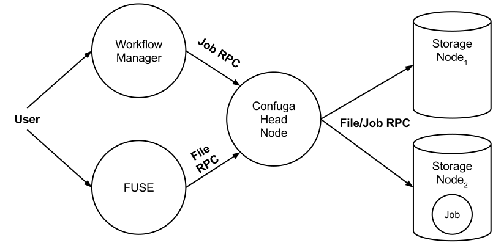

# Confuga User's Manual

## Overview

Confuga is an active storage cluster file system designed for executing DAG-
structured scientific workflows. It is used as a collaborative distributed
file system and as a platform for execution of scientific workflows with full
data locality for all job dependencies.

A high-level perspective of Confuga is visualized in the figure below.



Confuga is composed of a head node and multiple storage nodes. The head node
acts as the metadata server and job scheduler for the cluster. Users interact
with Confuga using the head node. All file and job operations go through the
head node.

A Confuga cluster can be setup as an ordinary user or maintained as a dedicated
service within the cluster. The head node and storage nodes run the
[Chirp](../chirp) file system service. Users may interact with Confuga using
Chirp's client toolset [chirp(1)](../chirp), [Parrot](../parrot), or
[Makeflow](../makeflow).

Confuga manages the details of scheduling and executing jobs for you. However,
it does not concern itself with job ordering; it appears as a simple batch
execution platform. We recommend using a high-level workflow execution system
like [Makeflow](../makeflow) to manage your workflow and to handle the
details of submitting jobs. However, you can also program job submmission
directly using the [Chirp job protocol](../chirp#job-execution-on-chirp).

Confuga is designed to exploit the unique parameters and characteristics of
POSIX scientific workflows. Jobs are single task POSIX applications that are
expressed with all input files and all output files. Confuga uses this
restricted job specification to achieve performance and to control load within
the cluster.

To get started using Confuga, please begin by [installing CCTools](../install)
on your system. When you are ready, proceed with the Getting Started section
below.

## Getting Started with Confuga

There are three services you need to start to get an operational cluster:

  * **The Storage Nodes (1 or more).** You must start a number of storage nodes which host data and execute jobs, all managed by Confuga. Each storage node is a Chirp server. Each storage node is added to the list of nodes passed to the Confuga head node.
  * **The Confuga Head Node.** This is naturally the core service for the cluster. It manages the storage nodes, distributing data and jobs.
  * **The Catalog Server (Optional).** The catalog server keeps track of operational storage nodes. It functions as a heartbeat listener for the Confuga head node. This service is optional because you may use the default catalog server managed by the Cooperative Computing Lab. Or you can start your own. See [Catalog Servers](../catalog) for details.

### Running a Test Cluster

Let's get started quickly by setting up a 2 storage node test cluster on your
local workstation.

**Start Storage Node 1:**
```sh
$ chirp_server \
--catalog-name=localhost \
--catalog-update=10s \
--interface=127.0.0.1 \
--jobs \
--job-concurrency=10 \
--root=./root.1 \
--port=9001 \
--project-name=$(whoami)-test \
--transient=./tran.1 &
```

**Start Storage Node 2:**
```sh
$ chirp_server \
--catalog-name=localhost \
--catalog-update=10s \
--interface=127.0.0.1 \
--jobs \
--job-concurrency=10 \
--root=./root.2 \
--port=9002 \
--project-name=$(whoami)-test \
--transient=./tran.2 &
```

**Add the Storage Nodes to Confuga:** 

```sh
$ confuga_adm confuga:///$(pwd)/confuga.root/ sn-add address localhost:9001
$ confuga_adm confuga:///$(pwd)/confuga.root/ sn-add address localhost:9002
```

**Start the Head Node:**

```sh
$ chirp_server \
--catalog-name=localhost \
--catalog-update=30s \
--debug=confuga \
--jobs \
--port=9000 \
--project-name=$(whoami)-test \
--root="confuga://$(pwd)/confuga.root/?auth=unix"
```

Confuga will output debug information to your terminal, so you can see what is
happening. In another terminal, use `chirp_status` to query the catalog
allowing you to see the status of the cluster:

```sh
$ chirp_status --server-project=$(whoami)-test
TYPE  NAME    PORT   OWNER   VERSION     TOTAL     AVAIL
chirp *.*.*.* 9002 batrick     6.0.0   81.6 GB   56.2 GB
chirp *.*.*.* 9001 batrick     6.0.0   81.6 GB   56.2 GB
chirp *.*.*.* 9000 batrick     6.0.0  163.1 GB  112.4 GB
```


### Running a Workflow

In another terminal, we can run the [standard Makeflow example](../makeflow)
against the cluster to confirm everything works:

[example.makeflow](example.makeflow)
```make
CURL=/usr/bin/curl
CONVERT=/usr/bin/convert
URL=http://ccl.cse.nd.edu/images/capitol.jpg

MAKEFLOW_INPUTS=
MAKEFLOW_OUTPUTS=capitol.montage.gif

capitol.montage.gif: capitol.jpg capitol.90.jpg capitol.180.jpg capitol.270.jpg capitol.360.jpg
	$CONVERT -delay 10 -loop 0 capitol.jpg capitol.90.jpg capitol.180.jpg capitol.270.jpg capitol.360.jpg capitol.270.jpg capitol.180.jpg capitol.90.jpg capitol.montage.gif

capitol.90.jpg: capitol.jpg
	$CONVERT -swirl 90 capitol.jpg capitol.90.jpg

capitol.180.jpg: capitol.jpg
	$CONVERT -swirl 180 capitol.jpg capitol.180.jpg

capitol.270.jpg: capitol.jpg
	$CONVERT -swirl 270 capitol.jpg capitol.270.jpg

capitol.360.jpg: capitol.jpg
	$CONVERT -swirl 360 capitol.jpg capitol.360.jpg

# If a rule is preceded by LOCAL, it executes at the local site.
capitol.jpg:
	LOCAL $CURL -o capitol.jpg $URL
```

```sh
$ makeflow --batch-type=chirp --working-dir=chirp://localhost:9000/ example.makeflow
parsing example.makeflow...
checking example.makeflow for consistency...
example.makeflow has 6 rules. recovering from log file
example.makeflow.makeflowlog... starting workflow....
submitting job: /usr/bin/curl -o capitol.jpg http://ccl.cse.nd.edu/images/capitol.jpg
submitted job 14 job 14 completed
submitting job: /usr/bin/convert -swirl 360 capitol.jpg capitol.360.jpg
submitted job 15
submitting job: /usr/bin/convert -swirl 270 capitol.jpg capitol.270.jpg
submitted job 16 submitting job: /usr/bin/convert -swirl 180 capitol.jpg capitol.180.jpg
submitted job 17 submitting job: /usr/bin/convert -swirl 90 capitol.jpg capitol.90.jpg
submitted job 18
job 15 completed
job 16 completed
job 17 completed
job 18 completed
submitting job: /usr/bin/convert -delay 10 -loop 0 capitol.jpg capitol.90.jpg capitol.180.jpg capitol.270.jpg capitol.360.jpg capitol.270.jpg capitol.180.jpg capitol.90.jpg capitol.montage.gif
submitted job 19
job 19 completed
nothing left to do.
```

You can then view the result by fetching the output and using your favorite
`gif` viewing program:

```sh
$ chirp localhost:9000 get /capitol.montage.gif
903.4 KB read in 0.05s (16.1 MB/s)

$ display ./capitol.montage.gif
```

You can also achieve the same thing using [Parrot](../parrot):

```sh
$ parrot_run display /chirp/localhost:9000/capitol.montage.gif
```


## Setting up Confuga

### Running Storage Nodes

Confuga uses regular Chirp servers as storage nodes. Each storage node is
added to the cluster using the [confuga_adm(1)](../man_pages/confuga_adm.md).
command. All storage node Chirp servers must be run with:

  * Ticket authentication enabled (`--auth=ticket`). Remember by default all authentication mechanisms are enabled.
  * Job execution enabled (`--jobs`).
  * Job concurrency of at least two (`--job-concurrency=2`).

These options are also suggested but not required:

  * More frequent Catalog updates (`--catalog-update=30s`).
  * Project name for the cluster (`--project-name=foo`).

You must also ensure that the storage nodes and the Confuga head node are
using the same [catalog_server](../catalog). By default, this
should be the case.

### Confuga Options

A Chirp server acting as the Confuga head node uses normal
[chirp_server(1)](../man_pages/chirp_server.md) options. In order to run the Chirp
server as the Confuga head node, use the `--root` switch with the Confuga URI.
You must also enable job execution with the `--jobs` switch.

The format for the Confuga URI is:

```sh
confuga:///path/to/workspace?option1=value&option2=value
```

The workspace path is the location Confuga maintains metadata and databases
for the head node. Confuga specific options are also passed through the URI.
The primary option is documented below.

  * `auth=method` Enable this method for Head Node to Storage Node authentication. The default is to enable all available authentication mechanisms.

Please refer to Confuga's man page [confuga(1)](../man_pages/confuga.md) for a
complete and up-to-date listing of Confuga's options.

## Executing Jobs

To execute jobs on Confuga, you must first place all of the jobs data
requirements, including the executable itself, within Confuga. This can be
done using Chirp's client toolset [chirp](../chirp), and [parrot](../parrot).

Once data is located on Confuga, you may begin executing jobs. Normally, you
will construct a workflow that executes within a **workflow namespace** within
Confuga. In simpler terms, this is just the root directory your workflow
operates in, probably your home directory on Confuga. For example, if you
place your files in Confuga like so:

```sh
$ chirp confuga.name.org put workflow /users/me
```

and your workflow looks something like this:

```make
simulation.txt: bin/sim params
    bin/sim -i params
```

The executable used by Confuga will be `/users/me/workflow/bin/sim` and the
parameter file will be `/users/me/workflow/params`. Likewise, after the job
completes, the output will be placed `/users/me/workflow/simulation.txt`. As
you may tell, the namespace your workflow is operating in is
`/users/me/workflow`. You will give this namespace to the workflow manager you
use along with your workflow. It describes the mapping relationship between
the namespace the **job** executes within and the namespace the **workflow**
executes within.

As an example, you might run Makeflow for the above situation like so:

```sh
$ makeflow -T chirp --working-dir=chirp://confuga.name.org /users/me/workflow
```


### Protocol

Jobs are executed using the [Chirp job protocol](../chirp#job-execution-on-chirp). No special
modifications are required to submit jobs to Confuga. We recommend using the
Makeflow workflow manager but you may also program your own jobs using this
protocol if so desired.


## Security

### Authentication

There are three authentication realms to consider for a Confuga cluster: user
to head node, head node to storage node, and storage node to storage node
authentication.

The head node is accessed by clients just like a regular Chirp server.
Therefore, you authenticate with Confuga in the [same way as
Chirp](../chirp#security). You may enable authentication
mechanisms on the head node using the `--auth` switch, documented in
[chirp_server(1)](../man_pages/chirp_server.md).

Head node authentication with storage nodes is controlled via the `auth`
Confuga option. Confuga will uses these authentication mechanisms to
authenticate with its storage nodes.

Lastly, Confuga handles the details of storage node to storage node
authentication. This is done using Chirp's [ticket authentication
mechanism.](../chirp#ticket-authentication) You as a user do not need to
do anything special to get this working beyond enabling ticket authentication (`--auth=ticket`) on
each storage node.

### Authorization

Confuga offers the same strong authorization system as Chirp. This includes
per-directory access control lists (ACL). For information on authorization
controls in Chirp, please see the [Authorization
section](../chirp#security) in the Chirp manual.

## Debugging

### Debugging Jobs

Confuga does not save the `stdout` or `stderr` of jobs. If you need to debug
your jobs by examining these files, you must explicitly save them. If you are
using Makeflow to submit jobs to Confuga, you may do this simply by using
Makeflow's `--wrapper` option to save these `stdout` and `stderr`. For
example:

```sh
$ makeflow --batch-type=chirp \
--working-dir=chirp://confuga.example.com/ \
--wrapper=$'{\\n{}\\n} > stdout.%% 2> stderr.%%' \
--wrapper-output='stdout.%%' \
--wrapper-output='stderr.%%'
```


## Notes

### AFS

Storage nodes used by Confuga must [not use AFS as their backing
storage](../chirp#chirp-jobs-on-afs). Confuga requires use of the Chirp job `LINK`
file binding. For this reason, it cannot use Chirp servers running with
`--root` on AFS.


# Further Information

## Please use the following citation for Confuga in a scientific publication

Patrick Donnelly, Nicholas Hazekamp, Douglas Thain, [Confuga: Scalable Data Intensive Computing for POSIX Workflows](http://ccl.cse.nd.edu/research/papers/confuga-ccgrid2015.pdf), IEEE/ACM International Symposium on Cluster, Cloud and Grid Computing, May, 2015.


Confuga is Copyright (C) 2015 The University of Notre Dame.  
All rights reserved.  
This software is distributed under the GNU General Public License.  
See the file COPYING for details.

Last edited: August 2019

