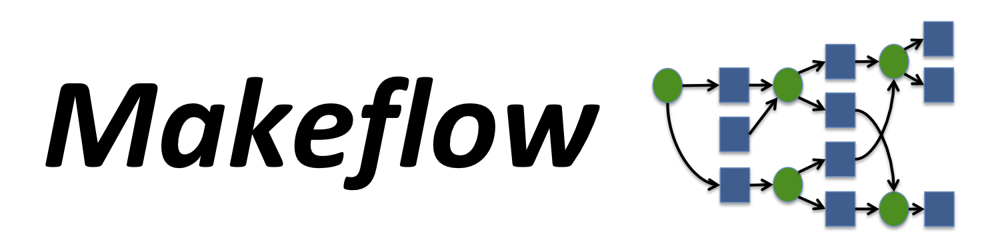

# Makeflow User's Manual

## Overview

Makeflow is a **workflow engine** for large scale distributed computing. It
accepts a specification of a large amount of work to be performed, and runs it
on remote machines in parallel where possible. In addition, Makeflow is
fault-tolerant, so you can use it to coordinate very large tasks that may run
for days or weeks in the face of failures. Makeflow is designed to be similar
to **Make** , so if you can write a Makefile, then you can write a
Makeflow.

Makeflow makes it easy to move a large amount of work from one facility to
another. After writing a workflow, you can test it out on your local laptop,
then run it at your university computing center, move it over to a national
computing facility like [ACCESS](http://www.access-ci.org), and then again to a
commercial cloud system. Using the (bundled) TaskVine system, you can even
run across multiple systems simultaneously. No matter where you run your
tasks, the workflow language stays the same.

Makeflow is used in production to support large scale problems in science and
engineering. Researchers in fields such as bioinformatics, biometrics,
geography, and high energy physics all use Makeflow to compose workflows from
existing applications.

Makeflow can send your jobs to a wide variety of services, such as batch
systems (HTCondor, UGE, SLURM, PBS, LSF, Torque), task executors (TaskVine, Work Queue),
cluster managers (Kubernetes), cloud services (Amazon EC2) and container environments like Docker
and Singularity. Details for each of those systems are given in the Batch
System Support section.

## Getting Started

### Installing

See the [Installation Instructions](../install/index.md) for the Cooperative Computing Tools package.  Then, Make sure to set your `PATH` appropriately.

### Basic Usage

A Makeflow workflow consists of a set of rules. Each rule specifies a set of
_output files_ to create, a set of _input files_ needed to create them, and a
_command_ that generates the target files from the source files.

Makeflow attempts to generate all of the output files in a workflow. It
examines all of the rules and determines which rules must run before others.
Where possible, it runs commands in parallel to reduce the execution time.

Makeflow suppose two ways of writing a workflow: classic Make and JX. Classic
Make is very easy to learn and get started, but but can very verbose when
writing large workflows. The [JX workflow language](../jx-workflow/jx-tutorial.md) is a
little more complex, but allows for more programmable construction of
workflows.

Here is an example workflow written in the classic Make language. It uses the
`convert` utility to make an animation. It downloads an image from the web,
creates four variations of the image, and then combines them back together
into an animation. The first and the last task are marked as LOCAL to force
them to run on the controlling machine.

```make
CURL=/usr/bin/curl
CONVERT=/usr/bin/convert
URL="http://ccl.cse.nd.edu/images/capitol.jpg"

capitol.anim.gif: capitol.jpg capitol.90.jpg capitol.180.jpg capitol.270.jpg capitol.360.jpg
    LOCAL $(CONVERT) -delay 10 -loop 0 capitol.jpg capitol.90.jpg capitol.180.jpg capitol.270.jpg capitol.360.jpg capitol.270.jpg capitol.180.jpg capitol.90.jpg capitol.anim.gif
    
capitol.90.jpg: capitol.jpg
    $(CONVERT) -swirl 90 capitol.jpg capitol.90.jpg
    
capitol.180.jpg: capitol.jpg
    $(CONVERT) -swirl 180 capitol.jpg capitol.180.jpg
    
capitol.270.jpg: capitol.jpg
    $(CONVERT) -swirl 270 capitol.jpg capitol.270.jpg
    
capitol.360.jpg: capitol.jpg
    $(CONVERT) -swirl 360 capitol.jpg capitol.360.jpg
    
capitol.jpg:
    LOCAL $(CURL) -o capitol.jpg $(URL)
```

(Note that Makeflow differs from Make in a few subtle ways, you can learn
about those in the Language Reference below.)

To try out the example above, copy and paste it into a file named
`example.makeflow`. To run it on your local machine:

```sh
$ makeflow example.makeflow
```

Note that if you run it a second time you will get the message:

`makeflow: nothing left to do`

as all of the files are already built.


Use the `--clean` option to clean everything up before trying it again:

```sh
$ makeflow --clean example.makeflow
```

If you have access to a batch system like Condor, UGE, or Torque, or a cloud
service provider like Amazon, you can direct Makeflow to run your jobs there
by using the `-T` option:

```sh
$ makeflow -T condor example.makeflow

$ makeflow -T uge example.makeflow

$ makeflow -T torque example.makeflow

$ makeflow -T amazon example.makeflow
```

To learn more about the various batch system options, see the [Batch System
Support section](#batch-system-support).


!!! warning
    You may have to slightly adapt the makeflow workflow file to work across different batch systems. This is because different batch systems have different expectations on whether the underlying filesystem is shared (e.g., Slurm and Torque), or not (e.g., HTCondor, TaskVine, and Work Queue). 

### JX Workflow Language

The classic make language is easy to learn and suitable for many purposes, but
it can get rather verbose for complex workflows. Makeflow also supports the JX
workflow language for expressing workflows in a more programmable way. To give
you an idea, here is how to quickly generate one thousand simulation jobs
using JX:

```json
{
    "rules": [
        {
            "command": "./simulate.py -n "+N+" > output."+N+".txt",
            "inputs": [ "simulate.py" ], "outputs": [ "output."+N+".txt" ],
        } for N in range(1,1000)
    ]
}
```

You can use the JX language with Makeflow by simply using
the `--jx` argument to any invocation. For example: `makeflow --jx example.jx -T condor`

Learn more about JX [here](../jx-workflow/index.md).


### Resources

Most batch systems require information about what resources each job needs, so
as to schedule them appropriately. You can convey this by setting the
variables CORES, MEMORY (in MB), and DISK (in MB), ahead
of each job. Makeflow will translate this information as needed to the
underlying batch system. For
example:

```make
CORES=4
MEMORY=1024
DISK=4000

output.txt: input.dat
    analyze input.dat > output.txt
```

### Monitoring

A variety of tools are available to help you monitor the progress of a
workflow as it runs. Makeflow itself creates a transaction log
(`example.makeflow.makeflowlog`) which contains details of each task as it
runs, tracking how many are idle, running, complete, and so forth. These tools
can read the transaction log and summarize the workflow:

  - `makeflow_monitor` reads the transaction log and produces a continuous
  display that shows the overall time and progress through the workflow:
```sh
$ makeflow example.makeflow
$ makeflow_monitor example.makeflow.makeflowlog
```

  - `makeflow_graph_log` will read the transaction log, and produce a timeline
    graph showing the number of jobs ready, running, and complete over time:
```sh
$ makeflow example.makeflow
$ makeflow_graph_log example.makeflow.makeflowlog example.png
```

  - `makeflow_viz` will display the workflow in graphical form, so that you can
    more easily understand the structure and dependencies. Read more about
    [Visualization](#visualization).

In addition, if you give the workflow a "project name" with the `-N` option,
it will report its status to the [catalog server](../catalog/index.md) once per
minute. The `makeflow_status` command will query the catalog and summarize
your currently running workloads, like this:

```sh
OWNER      PROJECT              JOBS   WAIT    RUN   COMP   ABRT   FAIL   TYPE
alfred     simulation           2263   2258      1      4      0      0 condor
betty      analysis             2260      1      1   2258      0      0   vine
```
    
### General Advice

A few key bits of advice address the most common problems encountered when
using Makeflow:

First, Makeflow works best when it has accurate information about each task
that you wish to run. Make sure that you are careful to indicate exactly which
input files each task needs, and which output files it produces.

Second, if Makeflow is doing something unexpected, you may find it useful to
turn on the debugging stream with the `-d all` option. This will emit all
sorts of detail about how each job is constructed and sent to the underlying
batch system.

When debugging failed tasks, it is often useful to examine any output
produced. Makeflow automatically saves these files in a
`makeflow.failed.$ruleno` directory for each failed rule. Only the specified
outputs of a rule will be saved. If the rule is retried and later succeeds,
the failed outputs will be automatically deleted.

Finally, Makeflow was created by the Cooperative Computing Lab at the
University of Notre Dame. We are always happy to learn more about how Makeflow
is used and assist you if you have questions or difficulty.

For the latest information about Makeflow, please visit our [web
site](http://ccl.cse.nd.edu/software/makeflow) and subscribe to our [mailing
list](http://ccl.cse.nd.edu/software) for more information.

## Batch System Support

Makeflow supports a wide variety of batch systems. Use `makeflow --help` to
see the current list supported. Generally speaking, simply run Makeflow with
the `-T` option to select your desired batch system. If no option is given,
then `-T local` is assumed.


!!! warning
    As mentioned before, different batch systems have different expectations on
    whether the underlying filesystem is shared. For example, one workflow may
    work with `-Tslurm`, but may fail with `-Tcondor`, etc. The most portable
    workflows read and write files from the working directory of each rule. If
    a rule depends on the creation of a directory, make this creation explicit,
    as the directory may not be present for the intermidate results on the site
    where the rule executes.

If you need to pass additional parameters to your batch system, such as
specifying a specific queue or machine category, use the `-B` option to
Makeflow, or set the `BATCH_OPTIONS` variable in your Makeflow file. The
interpretation of these options is slightly different with each system, as
noted below.

To avoid overwhelming a batch system with an enormous number of idle jobs,
Makeflow will limit the number of jobs sent to a system at once. You can
control this on the command line with the `--max-remote` option or the
`MAKEFLOW_MAX_REMOTE_JOBS` environment variable. Likewise, local execution can
be limited with `--max-local` and `MAKEFLOW_MAX_LOCAL_JOBS`.

### Local Execution

By default, Makeflow executes on the local machine. It will measure the
available cores, memory, and disk on the local machine, and then run as many
jobs as fit in those resources. (Of course, you must label your jobs with
`CORES`, `MEMORY`, and `DISK` appropriately. You can put an upper limit on the
resources used with the `--local-cores`, `--local-memory`, and `--local-disk`
options to Makeflow. Also, the total number of jobs running locally can be
limited with `--max-local`.

### HTCondor

If running Makeflow directly from the command line, simply use the `-T condor`
option to submit jobs to the [HTCondor](http://research.cs.wisc.edu/htcondor)
batch system.

If you have a long-running workflow, we recommend using
`condor_submit_makeflow` like this:

```sh
$ condor_submit_makeflow example.mf

Submitting example.mf as a background job to HTCondor...
Submitting job(s). 1 job(s) submitted to cluster 364.
Makeflow Output : makeflow.364.output
Makeflow Error : makeflow.364.error
Condor Log : makeflow.364.condorlog
```

This will cause Makeflow itself to be submitted as a batch job itself, so that
it can be monitored by HTCondor, allowing you to log out and return later to
check the status of the workflow. You will see both Makeflow and the jobs it
runs in the HTCondor queue:

```table
ID   OWNER  SUBMITTED   RUN_TIME    ST  PRI SIZE CMD
10.0 dthain 7/17 13:03  0+00:00:05  R   0   1.7  makeflow -T condor
11.0 dthain 7/17 13:03  0+00:00:00  I   0   0.0  condor.sh myjob -p 1
...
```

Makeflow will automatically generate a submit file for each job, so you don't
need to write one. However, if you would like to customize the Condor submit
file, use the `-B` option or `BATCH_OPTIONS` variable to specify text to add
to the submit file.

For example, if you want to add `Requirements` and `Rank` lines to your Condor
submit files, add this to your Makeflow:

```make
BATCH_OPTIONS="Requirements = (Memory>1024)"
```

### UGE - Univa Grid Engine / OGE - Open Grid Engine / SGE - Sun Grid Engine

Use the `-T uge` option to submit jobs to [Univa Grid Engine](http://www.univa.com/products/)
or its predecessors like Open Grid Scheduler or Sun Grid Engine. (`-T sge` is a synonym for backwards compatibility.)

As above, Makeflow will automatically generate `qsub` commands. Use the `-B`
option or `BATCH_OPTIONS` variable to specify text to add to the command line.
For example, to specify that jobs should be submitted to the `devel` queue:

```make
BATCH_OPTIONS="-q devel"
```


### PBS - Portable Batch System

Use the `-T pbs` option to submit jobs to the [Portable Batch
System](https://en.wikipedia.org/wiki/Portable_Batch_System) or compatible systems.

This will add the values for cores, memory, and disk. These values will be
added onto `qsub` in this format:  

```sh
-l nodes=1:ppn=${CORES},mem=${MEMORY}mb,file=${DISK}mb`
```

To remove resources specification at submission use the Makeflow option `--safe-submit-mode`.


### LSF - Load Sharing Facility

Use the `-T lsf` option to submit jobs to the [Load Sharing Facility](https://www.ibm.com/support/knowledgecenter/SSETD4/product_welcome_platform_lsf.html),
known previously as "Platform LSF" and now "IBM Spectrum LSF".

As above, Makeflow will automatically generate `bsub` commands to submit jobs.
For example, to submit a job requiring 4 cores, 64MB of memory, and an expected
runtime of 120 minutes, Makeflow will generate a command line like this:

```sh
bsub -J makeflow23 -n 4 -M 64MB -We 120 job.sh
```

If you have additional options peculiar to your local facility, use the `-B` option
to makeflow or the `BATCH_OPTIONS` variable to specify additional submission options.

### Torque Batch System

Use the `-T torque` option to submit jobs to the [Torque Resource
Manager](http://www.adaptivecomputing.com/products/open-source/torque) batch
system.

This will any of the values for cores, memory, disk, and wall-time defined.
These values will be added onto `qsub` in this format:  

```make
-l nodes=1:ppn=${CORES},mem=${MEMORY}mb,file=${DISK}mb
```

To remove resources specification at submission use Makeflow option `--safe-submit-mode`.


### SLURM - Simple Linux Resource Manager

Use the `-T slurm` option to submit jobs to the
[SLURM](http://slurm.schedmd.com) batch system.

This will add the values for cores and memory. These values will be added onto
`sbatch` in this format:  

```sh
-N 1 -n 1 -c ${CORES} --mem=${MEMORY}M --time=${WALL_TIME_in_minutes}
```

Note that slurm expects this time to be in minutes, while makeflow expects
WALL_TIME to be in seconds. You should specify `.MAKEFLOW WALL_TIME` in seconds, and
makeflow will round-up this value to minutes when submiting the job.

To remove resources specification at submission use Makeflow option `--safe-submit-mode`.

Disk is not specifies as a shared file system is assumed. The only available
disk command line option is `--tmp`, which governs temporary disk space. This
may have unintended limitations on available machines as temporary disk is
highly dependent on host site.

Note: Some SLURM sites disallow specifying memory (example Stampede2). To
avoid specification errors the Makeflow option `--ignore-memory-spec` removes
memory from `sbatch`.


#### SLURM and MPI jobs

If your rules should run as an MPI jobs, you can set the environment variables
"MPI_PROCESSES" and "CORES", or alternatively, use the makeflow directives
".MAKEFLOW MPI_PROCESSES" and ".MAKEFLOW CORES". The value of MPI_PROCESSES
sets the number of MPI processes the rule should spawn, and it should exactly
divide the value of CORES. The value of sbatch used is something similar to:

```sh
-N 1 -n ${MPI_PROCESSES} -c ${CORES_divided_by_MPI_PROCESSES} --mem=${MEMORY}M
```

Further, the commands in your rules should be prepended with the `srun` command
appropiate to your prefered MPI API, for example, here is a rule that uses 4
MPI process, with 2 CORES each, using the `pmi2` API:

```make
.MAKEFLOW MPI_PROCESSES 4
.MAKEFLOW CORES 8

output: input
    srun --mpi=pmi2 -- ./my-mpi-job -i input -o output
```

Some installations may require a queue and time limit specifications. Since
both `sbatch` (used internally by makeflow), and `srun` require these options,
the environment variable can be used in the following way:

```make
# Setting queue and time limit needed as in xsede stampede2:
BATCH_OPTIONS=-pnormal -t900
.MAKEFLOW MPI_PROCESSES 4
.MAKEFLOW CORES 8

output: input
    srun $(BATCH_OPTIONS) --mpi=pmi2 -- ./my-mpi-job -i input -o output
```


### Moab Scheduler

Use the `-T moab` option to submit jobs to the Moab scheduler or compatible
systems.

### Kubernetes

Makeflow can be run on [Kubernetes](https://kubernetes.io/) cluster. To run
Makeflow with Kubernetes, give the batch mode via `-T k8s` and indicate the
desired Docker image with the `--k8s-image` option. The Kubernetes mode is
depend on kubectl, before starting Makeflow, make sure kubectl has been
[installed and correctly set up](https://kubernetes.io/docs/tasks/tools/install-kubectl/) to access the
desired Kubernetes cluster.

Following is an example of running Makeflow on a Kubernetes cluster using
centos image.

```sh
$ makeflow -T k8s --k8s-image "centos" example.makeflow
```


### Amazon Web Services

Makeflow can be configured to run jobs remotely on Amazon Web Services. For
each job in the workflow, a new virtual machine will be created, the job will
run on the virtual machine, and then the virtual machine will be destroyed.

You will need to do some one-time setup first:

1. Create an account with [Amazon Web Services](http://aws.amazon.com), and test it out by creating and deleting some virtual machines manually. 

* Install the [AWS Command Line Interace](http://docs.aws.amazon.com/cli/latest/userguide/installing.html) on the machine where you will run Makeflow. 

* Add the `aws` command to your PATH.

* Run `aws configure` and enter your AWS Access Key ID, your AWS Secret Access Key, your preferred region name and json output format. (The keys can be obtained from the AWS web page by going to your profile menu, selecting "My Security Credentials" and then "Access Keys". You may need to create a new access key.)

* Test that the command-line tool is working by entering: `aws ec2 describe-hosts ` Which should display: `{ "Hosts": [] }`

Now you are ready to use Makeflow with Amazon. Before running a workflow, use
the `makeflow_ec2_setup` command, which will setup a virtual private cluster,
security group, keypairs, and other necessary details, and store the necessary
information into `my.config`.

Give the name of the default [Amazon Machine Image (AMI)](https://console.aws.amazon.com/ec2/v2/home?#Images) you wish to
use as the second argument:

```sh
$ makeflow_ec2_setup my.config ami-343a694f
```

and then

```sh
$ makeflow -T amazon --amazon-config my.config ...
```

to use the configuration you just created. You can run multiple workflows using
a single configuration.  Intances are reused between makeflow jobs.

When you are done, terminate created instances and destroy 
the configuration with this command: `makeflow_ec2_cleanup my.config `

Makeflow selects the virtual machine instance type automatically by translating
the job resources into an appropriate instance type of the `c4` or `m4`
category. For example, a job requiring `CORES=2` and `MEMORY=8000` will be
placed into an `m4.large` instance type. If you do not specify any resources
for a job, then it will be placed into a `t2.micro` instance, which has very
limited performance. To get good performance, you should label your jobs
with the appropriate `CORES` and `MEMORY`.

You can override the choice of virtual machine instance type, as well as the
choice of virtual machine image (AMI) within the Makeflow on a job-by-job
basis by setting the `AMAZON_INSTANCE_TYPE` and `AMAZON_AMI` environment
variables within the Makeflow file. For example:

```sh
$ export AMAZON_INSTANCE_TYPE=m4.4xlarge export AMAZON_AMI=ami-343a694f
```

### Generic Cluster Submission

For clusters that are not directly supported by Makeflow we strongly suggest
using the [TaskVine](../taskvine/index.md) system and
submitting workers via the cluster's normal submission mechanism.

However, if you have a system similar to Torque, UGE, or PBS which submits
jobs with commands like "qsub", you can inform Makeflow of those commands and
use the `cluster` driver. For this to work, it is assumed there is a
distributed filesystem shared (like NFS) shared across all nodes of the
cluster.

To configure a custom driver, set the following environment variables:

  * `BATCH_QUEUE_CLUSTER_NAME` The name of the cluster, used in debugging messages and as the name for the wrapper script.
  * `BATCH_QUEUE_CLUSTER_SUBMIT_COMMAND` The submit command for the cluster (such as qsub or msub)
  * `BATCH_QUEUE_CLUSTER_SUBMIT_OPTIONS` The command-line arguments that must be passed to the submit command. This string should end with the argument used to set the name of the task (usually -N).
  * `BATCH_QUEUE_CLUSTER_REMOVE_COMMAND` The delete command for the cluster (such as qdel or mdel)

These will be used to construct a task submission for each makeflow rule that consists of:

```sh
$SUBMIT_COMMAND $SUBMIT_OPTIONS $CLUSTER_NAME.wrapper "<rule commandline>"
```

The wrapper script is a shell script that reads the command to be run as an
argument and handles bookkeeping operations necessary for Makeflow.


## Using TaskVine

### Overview

As described so far, Makeflow translates each job in the workflow into a single
submission to the target batch system. This works well as long as each job is
relatively long running and does not perform a large amount of I/O.  However, if
each job is relatively short, the workflow may run very slowly, because it can
take 30 seconds or more for the batch system to start an individual job. If
common files are needed by each job, they may end up being transferred to the
same node multiple times.

To get around these limitations, we provide the [TaskVine](../taskvine/index.md) system.
The basic idea is
to submit a number of persistent "worker" processes to an existing batch
system. Makeflow communicates directly with the workers to quickly dispatch
jobs and cache data, rather than interacting with the underlying batch system.
This accelerates short jobs and exploits common data dependencies between
jobs.

To begin, let's assume that you are logged into the head node of your cluster,
called `head.cluster.edu` Run Makeflow in TaskVine mode like this:

```sh
$ makeflow -T vine example.makeflow
```

Then, submit 10 worker processes to Condor like this:

```sh
$ vine_submit_workers -T condor head.cluster.edu 9123 10

10 Submitting job(s)..........
Logging submit event(s)..........
10 job(s) submitted to cluster 298.
```

Or, submit 10 worker processes to UGE like this:

```sh
$ vine_submit_workers -T uge head.cluster.edu 9123 10
```

Or, you can start workers manually on any other machine you can log into:

```sh
$ vine_worker head.cluster.edu 9123
```

Once the workers begin running, Makeflow will dispatch multiple tasks to each
one very quickly. If a worker should fail, Makeflow will retry the work
elsewhere, so it is safe to submit many workers to an unreliable system.

When the workflow completes, your workers will still be available, so you can
either run another Makeflow with the same workers, remove them from the batch
system, or wait for them to expire. If you do nothing for 15 minutes, they
will automatically exit.

Note that `vine_submit_workers` is a simple shell script,
so you can edit it directly if you would like to change batch
options or other details. Please refer to the [TaskVine manual ](../taskvine/index.md) for more details.

### Port Numbers

Makeflow listens on a port which the remote workers would connect to. The
default port number is 9123. Sometimes, however, the port number might be not
available on your system. You can change the default port via the `-p` option.
For example, if you want the manager to listen on port 9567 by default, you can
run the following command:

```sh
$ makeflow -T vine -p 9567 example.makeflow
```

### Project Names

If you do not like using port numbers, an easier way to match workers to
managers is to use a project name. You can give each manager a project name with
the -N option.

```sh
$ makeflow -T vine -N MyProject example.makeflow
```

The -N option gives the manager a project name called `MyProject`, and will
cause it to advertise its information such as the project name, running status,
hostname and port number, to a default globally available catalog server. Then
a worker can simply identify the workload by its project name.

To start a worker that automatically finds the manager named __MyProject__ via the default
catalog server:

```sh
$ vine_worker -N MyProject
```

You can also give multiple `-N` options to a worker. The worker will find out
which ones of the specified projects are running from the catalog server and
randomly select one to work for. When one project is done, the worker would
repeat this process. Thus, the worker can work for a different manager without
being stopped and given the different hostname and port of the manager. An example
of specifying multiple projects:

```sh
$ vine_worker -N proj1 -N proj2 -N proj3
```

In addition to creating a project name using the -N option, this will also
trigger automatic reporting to the designated catalog server. The Port and
Server address are taken from the environment variables **CATALOG_HOST** and
**CATALOG_PORT**. If either variable is not set, then the addresses
`catalog.cse.nd.edu,backup-catalog.cse.nd.edu` and port `9097` will be used.

It is also easy to run your own catalog server, if you prefer. For more
details, see the [Catalog Server Manual](../catalog/index.md).

### Setting a Password

We recommend that anyone using the catalog server also set a password. To do
this, select any password and write it to a file called `mypwfile`. Then, run
Makeflow and each worker with the `--password` option to indicate the password
file:

```sh
$ makeflow --password mypwfile ...
$ vine_worker --password mypwfile ...
```

### SSL Encryption

We also recommend the use of SSL for encrypting the manager-worker connection
when operating on a wide area network.

If you do not have a key and certificate at hand, but you want the
communications to be encrypted, you can create your own key and certificate like this:

```sh
openssl req -x509 -newkey rsa:4096 -keyout MY_KEY.pem -out MY_CERT.pem -sha256 -days 365 -nodes
```

To activate SSL encryption, indicate the paths to the key and certificate when
running `makeflow` as well as the workers:

```sh
$ makeflow --ssl-key MY_KEY.pem --ssl-cert MY_CERT.pem ...
$ vine_worker --ssl ...
```

## Container Environments

Makeflow can interoperate with a variety of container technologies, including
Docker, Singularity, and Umbrella. In each case, you name the container image
on the command line, and then Makeflow will apply it to each job by creating
the container, loading (or linking) the input files into the container,
running the job, extracting the output files, and deleting the container.

Note that container specification is independent of batch system selection.
For example, if you select HTCondor execution with `-T condor` and Docker
support with `--docker`, then Makeflow will submit HTCondor batch jobs, each
consisting of an invocation of `docker` to run the job. You can switch to any
combination of batch system and container technology that you like.

### Docker

If you have the Docker container enviornment installed on your cluster,
Makeflow can be set up to place each job in your workflow into a Docker
container. Invoke Makeflow with the `--docker` argument followed by the
container image to use. Makeflow will ensure that the named image is pulled
into each Docker node, and then execute the task within that container. For
example, `--docker debian` will cause all tasks to be run in the container
name `debian`.

Alternatively, if you have an exported container image, you can use the
exported image via the `--docker-tar` option. Makeflow will load the container
into each execution node as needed. This allows you to use a container without
pushing it to a remote repository.

### Singularity

In a similar way, Makeflow can be used with the Singularity container system.
When using this mode, Singularity will take in an image, set up the container,
and runs the command inside of the container. Any needed input files will be
read in from Makeflow, and created files will be delivered by Makeflow.

Invoke Makeflow with the `--singularity` argument, followed by the path to the
desired image file. Makeflow will ensure that the named image will be
transferred to each job, using the appropriate mechanism for that batch system

### Umbrella

Makeflow allows the user to specify the execution environment for each rule
via its `--umbrella-spec` and `--umbrella-binary` options. The `--umbrella-
spec` option allows the user to specify an Umbrella specification, the
`--umbrella-binary` option allows the user to specify the path to an Umbrella
binary. Using this mode, each rule will be converted into an Umbrella job, and
the specified Umbrella specification and binary will be added into the input
file list of a job.

To test makeflow with umbrella using local execution engine:

```sh
$ makeflow --umbrella-binary
$ $(which umbrella) --umbrella-spec convert_S.umbrella example.makeflow
```

To test makeflow with umbrella using vine execution engine:

```sh
$ makeflow -T vine --umbrella-binary
$ $(which umbrella) --umbrella-spec convert_S.umbrella example.makeflow
```

To run each makeflow rule as an Umbrella job, the `--umbrella-spec` must be
specified. However, the `--umbrella-binary` option is optional: when it is
specified, the specified umbrella binary will be sent to the execution node;
when it is not specified, the execution node is expected to have an umbrella
binary available through the `$PATH` environment variable.

Makeflow also allows the user to specify the umbrella log file prefix via its
`--umbrella-log-prefix` option. The umbrella log file is in the format of ".".
The default value for the `--umbrella-log-prefix` option is ".umbrella.log".

Makeflow also allows the user to specify the umbrella execution mode via its
`--umbrella-mode` option. Currently, this option can be set to the following
three modes: local, parrot, and docker. The default value of the `--umbrella-
mode` option is local, which first tries to utilize the docker mode, and tries
to utilize the parrot mode if the docker mode is not available.

You can also specify an Umbrella specification for a group of rule(s) in the
Makefile by putting the following directives before the rule(s) you want to
apply the Umbrella spec to:

```make
.MAKEFLOW CATEGORY 1 .UMBRELLA SPEC convert_S.umbrella
```

In this case, the specified Umbrella spec will be applied to all the following
rules until a new `.MAKEFLOW CATEGORY ...` directive is declared. All the
rules before the first `.MAKEFLOW CATEGORY ...` directive will use the
Umbrella spec specified by the `--umbrella-spec` option. If the `--umbrella-
spec` option is not specified, these rules will run without being wrapped by
Umbrella.

### Wrapper Commands

Makeflow allows a global wrapper command to be applied to every rule in the
workflow. This is particularly useful for applying troubleshooting tools, or
for setting up a global environment without rewriting the entire workflow. The
`--wrapper` option will prefix a command in front of every rule, while the
`--wrapper-input` and `--wrapper-output` options will specify input and output
files related to the wrapper.

A few special characters are supported by wrappers. If the wrapper command or
wrapper files contain two percents (`%%`), then the number of the current rule
will be substituted there. If the command contains curly braces (`{}`) the
original command will be substituted at that point. Square brackets (`[]`) are
the same as curly braces, except that the command is quoted and escaped before
substitution. If neither specifier is given, Makeflow appends `/bin/sh -c []`
to the wrapper command.

For example, suppose that you wish to shell builtin command `time` to every
rule in the workflow. Instead of modifying the workflow, run it like this:

```sh
$ makeflow --wrapper 'time -p' example.makeflow
```

Since the preceding wrapper did not specify where to substitute the command,
it is equivalent to

```sh
$ makeflow --wrapper 'time -p /bin/sh -c []' example.makeflow
```

This way, if a single rule specifies multiple commands, the wrapper will time
_all_ of them.

The square brackets and the default behavior of running commands in a shell
were added because Makeflow allows a rule to run multiple commands. The curly
braces simply perform text substitution, so for example

```sh
$ makeflow --wrapper 'env -i {}' example.makeflow
```

does not work correctly if multiple commands are specified. For example:

```make
target_1: source_1
    command_1; command_2; command_3
```

will be executed as `env -i command_1; command_2; command_3`, which it is
likely not what you want.  Notice that only `command_1`'s environment will be
cleared; subsequent commands are not affected. Thus this wrapper should be
given as

```sh
$ makeflow --wrapper 'env -i /bin/sh -c []' example.makeflow
```

or more succinctly as 

```sh
$ makeflow --wrapper 'env -i' example.makeflow
```

Suppose you want to apply `strace` to every rule, to obtain system call
traces. Since every rule would have to have its own output file for the trace,
you could indicate output files like this:

```sh
$ makeflow --wrapper 'strace -o trace.%%' --wrapper-output 'trace.%%' example.makeflow
```

Suppose you want to wrap every command with a script that would set up an
appropriate Java environment. You might write a script called `setupjava.sh`
like this:

```sh
#!/bin/sh export JAVA_HOME=/opt/java-9.8.3.6.7 export
PATH=${JAVA_HOME}/bin:$PATH echo "using java in $JAVA_HOME" exec "$@"
```

And then invoke Makeflow like this:

```sh
$ makeflow --wrapper ./setupjava.sh --wrapper-input setupjava.sh example.makeflow
```

## Advanced Features

### Shared File Systems

By default, Makeflow does _not_ assume that your cluster has a shared
filesystem like NFS or HDFS, and so, to be safe, it copies all necessary
dependencies for each job. However, if you do have a shared filesystem, it can
be used to efficiently access files without making remote copies. Makeflow
must be told where the shared filesystem is located, so that it can take
advantage of it. To enable this, invoke Makeflow with the ` --shared-fs`
option, indicating the path where the shared filesystem is mounted. (This
option can be given multiple times.) Makeflow will then verify the existence
of input and output files in these locations, but will not cause them to be
transferred.

For example, if you use NFS to access the `/home` and `/software` directories
on your cluster, then invoke makeflow like this:

```sh
$ makeflow --shared-fs /home --shared-fs /software example.makeflow ...
```

### NFS Consistency Delay

After a job completes, Makeflow checks that the expected output files were
actually created. However, if the output files were written via NFS (or
another shared filesystem), it is possible that the outputs may not be visible
for a few seconds. This is due to caching and buffering effects in many
filesystems.

If you experience this problem, you can instruct Makeflow to retry the output
file check for a limited amount of time, before concluding that the files are
not there. Use the `--wait-for-files-upto` option to specify the number of
seconds to wait.

### Mounting Remote Files

It is often convenient to separate the _logical_ purpose of a file from it's
_physical location_. For example, you may have a workflow which makes use of a
large reference database called ` ref.db` which is a standard file downloaded
from a common data repository whenever needed.

Makeflow allows you to map logical file names within the workflow to arbitrary
locations on disk, or downloaded from URLs. This is accomplished by writing a
"mount file" in which each line lists a logical file name and its physical
location.

Here is an example of a mountfile:

```sh
curl        /usr/bin/curl
convert     ../bin/convert
data/file1  /home/bob/input1
1.root      http://myresearch.org/1.root
```

Then, simply execute Makeflow with the `--mounts` option to apply the desred
mountfile:

```sh
$ makeflow --mounts my.mountfile example.makeflow ...
```

Before execution, Makeflow first parses each line of the mountfile when the
`--mounts` option is set, and copies the specified dependency from the
location specified by `source` field into a local cache, and then links the
`target` to the item under the cache. Makeflow also records the location of
the local cache and the info (source, target, filename under the cache dir,
and so on) of each dependencies specified in the mountfile into its log.

To cleanup a makeflow together with the local cache and all the links created
due to the mountfile:

```sh
$ makeflow -c example.makeflow
```

By default, makeflow creates a unique directory under the current working
directory to hold all the dependencies introduced by the mountfile. This
location can be adjusted with the `--cache-dir` option.

To only cleanup the local cache and all the links created due to the
mountfile:

```sh
$ makeflow -ccache example.makeflow
```

To limit the behavoir of a makeflow inside the current working directory, the
`target` field should satisfy the following requirements:

  * the target path should not exist;
  * the target path should be relative;
  * the target path should not include any symbolic links; (For example, if the target path is `a/b/c/d`, then `a`, `b`, `c` should not be symbolic links.) This avoids the makeflow leaving the current working directory through symbolic links.
  * the target path should not include doubledots (`..`) to limit makeflow to the current working directory. For example, `a/../b` is an invalid target, however, `a/b..c/d` is a valid target. 
  * the target path should be the same with its usage in Makeflow makefiles. For example, the target path for the path `./mycurl` from a makefile must also be `./mycurl`, can not be `mycurl`. 

The `source` field can be a local file path or a http URL. When a local file
path is specified, the following requirements should be satisfied:

  * the source path should exist;
  * the source path can be relative or absolute;
  * the source path can include doubledots (`..`);
  * the source path should only be regular files, directories, and symbolic links;
  * the source path should not be any ancestor directory of the target to avoid infinite loop;

To limit the behavoir of a makeflow inside the current working directory, the
`cache_dir` should satisfy the following requirements:

  * the cache_dir path should be a relative path;
  * the cache_dir path should not include any symbolic link; (For example, if the cache_dir path is `a/b/c/d`, then `a`, `b`, `c` should not be symbolic link.) This limitation aims to avoid the makeflow leaving the current working directory through symbolic links.
  * the cache_dir path should not include doubledots (`..`) to limit the behavoir of the makeflow within the current working directory. For example, `a/../b` is an invalid cache_dir, however, `a/b..c/d` is a valid cache_dir. 

### Garbage Collection

As the workflow execution progresses, Makeflow can automatically delete
intermediate files that are no longer needed. In this context, an intermediate
file is an input of some rule that is the target of another rule. Therefore,
by default, garbage collection does not delete the original input files, nor
**final** target files.

Which files are deleted can be tailored from the default by appending files to
the Makeflow variables `MAKEFLOW_INPUTS` and `MAKEFLOW_OUTPUTS`. Files added
to `MAKEFLOW_INPUTS` augment the original inputs files that should not be
deleted. `MAKEFLOW_OUTPUTS` marks final target files that should not be
deleted. However, different from `MAKEFLOW_INPUTS`, files specified in
`MAKEFLOW_OUTPUTS` does not include all output files. If `MAKEFLOW_OUTPUTS` is
not specified, then all files not used in subsequent rules are considered
outputs. It is considered best practice to always specify
`MAKEFLOW_INPUTS/OUTPUTS` to clearly specify which files are considered inputs
and outputs and allow for better space management if garbage collection is
used.

Makeflow offers two modes for garbage collection: reference count, and on
demand. With the reference count mode, intermediate files are deleted as soon
as no rule has them listed as input. The on-demand mode is similar to
reference count, only that files are deleted until the space on the local file
system is below a given threshold.

To activate reference count garbage collection:

```sh
$ makeflow -gref_cnt
```

To activate on-demand garbage collection, with a threshold of 500MB:

```sh
$ makeflow -gon_demand -G500000000
```

### Visualization

There are several ways to visualize both the structure of a Makeflow as well
as its progress over time. `makeflow_viz` can be used to convert a Makeflow
into a file that can be displayed by [Graphviz DOT](http://www.graphviz.org)
tools like this:

```sh
$ makeflow_viz -D dot example.makeflow > example.dot
$ dot -Tgif < example.dot > example.gif
```

Or use a similar command to generate a [Cytoscape](http://www.cytoscape.org)
input file. (This will also create a Cytoscape `style.xml` file.)

```sh
$ makeflow_viz -D cyto example.makeflow > example.xgmml
```

To observe how a makeflow runs over time, use `makeflow_graph_log` to convert
a log file into a timeline that shows the number of tasks ready, running, and
complete over time:

```sh
$ makeflow_graph_log example.makeflowlog example.png
```

### Archiving Jobs

**Makeflow** allows for users to archive the results of each job within a
specified archive directory. This is done using the `--archive` option, which
by default creates an archiving directory at `/tmp/makeflow.archive.$UID`.
Both files and jobs are stored as the workflow executes. `Makeflow` will also
check to see if a job has already been archived into the archiving directory,
and if so the outputs of the job will be copied to the working directory and
the job will skip execution.

```sh
$ makeflow --archive example.makeflow
```

To only write to the archiving directory (and ensure that all nodes will be
executed instead), pass `--archive-write`. To only read from the archive and
use the outputs of any archived job, pass `--archive-read`. To specify a
directory to use for the archiving directory, give an optional argument as
shown below

```sh
$ makeflow --archive=/path/to/directory/ example.makeflow
```

The archive also has an option to upload and download workflow contents from
and Amazon Web Services S3 bucket. This is done using the `--archive-s3`
option, which by default uploads/downloads from the S3 bucket name
`makeflows3archive`. `Makeflow` will also check to see if files have already
been uploaded to the S3 bucket so files are not uploaded twice, wasting time.
Archiving with Amazon S3 utilizes the same functionality that the regular
archive tool uses locally with copying files to and from
`/tmp/makeflow.archive.$UID`. The user will need to make sure that their aws
key id and secret key are stored within the credentials file that is provided
when you configure AWS.

```sh
$ makeflow --archive-s3= Amazon S3 Bucket Name
```

If you do not want to check to see if files exist when uploading you can use
the other option `--archive-s3-no-check`, which has the same default S3 bucket
and options to change the bucket name.

```sh
$ makeflow --archive-s3-no-check= Amazon S3 Bucket Name
```

### Linking Dependencies

**Makeflow** provides a tool to collect all of the dependencies for a given
workflow into one directory. By collecting all of the input files and programs
contained in a workflow it is possible to run the workflow on other machines.

Currently, **Makeflow** copies all of the files specified as dependencies by the
rules in the makeflow file, including scripts and data files. Some of the
files not collected are dynamically linked libraries, executables not listed
as dependencies (`python`, `perl`), and configuration files (`mail.rc`).

To avoid naming conflicts, files which would otherwise have an identical path
are renamed when copied into the bundle:

  * All file paths are relative to the top level directory.
  * The makeflow file is rewritten with the new file locations and placed in the top level directory.
  * Files originally specified with an absolute path are placed into the top level directory.
  * Files with the same path are appended with a unique number

Example usage:

```sh
$ makeflow_analyze -b some_output_directory example.makeflow
```

## Technical Reference

### Language Reference

The Makeflow language is very similar to Make, but it does have a few
important differences that you should be aware of.

#### Get the Dependencies Right

You must be careful to accurately specify **all of the files that a rule
requires and creates** , including any custom executables. This is because
Makeflow requires all these information to construct the environment for a
remote job. For example, suppose that you have written a simulation program
called `mysim.exe` that reads `calib.data` and then produces and output file.
The following rule won't work, because it doesn't inform Makeflow what input files
are neded to execute the simulation:

```make
# This is an incorrect rule:
output.txt:
    ./mysim.exe -c calib.data -o output.txt
```

However, the following is correct, because the rule states all of the files
needed to run the simulation. **Makeflow** will use this information to construct
a batch job that consists of `mysim.exe` and `calib.data` and uses it to
produce `output.txt`:

```make
# This is a correct rule.
output.txt: mysim.exe calib.data
    ./mysim.exe -c calib.data -o output.txt
```

Note that when a directory is specified as an input dependency, it means that
the command relies on the directory and all of its contents. So, if you have a
large collection of input data, you can place it in a single directory, and
then simply give the name of that directory.

#### No Phony Rules

For a similar reason, you cannot have "phony" rules that do not actually create
the specified files. For example, it is common practice to define a `clean`
rule in Make that deletes all derived files. This does not make sense in
Makeflow, because such a rule does not actually create a file named `clean`.
Instead use the `-c` option as shown above.

#### Just Plain Rules

Makeflow does not support all of the syntax that you find in various versions
of Make. Each rule must have exactly one command to execute. If you have
multiple commands, simply join them together with semicolons. Makeflow allows
you to define and use variables, but it does not support pattern rules,
wildcards, or special variables like `$<` or `$@`. You simply have to write
out the rules longhand, or write a script in your favorite language to
generate a large Makeflow.

#### Local Job Execution

Certain jobs don't make much sense to distribute. For example, if you have a
very fast running job that consumes a large amount of data, then it should
simply run on the same machine as Makeflow. To force this, simply add the word
`LOCAL` to the beginning of the command line in the rule.

#### Rule Lexical Scope

Variables in Makeflow have global scope, that is, once defined, their value
can be accessed from any rule. Sometimes it is useful to define a variable
locally inside a rule, without affecting the global value. In Makeflow, this
can be achieved by defining the variables after the rule's requirements, but
before the rule's command, and prepending the name of the variable with `@`,
as follows:

```make
SOME_VARIABLE=original_value
target_1: source_1
    command_1
    
target_2: source_2
    SOME_VARIABLE=local_value_for_2
    command_2 target_3: source_3 command_3
```

In this example, SOME_VARIABLE has the value `original_value` for rules 1 and
3, and the value `local_value_for_2` for rule 2.

#### Environment Variables

Environment variables can be defined with the `export` keyword inside a
workflow. Makeflow will communicate explicitly named environment variables to
remote batch systems, where they will override whatever local setting is
present. For example, suppose you want to modify the PATH for every job in the
makeflow: `export PATH=/opt/tools/bin:${PATH}` If no value is given, then the
current value of the environment variable is passed along to the job, as in:

```make
export USER
```

#### Remote File Renaming⇗

When the underlying batch system supports it, Makeflow supports "Remote
Renaming" where the name of a file in the execution sandbox is different than
the name of the same file in the DAG. This is currently supported by the
TaskVine, Work Queue, HTCondor, and Amazon batch systems.

For example, `local_name->remote_name` indicates that the file `local_name` is
called `remote_name` in the remote system. Consider the following example:

```make
b: a myprog
    LOCAL myprog a > b
    
c->out: a->in1 b myprog->prog
    prog in1 b > out
```

The first rule runs locally, using the executable `myprog` and the local file
`a` to locally create `b`. The second rule runs remotely, but the
remote system expects `a` to be named `in1`, `c`, to be named `out` and
so on. Note we did not need to rename the file `b`. Without remote
file renaming, we would have to create either a symbolic link, or a copy of
the files with the expected correct names.

#### Nested Makeflows

One Makeflow can be nested inside of another by writing a rule with the
following syntax: `output-files: input-files MAKEFLOW makeflow-file [working-
dir] ` The input and output files are specified as usual, describing the files
consumed and created by the child makeflow as a whole. Then, the `MAKEFLOW`
keyword introduces the child makeflow specification, and an optional working
directory into which the makeflow will be executed. If not given, the current
working directory is assumed.

### Resources and Categories

Makeflow has the capability of automatically setting the cores, memory, and
disk space requirements to the underlying batch system.
(This works with TaskVine, WorkQueue, and HTCondor.)
Jobs are grouped into _job categories_ , and jobs in the same category have the same cores, memory, and disk requirements.

Job categories and resources are specified with variables. Jobs are assigned
to the category named in the value of the variable `CATEGORY`. Likewise, the
values of the variables `CORES`, `MEMORY` (in MB), and `DISK` (in MB) describe the
resources requirements for the category specified in `CATEGORY`.

Jobs without an explicit category are assigned to `default`. Jobs in the
default category get their resource requirements from the value of the
environment variables `CORES`, `MEMORY`, and `DISK`.

Consider the following example:

```make
# These tasks are assigned to the category preprocessing.
# MEMORY and CORES are read from the environment, if defined.

CATEGORY="preprocessing"
DISK=500

one: src
    cmd

two: src
    cmd
    
# These tasks have the category "simulation". Note that now CORES, MEMORY, and
# DISK are specified.

CATEGORY="simulation"
CORES=1
MEMORY=400
DISK=400

three: src
    cmd

four: src
    cmd
    
# Another category switch. MEMORY is read from the environment.
CATEGORY="analysis"
CORES=4
DISK=600

five: src
    cmd
```

Setting the `MEMORY` in the environment as

```sh
$ export MEMORY=800
$ makeflow ...
```

we get the following resources assignments per category:

Category| Cores| Memory (MB)| Disk (MB)  
---|---|---|---  
preprocessing  |  (unspecified)  |  800 (from environment)  |  500  
simulation  |  1  |  400  |  400  
analysis  |  4  |  800 (from environment) |  600  
  

### Transaction Log

As Makeflow runs, it creates a _transaction log_ that records the details of
each job, where it was sent, how long it ran, and what resources it consumed.
By default, this log is named ` X.makeflowlog` where X is the name of the
original makeflow file.

The transaction log serves several purposes:

  1. **Recovery.** The transaction log allows Makeflow to continue where it left off. If you must restart Makeflow after a crash, it will read the transaction log, determine what jobs are complete (or still running) and then continue forward from there. 
  2. **Cleanup.** The ` --clean` option relies on the transaction log to quickly determine exactly which files have been created and which jobs have been submitted, so that they can be quickly and precisely deleted and removed. (There is no need to create a `clean` rule by hand, as you would in traditional Make.) 
  3. **Monitoring.** Tools like ` makeflow_monitor` and `makeflow_graph_log` read the transaction log to determine the current state of the workflow and display it to the user. 

Each line in the log file represents a single action taken on a single rule in
the workflow. For simplicity, rules are numbered from the beginning of the
Makeflow, starting with zero. Each line contains the following items:

  * **timestamp** \- the unix time (in microseconds) when this line is written to the log file. 
  * **task id** \- the id of this n. 
  * **new state** \- a integer represents the new state this task (whose id is in the task_id column) has just entered. The value of the integer ranges from 0 to 4 and the states they are representing are:
    0. waiting 
    1. running 
    2. complete 
    3. failed 
    4. aborted 
  * **job id** \- the underline execution system is a batch system, such as Condor or UGE, the job id would be the job id assigned by the batch system when the task was sent to the batch system for execution.
  * **tasks waiting** \- the number of tasks are waiting to be executed.
  * **tasks running** \- the number of tasks are being executed.
  * **tasks complete** \- the number of tasks has been completed.
  * **tasks failed** \- the number of tasks has failed.
  * **tasks aborted** \- the number of tasks has been aborted.
  * **task id_counter** \- total number of tasks in this Makeflow

In addition, lines starting with a pound sign are comments and contain
additional high-level information that can be safely ignored. The transaction
log begins with a comment to indicate the starting time, and ends with a
comment indicating whether the entire workflow completed, failed, or was
aborted.

Aside from the high-level information, file states are also recorded in the
log. This allows for tracking files throughout the workflow execution. This
information is shown starting with the `#`:

`# FILE timestamp filename state size`


Each file state line records the state change and time:

  * **timestamp** \- the unix time (in microseconds) when this line is written to the log file. 
  * **filename** \- the file name given in the rule specification of Makeflow.
  * **state** \- the integer represents the new state this file has just entered. The value of the integer ranges from 0 to 4 and the states they are representing are:
    0. unknown 
    1. expect 
    2. exists 
    3. complete 
    4. delete 
  * **size** \- the file size in bytes, either on disk (states 2,3), or hinted (states 0,1).


```sh
# FILE 1559838621414397 example.makeflow.wqlog 1 0
# FILE 1559838621415289 example.makeflow.wqlog.tr 1 0
# STARTED 1559838621415323
# FILE 1559838621416244 capitol.jpg 1 1073741824
1559838621416490 5 1 30122 5 1 0 0 0 6
# FILE 1559838621624487 capitol.jpg 2 51274
1559838621624514 5 2 30122 5 0 1 0 0 6
# FILE 1559838621624543 capitol.360.jpg 1 1073741824
1559838621624608 4 1 1 4 1 1 0 0 6
# FILE 1559838621624629 capitol.270.jpg 1 1073741824
1559838621624660 3 1 2 3 2 1 0 0 6
# FILE 1559838621624678 capitol.180.jpg 1 1073741824
1559838621624709 2 1 3 2 3 1 0 0 6
# FILE 1559838621624726 capitol.90.jpg 1 1073741824
1559838621624759 1 1 4 1 4 1 0 0 6
# FILE 1559838913507186 capitol.90.jpg 2 61932
1559838913508280 1 2 4 1 3 2 0 0 6
# FILE 1559838913520062 capitol.360.jpg 2 70522
1559838913520082 4 2 1 1 2 3 0 0 6
# FILE 1559838913530803 capitol.270.jpg 2 68097
1559838913530814 3 2 2 1 1 4 0 0 6
# FILE 1559838913541134 capitol.180.jpg 2 64756
1559838913541145 2 2 3 1 0 5 0 0 6
# FILE 1559838913541173 capitol.montage.gif 1 1073741824
1559838913541257 0 1 5 0 1 5 0 0 6
# FILE 1559838914959866 capitol.montage.gif 2 913771
# FILE 1559838914959878 capitol.360.jpg 3 70522
# FILE 1559838914959886 capitol.270.jpg 3 68097
# FILE 1559838914959893 capitol.180.jpg 3 64756
# FILE 1559838914959900 capitol.90.jpg 3 61932
# FILE 1559838914959907 capitol.jpg 3 51274
1559838914959916 0 2 5 0 0 6 0 0 6
# COMPLETED 1559838914959929
```

## Further Information

For more information, please see [Getting Help](../help.md) or visit the [Cooperative Computing Lab](http://ccl.cse.nd.edu) website.

## Copyright

CCTools is Copyright (C) 2022 The University of Notre Dame. This software is distributed under the GNU General Public License Version 2. See the file COPYING for
details.

