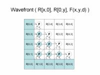
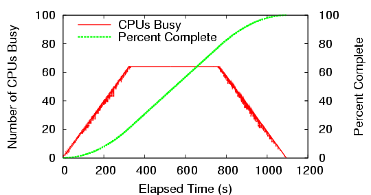
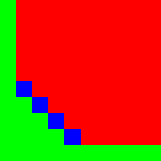
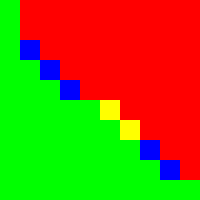
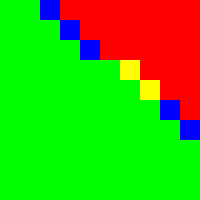
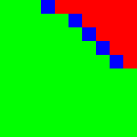

# Wavefront User's Manual

**Last edited: June 2013**

Wavefront is Copyright (C) 2022 The University of Notre Dame.  
All rights reserved.  
This software is distributed under the GNU General Public License.  
See the file COPYING for details.

## Introduction

 |

Wavefront( array R[x,0], array R[0,y], function F(x,y,d) )  
returns matrix R where  
R[i,j] = F( R[i-1,j], R[i,j-1], R[i-1,j-1] )  
  
  
---|---  
The Wavefront abstraction computes a two dimensional recurrence relation. You
provide a function F that accepts the left (x), right (y), and diagonal (d).
The abstraction then runs each of the functions in the order of dependency,
handling load balancing, data movement, fault tolerance, and so on.

To use Wavefront, install the [Cooperative Computing
Tools](http://ccl.cse.nd.edu/software/downloadfiles.shtml) and run the program
named `**wavefront_master**`. You need to set up an input file with initial
boundary values of R, and provide a function that computes a new cell from
adjacent cells. Each line of the input file has the format: `row column
arg1,arg2,...` In which row and column describe the position of a cell, with
zero-based indices, and arg1,arg2,... is the list of arguments fed to F (that
is, each R[i,j] is actually a tuple). To run wavefront, specifying the program
that computes each cell, and the number of cells in each dimension, for
example: `wavefront_master ./func.exe 10 10 input.data output.data` in which
input.data is the file with the initial boundary conditions, and output.data
are the results computed for a 10x10 matrix. The program ` func.exe` may be
written in any language that you like. For each cell of the result, the
program will be invoked like this: `./func.exe x y x-file y-file d-file` in
which each of `x-file`, `y-file` and `d-file` are files that contain the data
from the x, y, and diagonal neighbors, in the format: `arg1,arg2,...` These
files are generated automatically by `wavefront_master`. Your function is
required to parse them, and to print the result of the current cell to
`stdout`, in the format: `arg1,arg2,...` `wavefront_master` is a Work Queue
application, thus it does not perform any work by itself, but it relies on
workers connecting to it. To launch a single worker: `work_queue_worker
mymachine.somewhere.edu 9123` in which 9123 is the default port for Work Queue
applications. Work Queue provides convenient alternatives to launch many
workers simultaneously for different batch systems (e.g. condor), which are
explained in the section **Project names** in the [ Work Queue manual
](../work_queue/index.md). Wavefront will check for a few error conditions, and then
start to run, showing progress on the console like this: `# elapsed time :
waiting jobs / running jobs / complete jobs (percent complete) 0 : 0 / 1 / 0
(%0.00) 5 : 0 / 2 / 1 (%1.23) 10 : 0 / 3 / 3 (%3.70) 16 : 0 / 4 / 6 (%7.41) 21
: 0 / 4 / 8 (%9.88) ... ` When complete, your outputs will be stored in the
output file specified, with the same format as for the input data. Here is a
graph of a 100 by 100 problem run on a 64-core machine, where each F takes
about five seconds to execute:

The **-B** option will write a bitmap progress image every second. Each pixel
represents the state of one cell in the matrix: green indicates complete, blue
currently running, yellow ready to run, and red not ready. Here is an example
of the progress of a small ten by ten job using five CPUs:

 |  |
 |  Note
that at the broadest part of the workload, there are not enough CPUs to run
all cells at once, so some must wait. Also note that the wave does not need to
run synchronously: cells may begin to compute as soon as their dependencies
are satisfied.

## For More Information

For the latest information about Wavefront, please visit our [web
site](http://ccl.cse.nd.edu/software/wavefront) and subscribe to our [mailing
list](http://ccl.cse.nd.edu/software).

