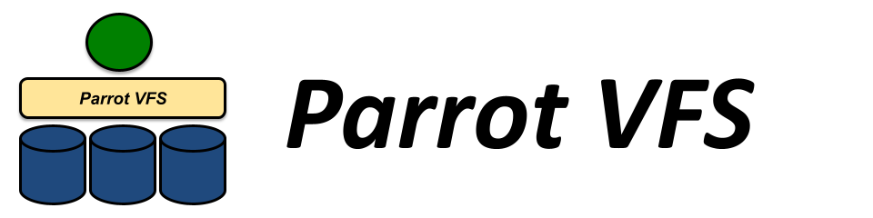

# Parrot User's Manual

## Overview

Parrot is a tool for attaching old programs to new storage systems. Parrot
makes a remote storage system appear as a file system to a legacy application.

Parrot does not require any special privileges, any recompiling, or any change
whatsoever to existing programs. It can be used by normal users doing normal
tasks.

For example, an anonymous FTP service is made available to `vi` like
so: 

```sh
$ parrot_run vi /anonftp/ftp.gnu.org/pub/README
```

Parrot is particularly handy for distributed computing, because it allows your
application to access remote software and data, regardless of where it is
actually executing. For example, it is commonly used in the high energy
physics community to obtain remote access to the CVMFS distributed software
repository.

Almost any application - whether static or dynmically linked, standard or
commercial, command-line or GUI - should work with Parrot. There are a few
exceptions. Because Parrot relies on the Linux `ptrace` interface any program
that relies on the ptrace interface cannot run under Parrot. This means Parrot
cannot run a debugger, nor can it run itself recursively. In addition, Parrot
cannot run setuid programs, as the operating system system considers this a
security risk.

Parrot also provide a new experimental features called _identity boxing_. This
feature allows you to securely run a visiting application within a protection
domain without become root or creating a new account. Read below for more
information on identity boxing.

Parrot currently runs on the Linux operating system with either AMD compatible
(x86_64) or Intel compatible (i386) processors. It relies on some fairly low
level details in order to implement system call trapping. Ports to other
platforms and processors Linux may be possible in the future.

Like any software, Parrot is bound to have some bugs. Please post questions to
our [forum](http://ccl.cse.nd.edu/community/forum) and bugs to our
[issue tracker](https://github.com/cooperative-computing-lab/cctools/issues).

### Installing

See the [Installation Instructions](../install) for the Cooperative Computing Tools package.  Then, make sure to set your `PATH` appropriately.

## Examples

To use Parrot, you simply use the `parrot_run` command followed by any other Unix
program.  Of course, it can be clumsy to
put `parrot_run` before every command you run, so try starting a shell with
Parrot already loaded:

```sh
$ parrot_run bash

# Now, you should be able to run any standard command using Parrot filenames:

$ cp /http/ccl.cse.nd.edu/research/papers/parrot-agm2003.pdf .

$ grep google /http/www.google.com

$ cat /anonftp/ftp.gnu.org/pub[Press TAB here]
```

### Interactive Use of Parrot

You may find it useful to have some visual indication of when Parrot is
active, so we recommend that you modify your shell startup scripts to change
the prompt when Parrot is enabled. Scripts may execute `parrot_run --is-
running` to detect if Parrot is already running in the current session:

#### Bash

Add to your `.bashrc`:

```sh
if parrot_run --is-running > /dev/null 2> /dev/null; then PS1="(Parrot) ${PS1}" fi
```
#### CSH

Add to your `.cshrc`:

```csh
which parrot_run > /dev/null && parrot_run --is-running > /dev/null if ($? == 0) then set prompt = " (Parrot) %n@%m%~%# " else set prompt = " %n@%m%~%# " endif
```


## Protocols

We have limited the examples so far to HTTP and anonymous FTP, as they are the
only services we know that absolutely everyone is familiar with. There are a
number of other more powerful and secure remote services that you may be less
familiar with. Parrot supports them in the same form: The filename begins with
the service type, then the host name, then the file name. Here are all the
currently supported services:

* * *

**example path**|  **remote service**|  **more info** |
|--|--|--|
/http/www.somewhere.com/index.html| Hypertext Transfer Protocol| included |
/grow/www.somewhere.com/index.html| GROW - Global Read-Only Web Filesystem | included |
/ftp/ftp.cs.wisc.edu/RoadMap| File Transfer Protocol| included |
/anonftp/ftp.cs.wisc.edu/RoadMap| Anonymous File Transfer Protocol| included |
/gsiftp/ftp.globus.org/path| Globus Security + File Transfer Protocol| [more info](http://www.globus.org/gridftp) |
/irods/host:port/zone/home/user/path| iRODS| [more info](http://irods.org) |
/hdfs/namenode:port/path| Hadoop Distributed File System (HDFS)| [more info](http://hadoop.apache.org/common/docs/current/hdfs_user_guide.html) |
/xrootd/host:port/path| XRootD/Scalla Distributed Storage System (xrootd)| [more info](http://project-arda-dev.web.cern.ch/project-arda- dev/xrootd/site/index.html) |
/cvmfs/grid.cern.ch/path| CernVM-FS| [more info](http://cernvm.cern.ch/portal/filesystem) |
/chirp/target.cs.wisc.edu/path| Chirp Storage System| included + [more info](../chirp)

The following protocols have been supported in the past, but are not currently
in active use.


**example path**|  **remote service**|  **more info** |
|--|--|--|
| /nest/nest.cs.wisc.edu/path| Network Storage Technology| [more info](http://www.cs.wisc.edu/condor/nest) |
/rfio/host.cern.ch/path| Castor Remote File I/O| [more info](http://castor.web.cern.ch/castor/Welcome.html) |
/dcap/dcap.cs.wisc.edu/pnfs/cs.wisc.edu/path| DCache Access Protocol| [more info](http://dcache.desy.de) |
/lfn/logical/path| Logical File Name - Grid File Access Library| [more info](http://grid-deployment.web.cern.ch/grid-deployment/gis/GFAL/GFALindex.html) |
/srm/server/path| Site File Name - Grid File Access Library| [more info](http://grid-deployment.web.cern.ch/grid-deployment/gis/GFAL/GFALindex.html) |
/guid/abc123| Globally Unique File Name - Grid File Access Library| [more info](http://grid-deployment.web.cern.ch/grid-deployment/gis/GFAL/GFALindex.html) |
/gfal/protocol://host//path| Grid File Access Library| [more info](http://grid-deployment.web.cern.ch/grid-deployment/gis/GFAL/GFALindex.html)

If a remote service is interfering with your system, e.g. you already have
CVMFS mounted at /cvmfs, you can run Parrot as

```sh
$ parrot_run --disable-service cvmfs ...etc..
```

to disable Parrot's handling. This option can be specified multiple times.


You will notice quite quickly that not all remote I/O systems provide all of
the functionality common to an ordinary file system. For example, HTTP is
incapable of listing files. If you attempt to perform a directory listing on
an HTTP server, Parrot will attempt to keep `ls` happy by producing a bogus
directory entry:

```sh
$ parrot_run ls -la /http/www.google.com/
-r-xr-xr-x 1 btovar campus 0 Aug 14 13:40 /http/www.google.com
```

A less-drastic example is found in FTP. If you attempt to perform a directory
listing of an FTP server, Parrot fills in the available information, such as 
file names and their sizes, but again inserts bogus information to fill the
rest out:

```sh
$ parrot_run ls -la /anonftp/ftp.gnu.org/pub
total 0M
-rwxrwxrwx 1 btovar campus 405121 Aug 14 13:41 before-2003-08-01.md5sums.asc
-rwxrwxrwx 1 btovar campus   1125 Aug 14 13:41 CRYPTO.README
-rwxrwxrwx 1 btovar campus 263387 Aug 14 13:41 find.txt.gz
...
```

If you would like to get a better idea of the underlying behavior of Parrot,
try running it with the `-d remote` option, which will display all of the
remote I/O operations that it performs on a program's behalf: 

```sh
$ parrot_run -d remote ls -la /anonftp/ftp.gnu.org
2019/08/14 13:43:52.25 parrot_run[17703] <child:17705> ftp: connecting to ftp.gnu.org:21
2019/08/14 13:43:52.32 parrot_run[17703] <child:17705> ftp: ftp.gnu.org 220 GNU FTP server ready.
2019/08/14 13:43:52.32 parrot_run[17703] <child:17705> ftp: ftp.gnu.org USER anonymous
2019/08/14 13:43:52.32 parrot_run[17703] <child:17705> ftp: ftp.gnu.org PASS ******
...
2019/08/14 13:43:52.54 parrot_run[17703] <child:17705> ftp: ftp.gnu.org 200 Switching to Binary mode.
2019/08/14 13:43:52.54 parrot_run[17703] <child:17705> ftp: ftp.gnu.org PASV
2019/08/14 13:43:52.57 parrot_run[17703] <child:17705> ftp: ftp.gnu.org 227 Entering Passive Mode (209,51,188,20,92,187).
2019/08/14 13:43:52.57 parrot_run[17703] <child:17705> ftp: ftp.gnu.org NLST /
2019/08/14 13:43:52.63 parrot_run[17703] <child:17705> ftp: ftp.gnu.org 150 Here comes the directory listing.
2019/08/14 13:43:52.66 parrot_run[17703] <child:17705> ftp: ftp.gnu.org 226 Directory send OK.
2019/08/14 13:43:52.66 parrot_run[17703] <child:17705> ftp: ftp.gnu.org CWD /CRYPTO.README
...
```

If your program is upset by the unusual semantics of such storage systems,
then consider using the Chirp protocol and server:


## The Chirp Protocol and Server

Although Parrot works with many different protocols, is it limited by the
capabilities provided by each underlying system. (For example, HTTP does not
have reliable directory listings.) Thus, we have developed a custom protocol,
**Chirp** , which provides secure remote file access with all of the
capabilities needed for running arbitrary Unix programs. **Chirp** is included
with the distribution of Parrot, and requires no extra steps to install.

To start a Chirp server, simply do the following:

```sh
$ chirp_server -d all -r .`
```

The ` -d all` option turns on debugging, which helps you to understand how it
works initially. You may remove this option once everything is working.

Suppose the Chirp server is running on `bird.cs.wisc.edu`. Using Parrot, you
may access all of the Unix features of that host from elsewhere: 

```sh
$ parrot_run bash
$ cd /chirp/bird.cs.wisc.edu
$ ls -la
...
```

In general, Parrot gives better performance and usability with Chirp than with
other protocols. You can read extensively about the Chirp server and protocol
[in the Chirp manual](../chirp).

In addition, Parrot provides several custom command line tools, such as
`parrot_getacl`, `parrot_setacl`, `parrot_lsalloc`, and `parrot_mkalloc`, that
can be used to manage the access control and space allocation features of Chirp
from the Unix command line.


## Name Resolution

In addition to accessing remote storage, Parrot allows you to create a custom
namespace for any program. All file name activity passes through the Parrot
**name resolver** , which can transform any given filename according to a
series of rules that you specify.

The simplest name resolver is the **mountlist** , given by the **-m
mountfile** option. (If you are familiar with Unix, this file resembles `
/etc/fstab`). A mountlist is simply a file with one mount entry given per line.
The first column is the path in Parrot's namespace. The next column can be
either an access control specifier or a path in the host's filesystem. If two
paths are given, then the third column can contain an optional access control
specifier.

!!! note
    The path in the host's filesystem should be an absolute path, that is, it
    should start with a `/`.


For example, the GNU FTP server available at `/anonftp/ftp.gnu.org` can
be accessed into the filesystem under `/gnu` with a mount list like this: 

```sh
# file: my.mountfile
/gnu /anonftp/ftp.gnu.org
```

Instruct Parrot to use the mountlist as follows:

```sh
$ parrot_run -m my.mountfile bash
$ cd /gnu
$ ls -la
...
```

Additionally, an **access control specifier** which restricts the operations allowed under a given
path can be added to the mountlist. There are three access control specifiers:

| | |
|-|-|
DENY   | Blocks all operations
ENOENT | Makes operations fail as if nothing was present at the path
LOCAL  | Only allows operation on the local filesystem.
||       **Or any combination of the following letters:**
R      | Allow read  operations
W      | Allow write operations
X      | Allow execute/search operations

!!! note
    Without an access control specifier, the default is `RWX`.

For example, a mountlist could contain the following entries:

```sh
/     RX
/home DENY
/tmp /tmp/sandbox
/opt /home/fred/project RX
```

The previous mountlist allows read and execute operations on `/`, denies all
operations on `/home`, mounts `/tmp` in `/tmp/sandbox`, and mounts `/opt` on
`/home/fred/project` with read and write permissions.

Individual mount entries may be given on the command line with the `-M` option
as follows:

```sh
$ parrot_run -M /gnu=/anonftp/ftp.gnu.org bash`
```

!!! warning
    Access control specifiers cannot be used with the -M option.

If you need to change the mount list at runtime, you need to execute
`parrot_run` with the option `--dynamic-mounts`, and inside the `parrot_run`
session use the `parrot_mount` utility, such as:

```sh
$ parrot_run --dynamic-mounts bash
$ ls /gnu
ls: cannot access /gnu: No such file or directory

$ parrot_mount /gnu /anonftp/ftp.gnu.org/gnu RWX
$ ls /gnu
...

$ parrot_mount --unmount /gnu
$ ls /gnu
ls: cannot access /gnu: No such file or directory
```

A more sophisticated way to perform name binding is with an _external
resolver_. This is a program executed whenever Parrot needs to locate a file or
directory. The program accepts a logical file name and then returns the
physical location where it can be found.

Suppose that you have a database service that locates the nearest copy of a
file for you via a program called `locate_file`. If you run the command
`locate_file`, it will print out the nearest copy of a file. For example,
consider:

[locate_file](locate_file)
```python
#! /usr/bin/env python

# locate_file script
# Prints the absolute path of the file corresponding to its argument.

import sys

sites = {
    'CA': '/anonftp/mirror.csclub.uwaterloo.ca/gnu',
    'EU': '/anonftp/ftp.mirror.nl/pub/mirror/gnu',
    'default': '/anonftp/ftp.gnu.org'
}

def where_am_i():
    # figure out the site closest to our geographical location
    # ... ... ...
    # (mock with random choice)
    import random

    location = random.choice(sites.keys())
    return location

if __name__ == '__main__':
    try:
        filename = ''

        if len(sys.argv) > 1:
            filename = sys.argv[1]
        
        location = where_am_i()
        location = 'default'
        site     = sites[location]

        print('{}/{}'.format(site, filename))

    except Exception as e:
        raise e
        print('')

```

To connect the program `locate_file` to Parrot, simply give a mount string
that specifies the program as a resolver:

```sh
$ parrot_run -M /gnu=resolver:/path/to/locate_file -- ls /gnu/pub
```

Now, if you attempt to access files under /gnu, Parrot will execute
`locate_file` and access the data stored there.

## Mount Namespaces

Mount entries in Parrot are organized into hierarchical, reference counted
namespaces. A fresh instance of Parrot puts all process into a single, global
namespace. This means that normally, all processes running under a Parrot
instance see the same view of the filesystem. More concretely, all processes
share the same mount list specified by the `-m` and `-M` options. The
`parrot_mount` command allows programs to edit this mount list.

Processes are also free to fork their mount namespaces with the Parrot-
specific `parrot_fork_namespace` syscall. Whenever a process forks its
namespace, its child will inherit a reference to its parent’s mount namespace.
Mount namespace changes are visible to processes subject to the following
rules. Given a process _P_ in namespace _N_ ,

  * _P_ may add/remove mount entries in _N_.
  * any other process with a reference to _N_ , will see changes by _P_.
  * suppose another process _P’_ forks _N_ , so that _P’_ is in namespace _N’_ , then 
    * any changes to _N’_ **are not** visible in _N_.
    * any changes to _N_ **are** visible in _N’_.
  * when adding a mount entry to _N_ , the redirect is resolved in the parent namespace of _N_.

A process' mount namespace forms a closure over the set of visible mount
entries. Forking another namespace will capture all visible mount entries, and
allow the process to make local changes independently from the parent
namespace.

Names are lexically scoped, i.e. a new mount is resolved in its
enclosing scope. When Parrot starts, the global mount namespace has no parent,
so mounts passed in are resolved in the host filesystem. Unless the
`--dynamic-mounts` flag is passed, Parrot **seals** the global mount namespace
before running the tracee by making a new child namespace. Thus all processes
are, by default, locked into the namespace set up by the command
line/environment variables.

Any processes may add mount entries to its own
mount namespace via ` parrot_mount`, but may not remove mount entries defined
in parent and sealed namespace(s). A process can make changes to its mount
namespace, then seal it with `parrot_mount --disable` to prevent the process
or its children from undoing those changes. If `--dynamic-mounts` is passed,
the global namespace is left unsealed, so mounts/unmounts are resolved in the
host filesystem. This allows a setup script to modify the command line mounts,
then seal the global namespace so that it can no longer be modified. Likewise,
a process can fork its namespace, add mount entries, then seal it so that all
children will be locked into the current view of the system.

The `parrot_namespace` utility gives a more convenient way to create new mount
namespaces rather than using the `parrot_fork_namespace` syscall directly.
This utility forks the current mount namespace and performs any mounts
specified on the command line. `parrot_namespace` detects whether or not it is
already running under Parrot. If so, `parrot_namespace` uses Parrot-specific
syscalls to make the mount changes in a newly-forked mount namespace. If not
running under Parrot, `parrot_namespace` simply executes `parrot_run`.

For applications that want to nest Parrot sessions and only need to make
changes to mounts, `parrot_namespace` should work as a drop-in replacement for
`parrot_run`. `parrot_namespace` only supports a limited subset of the options
available for `parrot_run`. By always using `parrot_namespace`, the user need
not be concerned with whether Parrot is already running.

## Packaging Dependencies

### Recording Dependencies

To figure out the underlying file dependencies and execution environment,
Parrot allows you to record the names of all the accessed files during the
execution process of one program, which is implemented as the **\--name-list
dependencylist** option, and allows you to record the environment variables of
your program, which is implemented as the **\--env-list envlist** option. When
one filename is resolved by the Parrot **name resolver** , it is also recorded
into the **dependencylist** file. The system call type of a file is also
transferred to the name resolver and recorded into the dependencylist file.
For example, all the accessed file names will be recorded into **list.txt** ,
and the environment variables will be recorded into **envlist** , if we run
the following command:

```sh
$ parrot_run --name-list namelist --env-list envlist ls ~
```

The format of list.txt is **filename|system-call-type** , such as
`usr/bin/ls|stat`, which means the file `/usr/bin/ls` is accessed using the
`stat` system call.

### Creating a Package

After recording the accessed files of one program with the help of the
**\--name-list** parameter of ` parrot_run` and the environment variables with
the help of the **\--env-list** parameter of ` parrot_run`,
`parrot_package_create` can generate a package containing all the accessed
files and the environment variables. `parrot_package_create` shares the same
**\--name-list** and **\--env-list** parameters with ` parrot_run`.
**\--package-path** parameter is used to specify the location of package.

```sh
$ parrot_package_create --name-list namelist --env-list envlist --package-path /tmp/my.package
```

After executing this command, one package with the path of **/tmp/package**
will be generated. The envlist file, **envlist** will be put under
**/tmp/package** with the name of **env_list**.

You can also add the dependencies recorded in a new namelist file into an
existing package: 

```sh
parrot_package_create --name-list namelist1 --env-list envlist1 --new-env envlist1 --add /tmp/my.package
```

After executing this command, all the new dependencies mentioned in
**namelist1** will be added into **/tmp/package** , the new envlist,
**envlist1** , will also be added into **/tmp/package** with the name
specified by the **\--new-env** option.

### Running a Package

Once a package is generated with the help of `parrot_package_create`, we can
use `parrot_package_run` to repeat the program within the package.
`parrot_package_run` is based on the mountlist redirection mechanism of
`parrot_run`. One mountlist wll be created so that the file access request of
your program can be redirected into the package. **\--package-path** parameter
specifies the paht of the package. If no command is given, a /bin/sh shell
will be returned.

```sh
$ parrot_package_run --package-path /tmp/package /bin/bash
```

After the execution of this command, one shell will be returned, where you can
repeat your original program. After everything is done, exit
`parrot_package_run`:

```sh
$ exit
```

You can also directly set your command as the arguments of
`parrot_package_run`. In this case, `parrot_package_run` will exit
automatically after the command is finished, and you do not need to use `exit`
to exit. However, your command must belong to the original command set
executed inside `parrot_run` and preserved by `parrot_package_create`.

```
$ parrot_package_run --package-path /tmp/package ls -al
```

You can also specify a different environment file to run programs inside a
package with the **\--env-list** option.

```sh
$ parrot_package_run -env-list /tmp/package/envlist1 --package-path /tmp/package ls -al
```

## Optimizing File Copies

### Reflink (reference link) Copy

Parrot can take advantage of the reflink feature (added in coreutils 7.5) when
using ` cp`. To use this feature, invoke `cp` as `$ cp --reflink foo bar` This
works by intercepting `BTRFS_IOC_CLONE` to trigger an in-Parrot copy with no
further interaction with `cp`, avoiding the overhead of moving data into the
client's buffer and then immediately back to Parrot. When run in Parrot, `cp --reflink`
is not restricted to files on the same BTRFS volume, and can be used
for efficiently copying any regular file.

As of coreutils 8.24, `mv` will automatically attempt a reflink copy when
moving files across mount points. Parrot's reflink feature allows e.g. `mv`ing
a file into a tmpfs like `/tmp` with minimal overhead.

### Parrot Native File Copies

If you are using Parrot to copy lots of files across the network, you may see
better performance using the `parrot_cp` tool. This program looks like an
ordinary `cp`, but it makes use of an optimized Parrot system call that
streams entire files over the network, instead of copying them block by block.

To use `parrot_cp`, simply use your shell to alias calls to `cp` with calls to
`parrot_cp`:

```sh
$ parrot_run bash
$ alias cp=parrot_cp
$ cp /tmp/mydata /chirp/server.nd.edu/joe/data
$ cp -rR /chirp/server.nd.edu/joe /tmp/joe
```

If run outside of Parrot, `parrot_cp` will operate as an ordinary `cp` without
any performance gain or loss.

## File Access Protocols

### HTTP Proxy Servers

HTTP, CVMFS, and GROW can take advantage of standard HTTP proxy servers. To
route requests through a single proxy server, set the HTTP_PROXY environment
variable to the server name and port: 

```sh
$ export HTTP_PROXY="http://proxy.nd.edu:8080"
```

Multiple proxy servers can be given, separated by a semicolon. This will cause
Parrot to try each proxy in order until one succeeds. If `DIRECT` is given as
the last name in the list, then Parrot will fall back on a direct connection
to the target web server. For example: 

```sh
$ export HTTP_PROXY="http://proxy.nd.edu:8080;http://proxy.wisc.edu:1000;DIRECT"
```

### GROW - Global Read Only Web Filesystem

Although the strict HTTP protocol does not allow for correct structured
directory listings, it is possible to emulate directory listings with a little
help from the underlying filesystem. We call this technique GROW, a global
filesystem based on the Web. GROW requires the exporter of data to run a
script (`make_growfs`) that generates a complete directory listing of the data
that you wish to export. This directory listing is then used to produce
reliable metadata. Of course, if the data changes, the script must be run
again, so GROW is only useful for data that changes infrequently.

To set up an GROW filesystem, you must run `make_growfs` on the web server
machine with the name of the local storage directory as the argument. For
example, suppose that the web server `my.server.com` stores pages for the URL
`http://my.server.com/~fred` in the local directory `/home/fred/www`. In this
case, you should run the following command:

```sh
$ make_growfs /home/fred/www
```

Now, others may perceive the web server as a
file server under the /grow hierarchy. For example:

```sh
$ parrot_run bash 
$cd /grow/my.server.com/~fred
$ ls -la
```

In addition to providing precise directory metadata, GROW offers two
additional advantages over plain HTTP:

* **Aggressive Caching.** GROW caches files in an on-disk cache, but unlike plain HTTP, does not need to issue up-to-date checks against the server. Using the cached directory metadata, it can tell if a file is up-to-date without any network communication. The directory is only checked for changes at the beginning of program execution, so changes become visible only to newly executed programs. 
* **SHA-1 Integrity.** ` make_growfs` generates SHA-1 checksums on the directory and each file so that the integrity of the system can be verified at runtime. If a checksum fails, GROW will attempt to reload the file or directory listing in order to repair the error, trying until the main timeout (set by the -T option) expires. This will also occur if the underlying files have been modified and `make_growfs` has not yet been re-run. If necessary, checksums can be disabled by giving the `-k` option to either Parrot or `make_growfs`. 

### iRODS

To use Parrot with [iRODS](http://www.irods.org), you must first follow the [special
build instructions](../install).

Then, use the `iinit` command to log into the desired iRODS service, and
verify that you are connected with the `ils` command. If those work, then you
can use Parrot to access files under the scheme `/irods/server/zone/path`. For
example, to access the iPlant data service:

    
    
    parrot_run bash
    cd /irods/data.iplantcollaborative.org/iplant/home/username
    cp /tmp/mydata .
    

### CVMFS - CernVM-FS

CVMFS is a read-only filesystem, which was initially based on GROW. It is used
within CernVM-FS to provide access to software repositories. It may be used
outside of CernVM-FS by mounting it as a FUSE module. Parrot makes it possible
to access CVMFS in cases where mounting CVMFS via FUSE is not an option. Like
GROW, CVMFS makes use of web proxies and local disk caching for scalability.
For security, data integrity is verified with cryptographic checksums. For
increased reliability and performance, CVMFS repositories may also be mirrored
in multiple locations and accessed via groups of load-balanced web proxies,
with fail-over between groups.

The CVMFS repositories hosted by the [CernVM project](http://cernvm.cern.ch/)
and by Open Science Grid (OASIS) are enabled by default. To access a different
repository, it is necessary to configure parrot to know how to access the
repository. This may be done with the `-r` option or with the
`PARROT_CVMFS_REPO` environment variable.

The repository configuration syntax is `repo_name:options repo_name2:option2 ...`

The repository with `repo_name` is used when the parrot user attempts to
access the matching path `/cvmfs/repo_name/...`. The configured repository
name may begin with `*`, which acts as a wildcard, matching one or more
characters in the requested repository name. This is useful when multiple
repositories are hosted at the same site and all configuration details are the
same except the beginnings of the repository names, as in `atlas.cern.ch` and
`cms.cern.ch`. Any `*` appearing in the options is replaced by the characters
in the requested path that were matched by the `*` in the configured
repository name. If a cvmfs path matches more than one configured repository,
the last one appearing in the configuration takes precedence.

The format of the repository options is `option1=value1,option2=value2,...`

Literal spaces, tabs, newlines, asterisks, equal signs, or commas in the
options must be proceeded by a backslash to avoid being interpreted as
delimiters. If the same option is specified more than once, the last value
takes precedence. The possible options are listed in the table below. The
`url` option is required and has no default. The `proxies` option is required
and defaults to the proxy used by parrot, if any.

| | |
|-|-|
| **url=URL**                | The URL of the CernVM-FS server(s): 'url1;url2;...'
| **proxies=HTTP_PROXIES**   | Set the HTTP proxy list, such as 'proxy1\|proxy2'; default is given by -P option (HTTP_PROXY). <p> Proxies separated by \|; are randomly chosen for load balancing. <p> Groups of proxies separated by ';' may be specified for failover. <p> If the first group fails, the second group is used, and so on down the chain.
| **cachedir=DIR**           | Where to store disk cache; default is within parrot temp directory (-t option)
| **timeout=SECONDS**        | Timeout for network operations; default is given by -T option (PARROT_TIMEOUT)
| **timeout_direct=SECONDS** | Timeout in for network operations without proxy; default is given by -T option (PARROT_TIMEOUT)
| **max_ttl=MINUTES**        | Maximum TTL for file catalogs; default: take from catalog
| **allow_unsigned**         | Accept unsigned catalogs (allows man-in-the-middle attacks)
| **whitelist=URL**          | HTTP location of trusted catalog certificates (defaults is /.cvmfswhitelist)
| **pubkey=PEMFILE**         | Public RSA key that is used to verify the whitelist signature.
| **rebuild_cachedb**        | Force rebuilding the quota cache db from cache directory
| **quota_limit=MB**         | Limit size of cache. -1 (the default) means unlimited. If not -1, files larger than
quota_limit-quota_threshold will not be readable.
| **quota_threshold=MB**     | Cleanup cache until size is <= threshold
| **deep_mount=prefix**      | Path prefix if a repository is mounted on a nested catalog
| **repo_name=NAME**         | Unique name of the mounted repository; default is the name used for this configuration entry
| **mountpoint=PATH**        |  Path to root of repository; default is /cvmfs/repo_name
| **blacklist=FILE**         |  Local blacklist for invalid certificates. Has precedence over the whitelist.
| **try_local_filesystem**   |  If this cvmfs repository is mounted on the local filesystem, use that instead of Parrot's CVMFS client.

Setting the CVMFS configuration overrides the default configuration. If it is
desired to configure additional repositories but still retain the default
repositories, the configuration entry `<default-repositories>` may be put in
the configuration string. For example: 

```sh
$ parrot_run -r '<default-repositories> my.repo:url=http://cvmfs.server.edu/cvmfs/my.repo.edu' ...
```

The entry `<default-repositories>` should come first, because it contains a
catch-all clause `*:try_local_filesystem` that matches anything that isn't
caught by later entries. This clause allows access to locally mounted CVMFS
repositories that Parrot is not configured to access internally.

The configuration of the default repositories may be modified by specifying
additional options using the syntax `<default-repositories>:option1=value1,option2=value2`.


### Parrot Cache

If a service does not allow partial reads of a file (e.g. the HTTP protocol:
`/http/foo.com/a.txt`), then Parrot will cache an entire copy of the file in
its temporary directory (`-t` or `$PARROT_TEMP_DIR` or `$TMPDIR/parrot.<pid>`,
in order). Cached files are named based on the hash of the canonical file
name.

!!! warning
    You can also force Parrot to cache all non-local files using the
    `-F/--with-snapshots` option. This is not usually recommended because Parrot
    will download the entire copy of the file when opened by the application. This
    also means that updates to the file during run-time are ignored (hence the
    name, "snapshot")!

Some services have their own cache, like `cvmfs`. This is a cache independent
of the regular Parrot cache. **It is important to note that some versions of
CVMFS may not correctly operate on the same cache. In that case, it is
essential to run concurrent instances of Parrot with different temporary
directories.**

### Hadoop Distributed File System (HDFS)

HDFS is the primary distributed filesystem used in the
[Hadoop](http://hadoop.apache.org) project. Parrot supports read and write
access to HDFS systems using the ` parrot_run_hdfs` wrapper. This script
checks that the appropriate environmental variables are defined and calls
`parrot`.

In particular, you must ensure that you define the following environmental
variables:

| | |
|-|-|
JAVA_HOME   | Location of your Java installation.
HADOOP_HOME | Location of your Hadoop installation.

Based on these environmental variables, `parrot_run_hdfs` will attempt to find
the appropriate paths for `libjvm.so` and `libhdfs.so`. These paths are stored
in the environmental variables `LIBJVM_PATH` and `LIBHDFS_PATH`, which are
used by the HDFS Parrot module to load the necessary shared libraries at run-
time. To avoid the startup overhead of searching for these libraries, you may
set the paths manually in your environment before calling `parrot_run_hdfs`,
or you may edit the script directly.

Note that while Parrot supports read access to HDFS, it only provides write-
once support on HDFS. This is because the current implementations of HDFS do
not provide reliable append operations. Likewise, files can only be opened in
either read (`O_RDONLY`) or write mode (`O_WRONLY`), and not both (`O_RDWR`).

## Identity Boxing

Parot provides a unique feature known as _identity boxing_. This feature
allows you to run a (possibly) untrusted program within a protection domain,
as if it were run in a completely separate account. Using an identity box, you
do not need to become root or even to manage account names: you can create any
identity that you like on the fly.

For example, suppose that you wish to allow a friend to log into your private
workstation. Instead of creating a new account, simply use a script supplied
with Parrot to create an identity box:

```sh
$ whoami dthain
$ parrot_identity_box MyFriend 
$ whoami MyFriend
$ touch ~dthain/some-data
$ touch: creating ~dthain/some-data': Permission denied
```

Note that the shell running within the identity box cannot change or modify
any of the supervising user's data. In fact, the contained user can only
access items that are world-readable or world-writable.

You can give the contained user access to other parts of the filesystem by
creating access control lists. (ACLs) An ACL is a list of users and the
resources that they are allowed to access. Each directory has it's own ACL in
the file `.__acl`. This file does not appear in a directory listing, but you
can read and write it just the same.

For example, ` MyFriend` above can see his initial ACL as follows:

```sh
$ cat .__acl
MyFriend rwlxa
```

This means that `MyFriend` can read, write, list, execute, and administer
items in the current directory. Now, suppose that `MyFriend` wants to allow
`Freddy` read access to the same directory. Simply edit the ACL file to read:
`MyFriend rwlxa Freddy rl ` Identity boxing and ACLs are particularly useful
when using distributed storage. You can read more about ACLs and identity
boxing in the [Chirp](../chirp) manual.

## 64-Bit Support

In all modes, Parrot supports applications that access large (>2GB) files that
require 64-bit seek pointers. However, be aware that many tools and
filesystems do not manipulate such large files properly. If possible, we
advise users to break up files into smaller pieces for processing.

Parrot supports 64 bit programs and processors in the following combinations:

| 32-bit| 64-bit| CPU Type |
|----|------|---|  
|YES |  NO  |  Parrot for 32-bit X86 CPU <br> Pentium, Xeon, Athlon, Sempron  
|YES |  YES |  Parrot for 64-bit X86_64 CPU <br> Opteron, Athlon64, Turion64, Sempron64  
  
## A Note on Docker

Docker by default blocks ptrace, the system call on which parrot relies. To
run parrot inside docker, the container needs to be started using the
`--security-opt seccomp=unconfined` command line argument. For example: `
docker run --security-opt seccomp=unconfined MY-DOCKER-IMAGE `

## Man Pages

An exhaustive list of all options and commands can be found in the manual
pages:

* [parrot_run](../man_pages/parrot_run.md)
* [parrot_cp](../man_pages/parrot_cp.md)
* [parrot_md5](../man_pages/parrot_md5.md)
* [parrot_getacl](../man_pages/parrot_getacl.md)
* [parrot_setacl](../man_pages/parrot_setacl.md)
* [parrot_mkalloc](../man_pages/parrot_mkalloc.md)
* [parrot_lsalloc](../man_pages/parrot_lsalloc.md)
* [parrot_locate](../man_pages/parrot_locate.md)
* [parrot_timeout](../man_pages/parrot_timeout.md)
* [parrot_whoami](../man_pages/parrot_whoami.md)
* [parrot_mount](../man_pages/parrot_mount.md)


## Citation

Douglas Thain and Miron Livny, [Parrot: An Application Environment for Data-Intensive Computing](http://www.cse.nd.edu/~dthain/papers/parrot-scpe.pdf), Scalable Computing: Practice and Experience, Volume 6, Number 3, Pages 9--18, 2005.

## Further Information

For more information, please see [Getting Help](../help) or visit the [Cooperative Computing Lab](http://ccl.cse.nd.edu) website.

## Copyright

CCTools is Copyright (C) 2022 The University of Notre Dame. This software is distributed under the GNU General Public License Version 2. See the file COPYING for
details.
