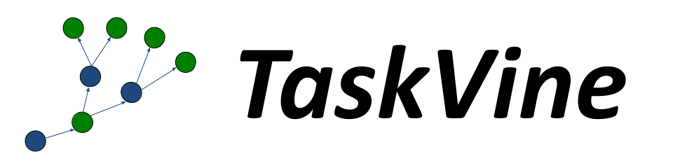
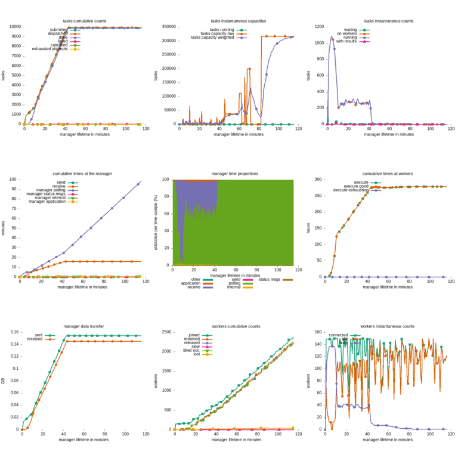
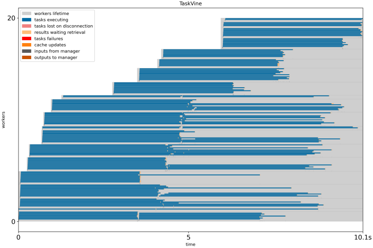
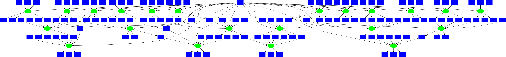
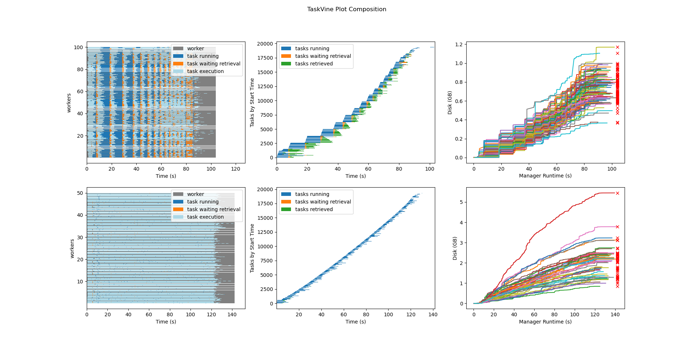
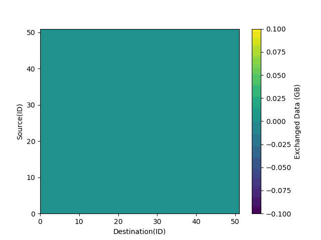

# TaskVine User's Manual

## Overview

TaskVine is a framework for building large scale data
intensive dynamic workflows that run on high performance computing (HPC)
clusters, GPU clusters, cloud service providers, and other distributed computing systems.
A workflow is a collection of programs and files that are
organized in a graph structure, allowing parts of the
workflow to run in a parallel, reproducible way:


A TaskVine workflow requires a manager and a large number of
worker processes.  The application generates a large number of small
tasks, which are distributed to workers.
As tasks access external data sources and produce their own outputs,
more and more data is pulled into local storage on cluster nodes.
This data is used to accelerate future tasks and avoid re-computing exisiting results.
The application gradually grows "like a vine" through
the cluster.


The TaskVine system is naturally robust.  While an application is running,
workers may be added or removed as computing resources become available.
Newly added workers will gradually accumulate data within the cluster.
Removed (or failed) workers are handled gracefully, and tasks will be
retried elsewhere as needed.  If a worker failure results in the loss
of files, tasks will be re-executed as necessary to re-create them.

TaskVine manager applications can be written in Python or C
on Linux or OSX platforms.  Individual tasks can be simple
Python functions, complex Unix applications, or serverless function
invocations.  The key idea is that you declare file
objects, and then declare tasks that consume them and
produce new file objects.  For example, this snippet
draws an input file from the Project Gutenberg repository
and runs a Task to search for the string "needle", producing
the file `output.txt`:

```
f = m.declare_url("https://www.gutenberg.org/cache/epub/2600/pg2600.txt")
g = m.declare_file("myoutput.txt")

t = Task("grep needle warandpeace.txt > output.txt")
t.add_input(f, "warandpeace.txt")
t.add_output(g, "outfile.txt")
```

Tasks share a common set of options.  Each task can be labelled with the resources
(CPU cores, GPU devices, memory, disk space) that it needs to execute.  This allows each worker to pack the appropriate
number of tasks.  For example, a worker running on a 64-core machine could run 32 dual-core tasks, 16 four-core tasks,
or any other combination that adds up to 64 cores.  If you don't know the resources needed, you can enable
a resource monitor to automatically track, report, and allocate what each task uses.

TaskVine is easy to deploy on existing HPC and cloud facilities.
The worker processes are self-contained executables, and TaskVine
arranges for all necessary task dependencies to be moved to workers,
making the system self-hosting.  Applications regularly consist of
millions of tasks running on thousands of workers.  Tools are
provided to easily deploy workers on HTCondor, SLURM, and Grid Engine.

TaskVine is our third-generation workflow system, built on our
twenty years of experience creating scalable applications in
fields such as high energy physics, bioinformatics, molecular dynamics,
and machine learning.

## Quick Start

Installing via `conda` is the easiest method for most users.
First, [Install Miniforge](https://github.com/conda-forge/miniforge#install) if you don't already have `conda` installed.
Then, open a terminal and install `ndcctools` like this:

```
conda install -c conda-forge ndcctools
```

Using a text editor, create a manager program called `quickstart.py` like this:

```python
# quickstart.py

import ndcctools.taskvine as vine

# Create a new manager
m = vine.Manager([9123, 9129])
print(f"Listening on port {m.port}")

# Declare a common input file to be shared by multiple tasks.
f = m.declare_url("https://www.gutenberg.org/cache/epub/2600/pg2600.txt", cache="workflow")

# Submit several tasks using that file.
print("Submitting tasks...")
for keyword in ['needle', 'house', 'water']:
    task = vine.Task(f"grep {keyword} warandpeace.txt | wc")
    task.add_input(f, "warandpeace.txt")
    task.set_cores(1)
    m.submit(task)

# As they complete, display the results:
print("Waiting for tasks to complete...")
while not m.empty():
    task = m.wait(5)
    if task:
        print(f"Task {task.id} completed with result {task.output}")

print("All tasks done.")
```

Run the manager program at the command line like this:

```
python quickstart.py
```

It should display output like this:
```
Listening on port 9123
Submitting tasks...
Waiting for tasks to complete...
```

The manager is now waiting for workers to connect and begin
requesting work. (Without any workers, nothing will happen.) You can start one worker on the same machine by opening a new shell and running:

```
vine_worker localhost 9123
```

The manager will send tasks to the worker for execution.  As they complete, you will see output like this:
```
Task 1 completed with result      12     139     824
Task 3 completed with result      99    1199    6672
Task 2 completed with result     536    6314   36667
All tasks done.
```

Congratulations! You have now run a simple manager application that runs tasks on one local worker.
To scale up, simply run more workers on a cluster or cloud facility.

## Example Applications

The following examples show more complex applications and various features of TaskVine: 

- [BLAST Example](example-blast.md)
- [Gutenberg Example](example-gutenberg.md)
- [Mosaic Example](example-mosaic.md)
- [Gradient Descent Example](example-gradient-descent.md)
- [Watch Files Example](example-watch.md)
- [Functional Example](example-functional.md)

Read on to learn how to build applications from scratch and run large numbers of workers at scale.

## Writing a TaskVine Application

A TaskVine application can be written in Python, or C.
In each language, the underlying principles are the same, but there are some syntactic differences shown below.
The full API documentation for each language is here:

- [TaskVine Python API](../api/html/namespacendcctools_1_1taskvine.html)
- [TaskVine C API](../api/html/taskvine_8h.html)

### Creating a Manager Object

To begin, you must import the TaskVine module, and then create a Manager object.
You may specify a specific port number to listen on like this:

=== "Python"
    ```python
    # Import the taskvine module
    import ndcctools.taskvine as vine

    # Create a new manager listening on port 9123
    m = vine.Manager(9123)
    ```

=== "C"
    ```
    /* Import the taskvine module */
    #include "taskvine.h"

    /* Create a new manager listening on port 9123 */
    struct taskvine *m = vine_create(9123);
    ```

In a shared environment, that specific port might already be in use, and so you may find it more convenient
to specify zero to indicated any available port:

=== "Python"
    ```python
    # Create a new manager listening on any port
    m = vine.Manager(0)
    print(f"listening on port {m.port}")
    ```

=== "C"
    ```
    /* Create a new manager listening on any port */
    struct taskvine *m = vine_create(0);
    printf("listening on port %d\n", vine_port(m));

    ```

### Declaring Files

Each file used in a TaskVine application must be declared to the manager,
so that it can be cached and replicated within the cluster as needed.
The following are examples of basic file descriptions:

=== "Python"
    ```python
    a = m.declare_file("mydata.txt")
    d = m.declare_file("dataset/")
    u = m.declare_url("https://ftp.ncbi.nlm.nih.gov/blast/db/human_genome.00.tar.gz")
    b = m.declare_buffer("These words are the contents of the file.")
    t = m.declare_temp()
    ```
=== "C"
    ```
    struct vine_file *a = vine_declare_file(m, "mydata.txt", VINE_CACHE_LEVEL_WORKFLOW, 0);
    struct vine_file *d = vine_declare_file(m, "dataset/", VINE_CACHE_LEVEL_WORKFLOW, 0);
    struct vine_file *u = vine_declare_url(m, "https://ftp.ncbi.nlm.nih.gov/blast/db/human_genome.00.tar.gz", VINE_CACHE_LEVEL_WORKFLOW, 0);
    struct vine_file *b = vine_declare_buffer(m, "These words are the contents of the file.", VINE_CACHE_LEVEL_WORKFLOW, 0);
    struct vine_file *t = vine_declare_temp(m);
    ```

`declare_file` indicates a file in the manager's local filesystem
which will be transferred into the cluster and made available to tasks.
Both files and directories can be declared in this way:
`declare_file("mydata.txt")` indicates a single text file,
while `declare_file("dataset")` refers to an entire directory tree.
A local file or directory can also be used as the output of a task.

`declare_url` indicates a remote dataset that will be loaded
as needed into the cluster.  This URL can be `http`, `https`,
`ftp`, `file` or any other method supported by the standard `curl` tool.
If many tasks need the same remote
URL, TaskVine is careful to limit the number of concurrent transfers,
and will seek to duplicate the file within the cluster, rather than
subject the source to a denial-of-service attack.

`declare_buffer` indicates a literal string of data that will be
presented to that task in the form of a file.  A buffer with no
initial data can also be used as the output of a task, made easily
visible within the manager application.

`declare_temp` indicates an unnamed ephemeral file that can be
used to capture the output of a task, and then serve as the input
of a later task.  Temporary files exist only within the cluster
for the duration of a workflow, and are deleted when no longer needed.
This accelerates a workflow by avoiding the step of returning the
data to the manager.
If a temporary file is unexpectedly lost due to the crash or failure
of a worker, then the task that created it will be re-executed. Temp files
may also be replicated across workers to a degree set by the `vine_tune` parameter
`temp-replica-count`. Temp file replicas are useful if significant work
is required to re-execute the task that created it. 
The contents of a temporary file can be obtained with `fetch_file`

If it is necessary to unpack a file before it is used,
use the `declare_untar` transformation to wrap the file definition.
This will permit the unpacked version to be shared by multiple
tasks at once:

=== "Python"
    ```python
    u = m.declare_url("https://ftp.ncbi.nlm.nih.gov/blast/db/human_genome.00.tar.gz")
    x = m.declare_untar(u)
    ```

=== "C"
    ```C
    struct vine_file *u = vine_declare_url(m, "https://ftp.ncbi.nlm.nih.gov/blast/db/human_genome.00.tar.gz", VINE_CACHE_LEVEL_WORKFLOW, 0);
    struct vine_file *x = vine_declare_untar(m, u);
    ```

`declare_untar` is an example of a [MiniTask](#minitasks), which is explained further below.


### Declaring Tasks

TaskVine supports several forms of tasks: **Standard Tasks** consist
of Unix command lines, **Python Tasks** consist of Python functions
and their dependencies, and **Serverless Tasks** consist of invocations
of functions in remote libraries.

A **Standard Task** consists of a Unix command line to execute
and the resources needed for that task.  Previously declared input
and output files must be attached to the task to provide it with
the necessary data.

Here is an example of a task that consists of the standard Unix `gzip` program,
which will read the file `mydata` and produce `mydata.gz` as an output:

=== "Python"
    ```python
    t = vine.Task("gzip < mydata > mydata.gz")
    t.add_input(a, "mydata")
    t.add_output(b, "mydata.gz")
    ```

=== "C"
    ```C
    struct vine_task *t = vine_task_create("gzip < mydata > mydata.gz");
    vine_task_add_input(t, a, "mydata", 0)
    vine_task_add_output(t, b, "mydata.gz", 0)
    ```

Note that each task will execute in a private sandbox at a worker.
And so, each input and output file must be "attached" to the task
under a specific name.  The task will only have access to those
files specifically declared, and should not assume access to
a general shared filesystem.

When the task executes, the worker will create a **sandbox** directory,
which serves as the working directory for the task.  Each of the input files
and directories will be linked into the sandbox directory with the given remote names.
The task should write its outputs into the current working directory,
which will be extracted from the locations given in the `add_output` statements.

The path of the sandbox directory is exported to
the execution environment of each worker through the `VINE_SANDBOX` shell
environment variable. This shell variable can be used in the execution
environment of the worker to describe and access the locations of files in the
sandbox directory.

!!! warning
    The remote names given go to the files should match the names in the
    command line of the task.

In Python you may find it more convenient to declare a task as a dictionary.

=== "Python"
    ```python
    t = vine.Task(
        command = "./gzip < mydata > mydata.gz",
        input_files = {
            a : {
                remote_name : "mydata",
                cache : False
            }
        },
        output_files = {
            b : {
                remote_name : "mydata.gz",
                cache : False
            }
        }
    )
    ```

In addition to describing the input and output files, you may optionally
specify additional details about the task that will assist TaskVine in
making good scheduling decisions.

If you are able, describe the resources needed by each task (cores, gpus,
memory, disk) so that the worker can pack as many concurrent tasks.
This is described in greater detail under [Managing Resources](#managing-resources).

You may also attach a `tag` to a task, which is just a user-defined string
that describes the purpose of the task.  The tag is available as `t.tag`
when the task is complete.

=== "Python"
    ```python
    t.set_cores(2)
    t.set_memory(4096)
    t.set_tag("config-4.5.0")

    # this can once again be done at task declaration as well:
     t = vine.Task(
        command = "./gzip < my-file > my-file.gz",
        cores = 2,
        memory = 4096,
        tag = "config-4.5.0"
     )
    ```

=== "C"
    ```C
    vine_task_set_cores(t, 2);
    vine_task_set_memory(t, 4096);
    vine_task_set_tag(t, "config-4.5.0");
    ```

### Managing Tasks

Once a task has been fully specified, it can be submitted to the manager.
`submit` returns a unique taskid that can be helpful when later referring
to a task:

=== "Python"
    ```python
    taskid = m.submit(t)
    ```

=== "C"
    ```C
    int taskid = vine_submit(m, t);
    ```

Once all tasks are submitted, use `wait` to wait until a task completes,
indicating how many seconds you are willing to pause.  If a task completes
within that time limit, then `wait` will return that task object.
If no task completes within the timeout, it returns null.

=== "Python"
    ```python
    while not m.empty():
        t = m.wait(5)
        if t:
            print(f"Task {t.id} has returned!")

            if t.successful():
                print(f"stdout:\n{t.std_output}")
            if t.completed():
                print(f"task complete with error exit code: {t.exit_code}")
            else:
                print(f"There was a problem executing the task: {t.result}")
    ```

=== "C"
    ```C
    while(!vine_empty(q)) {
        struct vine_task *t = vine_wait(m, 5);
        if(t) {
            printf("Task %d has returned!\n", t->taskid);
            int result = vine_task_get_result(t);
            if(result == VINE_RESULT_SUCCESS) {
                int exit_code = vine_task_get_exit_code(t);
                if(exit_code == 0) {
                    printf("stdout: %s\n", vine_task_get_stdout(t));
                } else {
                    printf("task complete with error exit code: %d\n", exit_code);
                } else {
                    printf("There was a problem executing the task: %s\n", vine_result_string(result));
                }
            }
        }
    }
    ```

A completed task will have its output files written to disk.
You may examine the standard output of the task in `output` and the exit code in `exit_status`.

!!! note
    The size of standard output is limited to 1 GB. Any output beyond 1 GB will be
    truncated.  If large output is expected, redirect the stdout `./my-command > my-stdout` of the
    task to a file and specify the file as an output file of the task as
    described above.

When you are done with the task, delete it (only needed for C):

=== "C"
    ```C
    vine_task_delete(t);
    ```

Continue submitting and waiting for tasks until all work is complete. You may
check to make sure that the manager is empty with `vine_empty`. When all
is done, delete the manager (only needed for C):

=== "C"
    ```C
    vine_delete(m);
    ```

Full details of all of the TaskVine functions can be found in the [TaskVine API](../api/html/taskvine_8h.html).

## Running a TaskVine Application

There are a variety of ways to execute a TaskVine application at scale.
The examples in this section make use of the example program
[functions.py](examples/functions.py)
which you can download to execute like this:

```
python3 functions.py
```

### Language Specific Setup

Before running the application, you may need some
additional setup, depending on the language in use:

#### Python Setup

If you installed via Conda, then no further setup is needed.

If you are running a Python application and did *not* install via Conda,
then you will need to set the `PYTHONPATH` to point to the cctools
installation, like this:

```sh
# Note: This is only needed if not using Conda:
$ PYVER=$(python -c 'import sys; print("%s.%s" % sys.version_info[:2])')
$ export PYTHONPATH=${HOME}/cctools/lib/python${PYVER}/site-packages:${PYTHONPATH}
```

#### C Language Setup

If you are writing a TaskVine application in C, you should compile it into an executable with a command like this. Note that this example assumes that CCTools has
been installed using the `conda` method.

```sh
gcc taskvine_example.c -o taskvine_example -I${CONDA_PREFIX}/include/cctools -L${CONDA_PREFIX}/lib -ltaskvine -ldttools -lm -lz
```

### Running a Manager Program

The example application simply compresses a bunch of files in parallel. The
files to be compressed must be listed on the command line. Each will be
transmitted to a remote worker, compressed, and then sent back to the
manager. To compress files `a`, `b`, and `c` with this example
application, run it as:


```sh
# Python:
$ ./taskvine_example.py a b c

# C
$ ./taskvine_example a b c
```

You will see this right away:


```sh
listening on port 9123...
submitted task: /usr/bin/gzip < a > a.gz
submitted task: /usr/bin/gzip < b > b.gz
submitted task: /usr/bin/gzip < c > c.gz
waiting for tasks to complete...
```

The TaskVine manager is now waiting for workers to connect and begin
requesting work. (Without any workers, it will wait forever.) You can start
one worker on the same machine by opening a new shell and running:


```sh
# Substitute the IP or name of your machine for MACHINENAME.
$ vine_worker MACHINENAME 9123
```

If you have access to other machines, you can simply `ssh` there and run workers as well. In general, the more workers you start, the faster the work gets done. If a
worker fails, the TaskVine infrastructure will retry the work
elsewhere, so it is safe to submit many workers to an unreliable system.

### Submitting Workers to a Batch System

If you have access to a HTCondor pool, you can use this shortcut to submit ten
workers at once via HTCondor:

```sh
$ vine_submit_workers -T condor MACHINENAME 9123 10

Submitting job(s)..........
Logging submit event(s)..........
10 job(s) submitted to cluster 298.
```

This will cause HTCondor to schedule worker jobs on remote machines.
When they begin to run, they will call home to the indicated machine
and port number, and begin to service the manager application.

Similar scripts are available for other common batch systems:

```sh
$ vine_submit_workers -T slurm MACHINENAME 9123 10
$ vine_submit_workers _T uge MACHINENAME 9123 10
```

When the manager completes, if the workers were not otherwise shut down,
they will still be available, so you can either run another manager
with the same workers, or you can remove the workers with `kill`, `condor_rm`,
or `qdel` as appropriate. If you forget to remove them, they will exit
automatically after fifteen minutes. (This can be adjusted with the `-t`
option to `worker`.)

### Project Names and the Catalog Server

Keeping track of the manager's hostname and port can get cumbersome, especially
if there are multiple managers. To help with this, a **project name** can be used to identify a TaskVine manager with a human-readable name.
TaskVine workers can then be started for their managers by providing
the project name instead of a host an port number.

The project name feature uses the [Catalog Server](../catalog/index.md) to maintain and track the
project names of managers and their respective locations. It works as follows:
the manager advertises its project name along with its hostname and port to the
catalog server. TaskVine workers that are provided with the manager's project
name query the catalog server to find the hostname and port of the manager with
the given project name.

For example, to have a TaskVine manager advertise its project name as
`myproject`, add the following code snippet after creating the manager:

=== "Python"
    ```python
    m = vine.Manager(name = "myproject")
    ```

=== "C"
    ```C
    vine_set_name(m, "myproject");
    ```

To start a worker for this manager, specify the project name (`myproject`) to
connect in the `-M` option:

```sh
$ vine_worker -M myproject
```


You can start ten workers for this manager on Condor using
`vine_submit_workers` by providing the same option arguments.:

```sh
$ vine_submit_workers -T condor -M myproject 10
Submitting job(s)..........
Logging submit event(s)..........
10 job(s) submitted to cluster 298.
```

Or similarly on UGE using `vine_submit_workers` as:

```sh
$ vine_submit_workers -T uge -M myproject 10
Your job 153097 ("worker.sh") has been submitted
Your job 153098 ("worker.sh") has been submitted
Your job 153099 ("worker.sh") has been submitted
...
```

### TaskVine Online Status Display

An additional benefit of using a project name is that you can
now use the [vine_status](../man_pages/vine_status.md) command
to display the progress of your application.  This shows the name,
location, and statistics of each application that reports itself to the
catalog server.  (Note that this information is updated about once
per minute.).  For example:

```sh
% vine_status
PROJECT               HOST                      PORT WAITING RUNNING COMPLETE WORKERS
molsim-c2h2           home.cse.nd.edu           8999     793      64      791      16
freds-model-search    mars.indiana.edu          9123     100     700     1372     350
yang-analysis-355     login.crc.nd.edu          9100    8932    4873    10007    4873
```

The same information is available in a more graphical form online
at the [TaskVine Online Status](http://ccl.cse.nd.edu/software/taskvine/status),
which looks like this:


### Managing Workers with the TaskVine Factory

Instead of launching each worker manually from the command line, the utility
**vine_factory** may be used to launch workers are needed. The factory
will submit and maintain a number of workers according to the tasks available
in one or more managers.
For example, we can supply a minimum of 2 workers and a maximum of 10 to
a manager with the project name `myproject` via the condor batch system as follows:

```sh
vine_factory -Tcondor --min-workers=2 --max-workers=10 --manager-name myproject
```

This arguments can be specified in a file. The factory will periodically
re-read this file, which allows adjustments to the number of workers desired:

Configuration file `factory.json`:
```json
{
    "manager-name": "myproject",
    "max-workers": 10,
    "min-workers": 2
}
```
```sh
vine_factory -Tcondor -Cfactory.json
```

For further options, please refer to the TaskVine factory [manual](../man_pages/vine_factory.md).

By default, the factory submits as many tasks that are waiting and running up
to a specified maximum. To run more than one task in a worker, please refer
to the following section on describing [task resources](#task-resources) and [worker resources](#worker-resources).

We can also create a factory directly in python. Creating a factory object does not
immediately launch it, so this is a good time to configure the resources,
number of workers, etc. Factory objects function as Python context managers, so
to indicate that a set of commands should be run with a factory running, wrap
them in a with statement. The factory will be cleaned up automtically at the
end of the block. As an example:

```python
workers = vine.Factory("condor", "myproject")
workers.cores = 4
workers.memory = 4000
workers.disk = 5000
workers.max_workers = 20
with workers:
    while not m.empty():
        t = m.wait(5)
        ...
```

## Advanced Data Handling

### Caching and Sharing

Wherever possible, TaskVine retains files (whatever their sources) within
the cluster so that they can be reused by later tasks.  To do this
consistently, each file is given a **unique cache name** that is computed
from its contents and metadata.  This ensures that if the external source
for a file changes, any old cached copies will not be reused.  In addition,
cached files used concurrently by multiple tasks may be transferred
between workers to share them efficiently.

If necessary, you can control the caching behavior of files individually.

- A cache value of **task** indicates that the file should be deleted as
soon as it is consumed by a task.  This is appropriate for input files
that are specific to one task, and one task only.
- A cache value of **workflow** (the default) indicates that the file
should be retained as long as the workflow runs, and then deleted at the end.
- A cache value of **worker** indicates that the file should be retained
by the worker until the worker's end-of-life.
- A cache value of **forever** indicates that the file should be retained
by the worker, even across workflows.  This is appropriate for widely used
software packages and reference datasets. This level of cache leaves files on
the execution sites even when workers terminate, thus use with care.

=== "Python"
    ```python
    f = m.declare_file("myfile.txt", cache="task")       # (default, same as cache=False)
    f = m.declare_file("myfile.txt", cache="workflow")   # (same as cache=True)
    f = m.declare_file("myfile.txt", cache="worker")
    f = m.declare_file("myfile.txt", cache="forever")
    ```
=== "C"
    ```
    vine_declare_file(m, "myfile.txt", VINE_CACHE_LEVEL_TASK, 0)
    vine_declare_file(m, "myfile.txt", VINE_CACHE_LEVEL_WORKFLOW, 0)
    vine_declare_file(m, "myfile.txt", VINE_CACHE_LEVEL_WORKER, 0)
    vine_declare_file(m, "myfile.txt", VINE_CACHE_LEVEL_FOREVER, 0)
    ```

TaskVine generally assumes that a file created on one worker can always
be transferred to another.  It is occasionally the case that a file created
on a specific worker is truly specialized to that machine and should
not be transferred.  (For example, if a MiniTask compiled some code specifically for the architecture of a given machine.)  In that case, you should indicate
that peer transfers are not permitted:

=== "Python"
    ```python
    f = m.declare_file("myfile.txt", cache="task", peer_transfer=False)
    ```
=== "C"
    ```
    vine_declare_file(m, "myfile.txt", VINE_CACHE_LEVEL_WORKFLOW, VINE_PEER_NOSHARE)
    ```
Automatic sharing of files between workers, or peer transfers, are enabled by default
in TaskVine. If communication between workers is not possible or not desired, peer transfers
may be globally disabled:

=== "Python"
    ```python
    m.disable_peer_transfers()
    ```
=== "C"
    ```
    vine_disable_peer_transfers(m);
    ```
If peer transfers have been disabled, they may be re-enabled accordingly:

=== "Python"
    ```python
    m.enable_peer_transfers()
    ```
=== "C"
    ```
    vine_enable_peer_transfers(m);
    ```

Transfers between workers may be impacted by transient issues which may cause intermittent transfer failures. In these situations we take note of the
failure that occured, and avoid using the same worker as a source for a period of time. This time period has a default value of 15 seconds.
It may be changed by the user using `vine_tune` with the parameter `transient-error-interval`.

### MiniTasks

A task can be used to perform custom fetch operations for input data. TaskVine
calls these tasks **mini tasks**, and they are defined in the same way as
regular tasks. Their only differences are that they are not submitted directly
to the manager, and that their output (either a file or a directory) has to be
specially declared.

This gives a lot of flexibility, as say for example, say you would like to
expand a compressed file that TaskVine does not natively support, or you would
like the input to be the result of a query to a database.

=== "Python"
    ```python
    # use cpio to expand archives coming from a url
    t = Task("cpio -iD output_dir < archive.cpio")

    my_url = m.declare_url("http://somewhere.com/archive.cpio", cache="workflow")
    t.add_input(my_url, "archive.cpio")

    mini_task = m.declare_mini_task(t, "output_dir")

    # regular tasks can use the mini task as input # the output of the mini
    # task is mounted in the regular task sandbox

    my_other_task = Task("my_cmd output_from_cpio/")
    my_other_task.add_input(mini_task, "output_from_cpio")

    # we submit to the manager only the regular task
    m.submit(my_other_task)
    ```


=== "C"
    ```C
    // use cpio to expand archives coming from a url
    struct vine_task *t = vine_task_create("cpio -iD output_dir < archive.cpio")

    struct vine_file *my_url = vine_declare_url("http://somewhere.com/archive.cpio", VINE_CACHE_LEVEL_WORKFLOW, 0);
    vine_task_add_input(my_url, "archive.cpio", 0);

    struct vine_file *mini_task = m.declare_mini_task(t, "output_dir")

    // regular tasks can use the mini task as input
    // the output of the mini task is mounted in the regular task sandbox

    struct vine_task *my_other_task = vine_task_create("my_cmd output_from_cpio/");
    vine_task_add_input(mini_task, "output_from_cpio");

    // we submit to the manager only the regular task
    vine_submit(m, my_other_task);
    ```

### Execution Contexts

The execution of a task can be wrapped with specially designed packages called execution contexts.
These ensure that the software dependencies for the
task are available in the execution site. TaskVine natively supports two types
of environments: [poncho](../poncho/index.md), which is based on `conda-pack`;
and [starch](../man_pages/starch.md), a lightweight package useful when the
manager and workers run the same linux version. Mini tasks can be used to
create environments not natively supported, as we will show later to construct
execution contexts for Apptainer (i.e., singularity containers).

#### Poncho

A Poncho package is a tarball based on `conda-pack`, and is useful to deliver
a complete python execution context. For example, to create a python package containing `numpy`:

`my_poncho_spec.json`
```json
{
    "conda": {
        "channels": [
            "conda-forge"
        ],
        "dependencies": [
            "python=3.10",
            "numpy=1.24.2"
        ]
    }
}
```

From the command line, create the poncho package like this:

```sh
poncho_package_create my_poncho_spec.json my_poncho_pkg.tar.gz
```

Attach the package to the task:

=== "Python"
    ```python
    # my task that requires python and numpy
    t = Task("python my_numpy_script.py")

    s = m.declare_file("my_numpy_script.py", cache="workflow")
    t.add_input(s, "my_numpy_script.py")

    # declare the package and its input file
    poncho_file = m.declare_file("my_poncho_pkg.tar.gz", cache="workflow")
    poncho_pkg = m.declare_poncho(poncho_file, cache="workflow")

    # attach the package to the task
    t.add_poncho_package(poncho_pkg)

    m.submit(t)
    ```

=== "C"
    ```C
    // my task that requires python and numpy
    struct vine_task *t = vine_task_create("python my_numpy_script.py");

    struct vine_file *s = vine_declare_file("my_numpy_script.py", VINE_CACHE_LEVEL_WORKFLOW, 0);
    vine_task_add_input(t, "my_numpy_script.py", 0);

    // declare the package and its input file
    struct vine_file *poncho_file = vine_declare_file("my_poncho_pkg.tar.gz", cache="workflow");
    struct vine_file *poncho_pkg  = vine_declare_poncho(poncho_file, cache="workflow")

    # attach the package to the task
    vine_task_add_poncho_package(t, poncho_pkg);

    vine_submit(m, t);
    ```

#### Starch

(to do)

#### Custom Execution Contents

TaskVine expects execution contents to expand to a directory, with this minimal
structure:

```text
root
└── bin
    └── run_in_env
```

where `run_in_env` is an executable file (usually a shell script) that takes as
an argument a command line to execute. In the rest of this section we will show
how to construct an execution context that runs its command line inside an Apptainer
container.

##### Apptainer Execution Context

Our script `run_in_env` script simply calls Apptainer with the desired image, and
mounts the task's sandbox as the home directory:

**run_command_in_apptainer.sh**
```shell
#! /bin/sh

# Wrap tasks with an Apptainer container

# get the directory that contains the execution context from the location of this script
ctx_dir=$(dirname $( cd -- "$( dirname -- "$0" )" > /dev/null 2>&1 && pwd ))

# execute the command line with the container image "image.img"
exec apptainer exec --home "${VINE_SANDBOX:-${PWD}}" "${ctx_dir}/image.sif" "$@"

```

To start, we can manually construct in the command line the needed directory
structure as follows. Later we will automate these steps with a mini task.

```sh
# ensure the right execution permissions for the script
chmod 755 run_command_in_apptainer.sh

# construct the needed directory structure
mkdir -p my_ctx/bin

# copy the apptainer script to the expected run_in_env location
cp run_command_in_apptainer.sh my_ctx/bin/run_in_env

# copy the desired image into the package
cp path/to/my_image.img my_ctx/image.img
```

Now we are ready to declare the execution context from its local directory "my_ctx":

=== "Python"
    ```python
    t = Task("/bin/echo from inside apptainer!")

    ctx = m.declare_file("my_ctx", cache="workflow")
    t.add_execution_context(ctx)

    m.submit(t)
    ```

=== "C"
    ```C
    struct vine_task *t = vine_task_create("/bin/echo from inside apptainer!");

    struct vine_file *ctx = vine_declare_file(m, "my_ctx", VINE_CACHE_LEVEL_WORKFLOW, 0);
    vine_task_add_execution_context(ctx);

    vine_submit(t);
    ```


##### Apptainer Execution Cpntext From a Mini Task

In the previous section we manually built the directory structure needed for
the execution context. This is not very flexible, as we need to create one such
directory per container image that we would like to use. Instead, we can use a
mini task to construct the execution context directly on the workers.


=== "Python"
    ```python
    # construct the mini task. We only need the mini task for its sandbox to
    # create the environment structure, thus we use the command ":" as no-op.
    mt = Task(":")

    runner = m.declare_file("run_command_in_apptainer.sh", cache="workflow")
    image  = m.declare_file("path/to/my_image.img", cache="workflow")

    mt.add_input(runner, "ctx/bin/run_in_env")
    mt.add_input(image,  "ctx/image.img")

    # the mini task will extract the environment directory
    ctx = m.declare_mini_task(mt, "ctx")

    # now we define our regular task, and attach the environment to it.
    t = Task("/bin/echo from inside apptainer!")
    t.add_execution_context(ctx)

    m.submit(t)
    ```

You can see the complete example [here](examples/vine_example_apptainer_ctx.py).

### Watching Output Files

If you would like to see the output of a task as it is produced, add
the watch flag as an argument of `add_file`. This will
cause the worker to periodically send output appended to that file back to the
manager. This is useful for a program that produces a log or progress bar as
part of its output.

=== "Python"
    ```python
    t.add_output_file("my-file", watch=True)
    ```

=== "C"
    ```C
    vine_task_add_file(t, "my-file", "my-file", VINE_OUTPUT, VINE_WATCH);
    ```

### Optional Output Files

It is sometimes useful to return an output file only in the case of a failed task.
For example, if your task generates a very large debugging output file `debug.out`,
then you might not want to keep the file if the task succeeded.  In this case,
you can mark the file as a "failure-only" output to indicate that it should
only be returned when the task fails:

=== "Python"
    ```python
    my_debug = m.declare_file("debug.out", cache="task")
    t.add_output(my_debug, "debug.out", failure_only=True)
    ```

=== "C"
    ```C
    struct vine_file *my_debug = vine_declare_file("debug.out", VINE_CACHE_LEVEL_TASK, 0);
    vine_task_add_output(t, "debug.out", VINE_FAILURE_ONLY);
    ```

In a similar way, files can be marked to indicate that they should be returned on success:

=== "Python"
    ```python
    my_debug = m.declare_file("debug.out", cache="task")
    t.add_output(my_debug, "debug.out", success_only=True)
    ```

=== "C"
    ```C
    struct vine_file *my_debug = vine_declare_file("debug.out", VINE_CACHE_LEVEL_TASK, 0);
    vine_task_add_output(t, "debug.out", VINE_SUCCESS_ONLY);
    ```
## Advanced Task Handling

A variety of advanced features are available for programs with unusual needs
or very large scales. Each feature is described briefly here, and more details
may be found in the [TaskVine
API](../api/html/taskvine_8h.html).

### Security

By default, TaskVine does **not** perform any encryption or authentication,
so any workers will be able to connect to your manager, and vice versa. This
may be fine for a short running anonymous application, but is not safe for a
long running application with a public name.

We recommend that, at a minimum, you enable an application password to provide
authentication between managers and workers.  And, consider enabling SSL
to provide communication encryption.
These features can be enabled independently.

#### Password Authentication

We recommend that you enable a password for your TaskVine applications.
Create a file `vine.password` that contains a long string of random data like this:

```
openssl rand -hex 32 > vine.password
```

This password will be particular to your application, and only managers and
workers with the same password will be able to interoperator.
Then, modify your manager program to use the password:

=== "Python"
    ```python
    m.set_password_file("vine.password")
    ```

=== "C"
    ```C
    vine_set_password_file(m, "vine.password");
    ```


And give the `--password` option to give the same password file to your
workers:

```sh
$ vine_worker --password vine.password -M myproject
```

With this option enabled, both the manager and the workers will verify that the
other has the matching password before proceeding.  Likewise, when workers perform
peer-to-peer transfers, the password will be verified.

Note that the password is **not** sent in the clear, but is securely verified
through a SHA1-based mutual challenge-response protocol.

#### SSL Encryption

TaskVine can encrypt the communication between manager and workers using SSL.
For this, you need to set the key and certificate (in PEM format) of your
server when creating the manager.

If you do not have a key and certificate at hand, but you want the
communications to be encrypted, you can create your own key and certificate:

```sh
# Be aware that since this certificate would not be signed by any authority, it
# cannot be used to prove the identity of the server running the manager.

openssl req -x509 -newkey rsa:4096 -keyout MY_KEY.pem -out MY_CERT.pem -sha256 -days 365 -nodes
```

To activate SSL encryption, indicate the paths to the key and certificate when
creating the manager:

=== "Python"
    ```python
    # Import the taskvine module
    import ndcctools.taskvine as vine
    m = vine.Manager(port=9123, ssl=('MY_KEY.pem', 'MY_CERT.pem'))

    # Alternatively, you can set ssl=True and let the python API generate
    # temporary ssl credentials for the manager:
    m = vine.Manager(port=9123, ssl=True)
    ```

=== "C"
    ```
    /* Import the taskvine module */
    #include "taskvine.h"

    /* Create a new manager listening on port 9123 */
    struct taskvine *m = vine_ssl_create(9123, 'MY_KEY.pem', 'MY_CERT.pem');
    ```


If you are using a [project name](#project-names-and-the-catalog-server) for
your manager, then the workers will be aware that the manager is using SSL and
communicate accordingly automatically. However, you are directly specifying the
address of the manager when launching the workers, then you need to add the
`--ssl` flag to the command line, as:

```sh
vine_worker (... other args ...) --ssl HOST PORT
vine_factory (... other args ...) --ssl HOST PORT
vine_status --ssl HOST PORT
vine_submit_workers -T condor -E'--ssl' HOST PORT
```

### Maximum Retries

When a task cannot be completed because a worker disconnects or because it
exhausted some intermediate resource allocation, it is automatically retried.
By default, there is no limit on the number of retries. However, you can set a
limit on the number of retries:

=== "Python"
    ```python
    t.set_retries(5)   # Task will be try at most 6 times (5 retries).

    # this can be done at task declaration as well:
     t = vine.Task(
        command = ...,
        retries = 5
     )
    ```

=== "C"
    ```C
    vine_set_retries(t, 5)
    ```

When a task cannot be completed in the set number of tries, then the its result
is set to the result of the last attempt (e.g. `"resource exhaustion"` in python,
or `VINE_RESULT_RESOURCE_EXHAUSTION` in C).


### Pipelined Submission

If you have a **very** large number of tasks to run, it may not be possible to
submit all of the tasks, and then wait for all of them. Instead, submit a
small number of tasks, then alternate waiting and submitting to keep a constant
number in the manager. The `hungry` will tell you if more submissions are
warranted:

=== "Python"
    ```python
    if m.hungry():
        # submit more tasks...
    ```

=== "C"
    ```C
    if(vine_hungry(q)) {
        // submit more tasks...
    }
    ```

### Automatic Garbage Collection on Disk

For workflows that generate partial results that are not needed once a final
result has been computed, TaskVine can automatically delete them from disk when
the application indicates that they will not be needed anymore:

=== "Python"
    ```python
    partial_result = m.declare_file("my_partial_result", unlink_when_done=True)

    t1 = Task(...)
    t1.add_output(partial_result, "my_partial_result")
    ...

    t2 = Task(...)
    t2.add_input(partial_result, "my_partial_result")
    ...

    # once t2 is done, the following call will remove the file from the
    # taskvine workflow. Further, when no task refers to the file, the file
    # will be removed from the manager's disk because of unlink_when_done=True
    # at its declaration.
    m.undeclare_file(partial_result)
    ```

=== "C"
    ```C
    struct vine_file *partial_result = vine_declare_file(m, "my_partial_result", VINE_UNLINK_WHEN_DONE);

    struct vine_task *t1 = vine_task_create(...);
    vine_task_add_output(partial_result, "my_partial_result", /* any desired mount flags */ 0);
    ...

    struct vine_task *t2 = vine_task_create(...);
    vine_task_add_input(partial_result, "my_partial_result", /* any desired mount flags */ 0);
    ...

    # once t2 is done and deleted with `vine_task_delete`, the following call
    # will remove the file from the taskvine workflow. Further, when no task
    # refers to the file, the file will be removed from the manager's disk
    # because of VINE_UNLINK_WHEN_DONE at its declaration.
    vine_undeclare_file(partial_result);
    ```

!!! warning
    Never use this feature on files that the TaskVine application did not create. Otherwise you
    run the risk of removing irreplaceable input files


### Disconnect slow workers

A large computation can often be slowed down by stragglers. If you have a
large number of small tasks that take a short amount of time, then
automatically disconnecting slow workers can help. With this feature enabled,
statistics are kept on tasks execution times and statistical outliers are
terminated. If two different tasks are canceled in the same worker, then the
worker is disconnected and blacklisted.

=== "Python"
    ```python
    # Disconnect workers that are executing tasks twice as slow as compared to the average.
    m.enable_disconnect_slow_workers(2)
    ```

=== "C"
    ```C
    // Disconnect workers that are executing tasks twice as slow as compared to the average.
    vine_enable_disconnect_slow_workers(m, 2);
    ```

Tasks terminated this way are automatically retried in some other worker.
Each retry allows the task to run for longer times until a
completion is reached. You can set an upper bound in the number of retries with
[Maximum Retries](#maximum-retries).


### String Interpolation

If you have workers distributed across multiple operating systems (such as
Linux, Cygwin, Solaris) and/or architectures (such as i686, x86_64) and have
files specific to each of these systems, this feature will help. The strings
$OS and $ARCH are available for use in the specification of input file names.
TaskVine will automatically resolve these strings to the operating system
and architecture of each connected worker and transfer the input file
corresponding to the resolved file name. For example:

=== "Python"
    ```python
    my_exec = m.declare_file("my-executable.$OS.$ARCH",  cache="workflow")
    t.add_input_input(my_exec, "my_exe")
    ```

=== "C"
    ```C
    struct vine_file *my_exec = vine_declare_file(m, "my-executable.$OS.$ARCH",  VINE_CACHE_LEVEL_WORKFLOW, 0);
    add_input_input(my_exec, "my_exe", 0);
    ```

This will transfer `my-executable.Linux.x86_64` to workers running on a Linux
system with an x86_64 architecture and `a.Cygwin.i686` to workers on Cygwin
with an i686 architecture. These files will be named "my_exe" in the task's
sandbox, which means that the command line of the tasks does not need to
change.

Note this feature is specifically designed for specifying and distingushing
input file names for different platforms and architectures. Also, this is
different from the $VINE_SANDBOX shell environment variable that exports
the location of the working directory of the worker to its execution
environment.


### Task Cancellations

This feature is useful in workflows where there are redundant tasks or tasks
that become obsolete as other tasks finish.  Tasks can be removed either
by either `task_id` or `tag`.  Tasks removed in this way will still be
returned in the usual way via `wait` with a `result` of `VINE_RESULT_CANCELLED`.
For example:

=== "Python"
    ```python
    # create task as usual and tag it with an arbitrary string.
    t = vine.Task(...)
    t.set_tag("my-tag")

    # or set tag in task declaration
    t = vine.Task(
        command = ...,
        tag = "my-tag"
    )

    taskid = m.submit(t)

    # cancel task by id.
    m.cancel_by_taskid(taskid)

    # or cancel task by tag.
    m.cancel_by_tasktag("my-tag")
    ```

=== "C"
    ```C
    // create task as usual and tag it with an arbitrary string.
    struct vine_task *t = vine_task_create("...");
    vine_set_task(t, "my-tag");

    int taskid = vine_submit(m, t);

    // cancel task by id.
    vine_cancel_by_taskid(m, taskid);

    # or cancel task by tag.
    vine_cancel_by_tasktag(m, "my-tag");
    ```


!!! note
    If several tasks have the same tag, only one of them is cancelled. If you
    want to cancel all the tasks with the same tag, you can use loop until
    `cancel_by_task` returns zero:
```
    while m.cancel_by_taskid("my-tag")>0:
        pass
```


### Blocking workers

You may find that certain hosts are not correctly configured to run your
tasks. The manager can be directed to ignore certain workers, as:

=== "Python"
    ```python
    t = m.wait(5)

    # if t fails given a worker misconfiguration:
    m.block_host(t.hostname)
    ```

=== "C"
    ```C
    struct vine_task *t = vine_wait(m, t);

    //if t fails given a worker misconfiguration:
    vine_block_host(m, vine_task_get_hostname(t));
    ```

### Performance Statistics

The manager tracks a fair number of statistics that count the number of tasks,
number of workers, number of failures, and so forth. This information is useful
to make a progress bar or other user-visible information:

=== "Python"
    ```python
    stats = m.stats
    print(stats.workers_busy)
    ```

=== "C"
    ```C
    struct vine_stats stats;
    vine_get_stats(m, &stats);
    printf("%d\n", stats->workers_connected);
    ```

## Python Programming Models

When writing a manager in Python, you have access to several types of tasks
that wrap around the standard task abstraction:

### Python Tasks

A `PythonTask` is an extension of a standard task.
It is not defined with a command line to execute,
but with a Python function and its arguments, like this:

=== "Python"
    ```python
    def my_sum(x, y):
        return x+y

    # task to execute x = my_sum(1, 2)
    t = vine.PythonTask(my_sum, 1, 2)
    ```

A PythonTask is handled in the same way as a standard task,
except that its output `t.output` is simply the Python return
value of the function.  If the function should throw an exception,
then the output will be the exception object.

You can examine the result of a PythonTask like this:

=== "Python"
    ```
    while not m.empty():
        t = m.wait(5)
        if t:
            x = t.output
            if isinstance(x, Exception):
                print("Exception: {}".format(x))
            else:
                print("Result: {}".format(x))
    ```

A `PythonTask` is derived from `Task` and so all other methods for
controlling scheduling, managing resources, and setting performance options
all apply to `PythonTask` as well.

When running a Python function remotely, it is assumed that the Python interpreter
and libraries available at the worker correspond to the appropiate python environment for the task.
If this is not the case, an environment file can be provided with t.set_environment:

=== "Python"
    ```python
    t = vine.PythonTask(my_sum, 1, 2)
    t.set_environment("my-env.tar.gz")
    ```

The file `my-env.tar.gz` is a
[conda](https://docs.conda.io/projects/conda/en/latest/user-guide/install/linux.html)
environment created with [conda-pack](https://conda.github.io/conda-pack/).  A
minimal environment can be created a follows:

```sh
conda create -y -p my-env python=3.8 cloudpickle conda
conda install -y -p my-env -c conda-forge conda-pack
# conda install -y -p my-env pip and conda install other modules, etc.
conda run -p my-env conda-pack
```

### Serverless Computing

TaskVine offers a serverless computing model which is
especially appropriate for invoking functions that have
a relatively short execution time (10s or less) and have
substantial startup time due to large numbers of libraries
or dependent data.

In this model, you first define and install a `LibraryTask`
that defines a function, and then invoke `FunctionCall` tasks
that invoke the library by name.

Suppose your main program has two functions `my_sum` and `my_mul`.
Invoke `create_library_from_functions` to package up these
function definitions into a library task `libtask`

=== "Python"
    ```python
    def my_sum(x, y):
        return x+y

    def my_mul(x, y):
        return x*y

    libtask = m.create_library_from_functions("my_library", my_sum, my_mul)
    ```

We strongly recommend to specify the modules the function needs inside the function itself. This ensures that the correct modules and their aliases will be available when the functions are executed in isolation at the worker:

You can certainly embed `import` statements within the function and install any necessary packages:

=== "Python"
    ```python
    def divide(dividend, divisor): 
        import math 
        return dividend / math.sqrt(divisor)

    libtask = m.create_library_from_functions("my_library", divide)
    ```

If the overhead of importing modules per function is noticeable, modules can be optionally imported as a common preamble to the function executions. Common modules can be specified with the `hoisting_modules` argument to `create_library_from_functions`. This reduces the overhead by eliminating redundant imports:


=== "Python"
    ```python
    import numpy
    import math

    hoisting_modules = [numpy, math]
    ```

`hoisting_modules` only accepts modules as arguments (e.g. it can't be used to import functions, or select particular names with `from ... import ...` statements. Such statements should be made inside functions after specifying the modules with `hoisting_modules`.

=== "Python"
    ```python
    def cube(x):
        # whenever using FromImport statments, put them inside of functions
        from random import uniform
        from time import sleep as time_sleep

        random_delay = uniform(0.00001, 0.0001)
        time_sleep(random_delay)

        return math.pow(x, 3)
    ```


After installing the packages and functions, you can optionally specify the number of functions the library can run concurrently by setting the number of function slots.  (If unset, TaskVine will assume the library can run one function per core available.)

=== "Python"
    ```python
    libtask.set_function_slots(4)   # maximum 4 concurrent functions
    ```

Once complete, the library task must be `installed` in the system:

=== "Python"
    ```python
    m.install_library(t)
    ```

This causes the library task to be dispatched and started at
available workers, where it remains running.  Immediately after
installing the library, you may submit `FunctionCall` tasks
that invoke the library and functions by name:

=== "Python"
    ```python
    t = vine.FunctionCall("my_library", "my_mul", 20, 30);
    t.set_cores(1)
    t.set_memory(100)
    t.set_disk(100)
    m.submit(t)
    ```

The function invocation will be dispatched to available workers,
and when it is returned, the result is present as `t.output`:

=== "Python"
    ```python
    t = m.wait(5)
    if t:
        print(t.output)
    ```

Note that both library tasks and function invocations consume
resources at the worker, and the number of running tasks will be
constrained by the available resources in the same way as normal tasks.

### Stateful Serverless Computing
A function typically sets up its states (e.g., load modules/packages, build internal models or states) before executing its computation. With advanced serverless computing in TaskVine, you can set up a shared state between function invocations so the cost of setting up states doesn't have to be paid for every invocation, but instead is paid once and shared many times. TaskVine supports this technique as demonstrated via the below example.

Assume that you program has two functions `my_sum` and `my_mul`, and they both use `base` to set up a common value in their computations.

=== "Python"
    ```python
    def base(x, y=1):
        return x**y
    
    A = 2
    B = 3

    def my_sum(x, y):
        base_val = base(A, B)
        return base_val + x+y

    def my_mul(x, y):
        base_val = base(A, B)
        return base_val + x*y
    ```

With this setup, `base(A, B)` has to be called repeatedly for every function invocation of `my_sum` and `my_mul`. What you want instead is to have the value of `base(A, B)` created and computed once and stored in a library. `my_sum` and `my_mul` thus only have to load such value, instead of computing the value, from a library's state, as follows.

=== "Python"
    ```python
    from ndcctools.taskvine.utils import load_variable_from_library
    def base(x, y=1):
        return {'base_val': x**y}

    A = 2
    B = 3

    def my_sum(x, y):
        base_val = load_variable_from_library('base_val')
        return base_val + x+y

    def my_mul(x, y):
        base_val = load_variable_from_library('base_val')
        return base_val + x*y
    
    libtask = m.create_library_from_functions("my_library", my_sum, my_mul, library_context_info=[base, [A], {'y': B})
    m.install(libtask)
    # application continues as usual with submitting FunctionCalls and waiting for results.
    ...
    ```

This technique enables maximum sharing between invocations of functions that share some common states, and between invocations of the same function in a library. This is especially helpful in ML/AI workloads where one has to build an ML/AI model on a remote node to best configure it against the remote node's local resources (e.g., GPU). Thus, instead of loading and creating a model for every invocation:

=== "Python"
    ```python
    def infer(image):
        # load model parameters
        ...
        # build model
        model = tf.ResNet50(...)
        # load model in GPU
        model.to_gpu(1)
        # execute an inference
        return model.infer(image)
    ```

One can do this to have the model created and loaded in a GPU once and separate the model creation from the actual inference:

=== "Python"
    ```python
    from ndcctools.taskvine.utils import load_variable_from_library
    def model_setup():
        # load model parameters
        ...
        # build model
        model = tf.ResNet50(...)
        # load model in GPU
        model.to_gpu(1)
        return {'model': model}

    def infer(image):
        model = load_variable_from_library('model')
        # execute an inference
        return model.infer(image)
    
    libtask = m.create_library_from_functions('infer_library',
                                              infer,
                                              library_context_info=[model_setup, [], {})
    m.install(libtask)

    # application continues as usual with submitting FunctionCalls and waiting for results.
    ...
    ```


### Futures

TaskVine provides a futures executor model which is a subclass
of Python's concurrent futures executor. A function along with its
arguments are submitted to the executor to be executed. A future is 
returned whose value will be resolved at some later point.

To create a future, a `FuturesExecutor` object must first be created. Tasks can 
then be submitted through the `submit` function. This will return 
a Future object. The result of the task can retrieved by calling `future.result()`

=== "Python"
    ```python
    import ndcctools.taskvine as vine

    def my_sum(x, y):
        return x + y

    m = vine.FuturesExecutor(manager_name='my_manager')

    a = m.submit(my_sum, 3, 4)
    b = m.submit(my_sum, 5, 2)
    c = m.submit(my_sum, a, b)  # note that the futures a and b are
                                # passed as any other argument.

    print(c.result())
    ```

If the tasks need to be configured in some way, for example to specify maximum
resources allowed, the method `future_task` returns a `FuturePythonTask` that
can be tailored as any other task:


=== "Python"
    ```python
    import ndcctools.taskvine as vine

    def my_sum(x, y):
        return x + y

    m = vine.FuturesExecutor(manager_name='my_manager')

    t = m.future_task(my_sum, 3, 4)
    t.set_cores(1)

    f = m.submit(t)

    print(f.result())
    ```

Additionally, the executor the Vine Factory to submit TaskVine workers.
Specifications for the workers can be provided via the `opts` keyword argument when creating to executor.

=== "Python"
    ```python
    import ndcctools.taskvine as vine

    def my_sum(x, y):
        return x + y

    opts = {"memory": 8000, "disk":8000, "cores":8, "min-workers": 5}
    m = vine.FuturesExecutor(manager_name='my_manager', batch_type="condor", opts=opts)

    t = m.future_task(my_sum, 3, 4)
    t.set_cores(1)

    f = m.submit(t)

    print(f.result())

Instead of tasks, the futures may also executed using [function calls](#serverless-computing) with the `future_funcall` method:

=== "Python"
    ```python
    import ndcctools.taskvine as vine

    def my_sum(x, y):
        return x + y

    m = vine.FuturesExecutor(manager_name='my_manager')

    libtask = m.create_library_from_functions('test-library', my_sum)
    m.install_library(libtask)

    t = m.future_funcall('test-library', 'my_sum', 7, 4)

    a = m.submit(t)

    print(a.result())
    ```


### Functional Abstractions

The TaskVine **map* abstraction works similar to python map, as it applies a
a function to every element in a list. This function works by taking in a chunk_size,
which is the size of an iterable to send to a worker. The worker than maps the given
function over the iterable and returns it. All the results are then combined from the
workers and returned. The size of the chunk depends on the cost of the function.
If the function is very cheap, then sending a larger chunk_size is better. If the
function is expensive, then smaller is better. If an invalid operation happens,
the error will appear in the results.

```python
def fn(a):
    return a*a

m.map(fn, arry, chunk_size)
```

The TaskVine **pair** function computes all the pairs of 2 sequences, and then uses
them as inputs of a given function. The pairs are generated locally using itertools,
and then based on the given chunk_size, are sent out to a worker as an iterable of pairs.
The given function must accept an iterable, as the pair will be sent to the function as
a tuple. The worker will then return the results, and each result from each worker will be
combined locally. Again, cheaper functions work better with larger chunk_sizes,
more expensive functions work better with smaller ones. Errors will be placed in results.

```python
def fn(pair):
    return pair[0] * pair[1]

m.pair(fn, seq1, seq2, chunk_size)
```

The **treeReduce** function combines an array using a given function by
breaking up the array into chunk_sized chunks, computing the results, and returning
the results to a new array. It then does the same process on the new array until there
only one element left and then returns it. The given fucntion must accept an iterable,
and must be an associative fucntion, or else the same result cannot be gaurenteed for
different chunk sizes. Again, cheaper functions work better with larger chunk_sizes,
more expensive functions work better with smaller ones. Errors will be placed in results.
Also, the minimum chunk size is 2, as going 1 element at time would not reduce the array

```python
def fn(seq):
    return max(seq)

m.treeReduce(fn, arry, chunk_size)
```

Below is an example of all three abstractions, and their expected output:

```python
# abstractions.py

import ndcctools.taskvine as vine

def main():
    # Set up queue
    q = vine.Manager(port=9123)

    # map - similar to Python's own map function, but uses a taskvine worker
    # to complete computation. Returns sequence with the results from the given function
    # [result] = q.map(func, sequence)
    # Example: (returns [1, 4, 9, 16])
    results = q.map(lambda x: x*x, [1, 2, 3, 4])
    print(results)

    # pair - similar to map function, but uses the function for every pair between
    # the two sequences. Returns sequence of results of each pair.
    # [result] = q.pair(func, sequence1, sequence2)
    # Example: (returns [1, 2, 3, 4, 2, 4, 6, 8, 3, 6, 9, 12, 4, 8, 12, 16])
    results = q.pair(lambda x, y: x*y, [1, 2, 3, 4], [1, 2, 3, 4])
    print(results)

    # tree_reduce - combines pairs of values using a given function, and then returns
    # to a single final number after reducing the sequence.
    # result = q.tree_reduce(func, sequence)
    # Example (even): (returns 24)
    results = q.tree_reduce(lambda x, y: x*y, [1, 2, 3, 4])
    print(results)

    # Example (odd): (returns 120)
    results = q.tree_reduce(lambda x, y: x*y, [1, 2, 3, 4, 5])
    print(results)


if __name__ == "__main__":
    main()
```

Run:
```
python abstractions.py
```

Expected output:
```
Map: [2, 4, 6, 8]
Pair: [2, 4, 6, 8, 4, 8, 12, 16, 6, 12, 18, 24, 8, 18, 24, 32]
Tree: 8
```

## Managing Resources

Unless otherwise specified, TaskVine assumes that a single task runs on a
single worker at a time, and a single worker occupies an entire machine.

However, if the resources at a machine are larger than what you know a task
requires, you most likely will want one worker to manage multiple tasks
running on that machine. For
example, if you have a 8-core machine, then you might want to run four 2-core
tasks on a single worker at once, being careful not to exceed the available
memory and disk.

### Task Resources

To run several tasks in a worker, every task must have a description of the
resources it uses, in terms of cores, memory, disk, and gpus. While time is
not exactly a type of resource, specifying the running time of tasks can
often be helpful to map tasks to workers. These resources can be specified
as in the following example:

=== "Python"
    ```python
    t.set_cores(1)           # task needs one core
    t.set_memory(1024)       # task needs 1024 MB of memory
    t.set_disk(4096)         # task needs 4096 MB of disk space
    t.set_gpus(0)            # task does not need a gpu
    t.set_time_max(100)      # task is allowed to run in 100 seconds
    t.set_time_min(10)       # task needs at least 10 seconds to run (see vine_worker --wall-time option above)
    t.add_feature("NVIDIA RTX A2000")  # task requires this specific GPU type

    # these can be set when the task is declared as well:
     t = vine.Task(
        command = "./gzip < my-file > my-file.gz",
        cores = 1,
        memory = 1024,
        disk = 4096,
        gpus = 0,
        time_max = 100,
        time_min = 10
    )
    ```

=== "C"
    ```C
    vine_task_set_cores(t, 1)             # task needs one core
    vine_task_set_memory(t, 1024)         # task needs 1024 MB of memory
    vine_task_set_disk(t, 4096)           # task needs 4096 MB of disk space
    vine_task_set_gpus(t, 0)              # task does not need a gpu
    vine_task_set_run_time_max(t, 100)    # task is allowed to run in 100 seconds
    vine_task_set_run_time_min(t, 10)     # task needs at least 10 seconds to run (see vine_worker --wall-time option above)
    vine_task_add_feature(t, "NVIDIA RTX A2000")  # task requires this specific GPU type
    ```

When the maximum running time is specified, TaskVine will kill any task that
exceeds its maximum running time. The minimum running time, if specified, helps
TaskVine decide which worker best fits which task.  Specifying tasks' running
time is especially helpful in clusters where workers may have a hard threshold
of their running time.

Resources are allocated according to the following rules:

1. If the task does not specify any resources, then it is allocated a whole worker.
2. The task will be allocated as least as much of the value of the resources
  specified. E.g., a task that specifies two cores will be allocated at
  least two cores.
3. If gpus remain unspecified, then the task is allocated zero gpus.
4. If a task specifies gpus, but does not specify cores, then the task is allocated zero cores.
5. In all other cases, cores, memory, and disk of the worker are divided
  evenly according to the maximum proportion of specified task
  requirements over worker resources. The proportions are rounded up so that
  only whole number of tasks could fit in the worker.

As an example, consider a task that only specifies 1 core, and does not specify
any other resource, and a worker with 4 cores, 12 GB of memory, and 36 GB of
disk. According to the rules above:

- Rule 1 does not apply, as at least one resource (cores) was specified.
- According to rule 2, the task will get at least one core.
- According to rule 3, the task will not be allocated any gpus.
- Rule 4 does not apply, as no gpus were specified, and cores were specified.
- For rule 5, the task requires 1 core, and the worker has 4 cores. This gives a proportion
  of 1/4=0.25. Thus, the task is assigned 25% of the memory and disk (3 GB and
  9 GB respectively).

As another example, now assume that the task specifies 1 cores and 6 GB of memory:

- Rules 1 to 4 are as the last example, only that now the task will get at
  least 6 GB of memory.
- From cores we get a proportion of 1/4=0.25, and from memory 6GB/12GB=0.5.
  The memory proportion dictates the allocation as it is the largest. This
  means that the task will get assigned 50% of the cores (2), memory
  (6 GB), and disk (18 GB).

Note that proportions are 'rounded up', as the following example shows.
Consider now that the task requires 1 cores, 6GB of memory, and 27 GB of disk:

- Rules 1 to 4 are as before, only that now the worker will get at
  least 30 GB of disk.
- The proportions are 1/4=0.25 for cores, 6GB/12GB=0.5 for memory, and
  27GB/36GB=0.75 for disk. This would assign 3 cores, 9 memory, and 27
  to the task. However, this would mean that no other task of this size would
  be able to run in the worker. Rather than assign 75% of the resources and
  risk an preventable failure because of resource exhaustion, the task is
  assigned 100% of the resources from the worker. More generally, allocations
  are rounded up so that only a whole number of tasks can be fit in the worker.

!!! note
    If you want TaskVine to exactly allocate the resources you have
    specified, use `m.disable_proportional_resources()` (see also `proportional-whole-tasks`
    [here](#tuning-specialized-execution-parameters).  In
    general, however, we have found that using proportions nicely adapts to the
    underlying available resources, and leads to very few resource exhaustion
    failures while still using worker resources efficiently.

The current TaskVine implementation only accepts whole integers for its
resources, which means that no worker can concurrently execute more tasks than
its number of cores. (This will likely change in the future.)

When you would like to run several tasks in a worker, but you are not sure
about the resources each task needs, TaskVine can automatically find values
of resources that maximize throughput, or minimize waste. This is discussed in
the section [below](#grouping-tasks-with-similar-resource-needs).

### Worker Resources

By default, a worker tries to use all the resources of the machine it is
running.  The resources detected are displayed when the worker starts up,
for example:

```
vine_worker: creating workspace /tmp/worker-102744-8066
vine_worker: using 16 cores, 15843 MB memory, 61291 MB disk, 0 gpus
```

You can manually adjust the resources managed by a worker like this:


```sh
$ vine_worker --cores 8  --memory 1000 --disk 8000 --gpus 1 ...other options...
```

Unlike other resources, the default value for gpus is 0. You can use the
command line option `--gpus` to declare how many gpus are available at a
worker.

When the lifetime of the worker is known, for example, the end of life of a
lease, this information can be communicated to the worker as follows. For
example, if the worker will be terminated in one hour:

```sh
$ vine_worker --wall-time 3600 ...other options...
```

In combination with the worker option `--wall-time`, tasks can request a
minimum time to execute with `set_time_min`, as explained (below)[#setting-task-resources].

You may also use the same `--cores`, `--memory`, `--disk`, and `--gpus` options when using
batch submission script `vine_submit_workers`, and the script will correctly ask the right 
batch system for a node of the desired size.

The only caveat is when using `vine_submit_workers -T uge`, as there are many
differences across systems that the script cannot manage. For `
vine_submit_workers -T uge` you have to set **both** the resources used by the
worker (i.e., with `--cores`, etc.) and the appropiate computing node with the `
-p ` option.

For example, say that your local UGE installation requires you to set the
number of cores with the switch ` -pe smp ` , and you want workers with 4
cores:

```sh
$ vine_submit_workers -T uge --cores 4 -p "-pe smp 4" MACHINENAME 9123
```

If you find that there are options that are needed everytime, you can compile
CCTools using the ` --uge-parameter `. For example, at Notre Dame we
automatically set the number of cores as follows:

```sh
$ ./configure  --uge-parameter '-pe smp $cores'
```


So that we can simply call:

```sh
$ vine_submit_workers -T uge --cores 4 MACHINENAME 9123
```

The variables `$cores `, `$memory `, and `$disk `, have the values of the
options passed to `--cores`, `--memory`, `--disk. `

### Factory Resources

The `vine_factory` accepts the arguments `--cores`, `--memory`,
`--disk`, and `--gpus` to set the size of the desired workers. Resources may also be
set in the configuration file as follows:

```json
{
    "manager-name": "myproject",
    "max-workers": 4,
    "min-workers": 1,
    "cores": 4,
    "memory": 4096,
    "disk": 4096,
    "gpus": 1
}
```

### GPU Types and Custom Features

It is sometimes necessary to match a task to a worker that has a specific capability.
Perhaps your pool of workers has two different kinds of GPUs.
The type of a GPU is automatically reported as a "feature" that tasks can select.

To describe a task that can only run on a specific GPU type, use `add_feature`:

=== "Python"
    ```python
    t.add_feature("NVIDIA RTX A2000") # task requires worker with this feature
    ```

=== "C"
    ```C
    vine_task_add_feature(t, "NVIDIA RTX A2000") # task requires worker with this feature
    ```

(Note that the GPU feature is automatically reported by the worker
when it starts up.)

```
vine_worker: using 4 cores, 15610 MB memory, 33859 MB disk, 1 gpus
vine_worker: gpu is called feature "NVIDIA RTX A2000"
```

You may also add additional custom features to a worker at startup time
using the `--feature` option:

```
vine_worker ... --feature alpha --feature beta ...
```

Or, use the factory to start a large number of workers with that feature:

```
vine_factory ... --feature alpha --feature beta ...
```

### Monitoring and Enforcement

So far we have used resources values simply as hints to TaskVine to schedule
concurrent tasks at workers. By default, TaskVine does not monitor or enforce
these limits. You can enable monitoring and enforcement as follows:

=== "Python"
    ```python
    # Measure the resources used by tasks, and terminate tasks that go above their
    # resources:
    m.enable_monitoring()

    # Measure the resources used by tasks, but do not terminate tasks that go above
    # declared resources:
    m.enable_monitoring(watchdog=False)

    # Measure the resources used by tasks, but do not terminate tasks that go
    # above declared resources, and generate a time series per task. These time
    # series are written to the logs directory `vine-logs/time-series`.
    # Use with caution, as time series for long running tasks may be in the
    # order of gigabytes. 
    m.enable_monitoring(m, watchdog=False, time_series=True)
    ```

=== "C"
    ```C
    /* Measure the resources used by tasks, and terminate tasks that go above their
    resources: */
    vine_enable_monitoring(m, 1, 0)

    /* Measure the resources used by tasks, but do not terminate tasks that go above
    declared resources: */
    vine_enable_monitoring(m, 0, 0)

    /* Measure the resources used by tasks, but do not terminate tasks that go
    above # declared resources, and generate a time series per task. These time
    series are written to the logs directory `vine-logs/time-series`.
    Use with caution, as time series for long running tasks may be in the
    order of gigabytes. */
    vine_enable_monitoring(m, 0, 1)
    ```

When monitoring is enabled, you can explore the resources measured when a task
returns:

=== "Python"
    ```python
    t = m.wait(5)
    if t:
        print("Task used {} cores, {} MB memory, {} MB disk",
            t.resources_measured.cores,
            t.resources_measured.memory,
            t.resources_measured.disk)
        print("Task was allocated {} cores, {} MB memory, {} MB disk",
            t.resources_requested.cores,
            t.resources_requested.memory,
            t.resources_requested.disk)
        if t.limits_exceeded and t.limits_exceeded.cores > -1:
            print("Task exceeded its cores allocation.")
    ```

=== "C"
    ```C
    vine_task *t = vine_wait(m, 5);
    if(t) {
        const struct rmsummary *measured  = vine_task_get_resources(t, "measured");
        const struct rmsummary *requested = vine_task_get_resources(t, "requested");
        const struct rmsummary *allocated = vine_task_get_resources(t, "allocated");

        printf("Task used %f cores, %f MB memory, %f MB disk",
            measured->cores,
            measured->memory,
            measured->disk);
        printf("Task was allocated %f cores, %f MB memory, %f MB disk",
            requested->cores,
            requested->memory,
            requested->disk});
        if(measured->limits_exceeded && measured->limits_exceeded->cores > -1) {
            printf("Task exceeded its cores allocation.")
        }
    }
    ```

Alternatively, when you declare a task (i.e., before submitting it), you can
declare a directory to which a report of the resources will be written. The
report format is JSON, as its filename has the form
`vine-PID_OF_MANAGER-task-TASK_ID.summary`.

=== "Python"
    ```python
    t = vine.Task(...)
    t.set_monitor_output("my-resources-output")
    ...
    taskid = m.submit(t)

    # this can be set at declaration as well:
     t = vine.Task(
        command = ...,
        monitor_output = "my-resources-output"
     )
    ```

=== "C"
    ```C
    struct vine_task *t = vine_task_create(...);
    vine_task_set_monitor_output(t, "my-resources-output");
    ...
    int taskid = vine_submit(m, t);
    ```

TaskVine also measures other resources, such as peak `bandwidth`,
`bytes_read`, `bytes_written`, `bytes_sent`, `bytes_received`,
`total_files`, `cpu_time`, and `wall_time`.


### Grouping Tasks with Similar Resource Needs

Several tasks usually share the same resource description, and to this end,
TaskVine allows you to tasks into groups called **categories**. You can
attach resource descriptions to each category, and then label a task to set it
as part of a category.

We can create some categories with their resource description as follows:

=== "Python"
    ```python
    # memory and disk values in MB.
    m.set_category_resources_max('my-category-a', {'cores': 2, 'memory': 1024, 'disk': 2048, 'gpus': 0})
    m.set_category_resources_max('my-category-b', {'cores': 1})
    m.set_category_resources_max('my-category-c', {})
    ```

=== "C"
    ```C
    # memory and disk values in MB.
    struct rmsummary *ra = rmsummary_create(-1);
    ra->cores = 2;
    ra->memory = 1024;
    ra->disk = 2048;
    vine_set_resources_max("my-category-a", ra);
    rmsummary_delete(ra);

    struct rmsummary *rb = rmsummary_create(-1);
    rb->cores = 1;
    vine_set_resources_max("my-category-b", rb);
    rmsummary_delete(rb);

    vine_set_resources_max("my-category-c", NULL);
    ```

In the previous examples, we created three categories. Note that it is not
necessary to set all the resources, as TaskVine can be directed to
compute some efficient defaults. To assign a task to a category:

=== "Python"
    ```python
    t.set_category('my-category-a')

    # alternatively:
     t = vine.Task(
        command = ...,
        category = 'my-category-a'
     )
    ```

=== "C"
    ```C
    vine_task_set_category(t, "my-category-a")
    ```
When a category leaves some resource unspecified, then TaskVine tries to find
some reasonable defaults in the same way described before in the section
(Specifying Task Resources)[#setting-task-resources].

!!! warning
    When a task is declared as part of a category, and also has resources
    set directly with calls such as `t.set_cores`, the resources
    directly set take precedence over the category declaration for that
    task

When the resources used by a task are unknown, TaskVine can measure and
compute efficient resource values to maximize throughput or minimize waste, as
we explain in the following sections.

### Automatic Resource Management

If the resources a category uses are unknown, then TaskVine can be directed
to find efficient resource values to maximize throughput or minimize resources
wasted. In these modes, if a value for a resource is set with
`set_resources_max`, then it is used as a theoretical maximum.

When automatically computing resources, if any of cores, memory or disk are
left unspecified in `set_resources_max`, then TaskVine will run some
tasks using whole workers to collect some resource usage statistics. If all
cores, memory, and disk are set, then TaskVine uses these maximum
values instead of using whole workers. As before, unspecified gpus default to 0.

Once some statistics are available, further tasks may run with smaller
allocations if such a change would increase throughput. Should a task exhaust
its resources, it will be retried using the values of `set_resources_max`,
or a whole worker, as explained before.

Automatic resource management is enabled per category as follows:

=== "Python"
    ```python
    m.enable_monitoring()
    m.set_category_resources_max('my-category-a', {})
    m.set_category_mode('my-category-a', "max throughput")

    m.set_category_resources_max('my-category-b', {'cores': 2})
    m.set_category_mode('my-category-b', "max throughput")
    ```

=== "C"
    ```C
    vine_enable_monitoring(m, 0, 0);
    vine_set_category_resources_max(m, "my-category-a", NULL);
    vine_set_category_mode(m, "my-category-a", VINE_ALLOCATION_MODE_MAX_THROUGHPUT);

    struct rmsummary *r = rmsummary_create(-1);
    r->cores = 2;
    vine_set_category_resources_max(m, "my-category-b", r);
    vine_set_category_mode(m, "my-category-b", VINE_ALLOCATION_MODE_MAX_THROUGHPUT);
    rmsummary_delete(r);
    ```

In the previous examples, tasks in 'my-category-b' will never use more than two
cores, while tasks in 'my-category-a' are free to use as many cores as the
largest worker available if needed.

You can set a limit on the minimum resource value a category can use. The
automatic resource computation will never go below the values set:

=== "Python"
    ```python
    m.set_category_resources_min('my-category-a', {'memory': 512})
    ```

=== "C"
    ```C
    struct rmsummary *r = rmsummary_create(-1);
    r->memory = 512;
    vine_set_category_resources_min(m, "my-category-a", r);
    rmsummary_delete(r);
    ```

You can enquire about the resources computed per category with
`vine_status`:


```
$ vine_status -A  IP-OF-MACHINE-HOSTING-WQ PORT-OF-WQ
CATEGORY        RUNNING    WAITING  FIT-WORKERS  MAX-CORES MAX-MEMORY   MAX-DISK
analysis            216        784           54          4      ~1011      ~3502
merge                20         92           30         ~1      ~4021      21318
default               1         25           54         >1       ~503       >243
```

In the above, we have three categories, with RUNNING and WAITING tasks. The
column FIT-WORKERS shows the count of workers that can fit at least one task in
that category using the maximum resources either set or found. Values for max
cores, memory and disk have modifiers `~` and `>` as follows:

- No modifier: The maximum resource usage set with `set_category_resources_max`, or set for any task in the category via calls such as `set_cores`.
- ~: The maximum resource usage so far seen when resource is left unspecified in `set_category_resources_max`. All tasks so far have run with no more than this resource value allocated.
- >: The maximum resource usage that has caused a resource exhaustion. If this value is larger than then one set with `set_category_resources_max`, then tasks that exhaust resources are not retried. Otherwise, if a maximum was not set, the tasks will be retried in larger workers as workers become available.


!!! warning
    When resources are set directly to the task with calls such as
    `t.set_cores`, such resources are fixed for the task and are not
    modified when more efficient values are found.


## Logging, Plotting, and Tuning

A TaskVine manager produces several logs: `debug`, `taskgraph`, `performance`,
and `transactions`. These logs are always enabled, and appear in the current
working directory in the sudirectories:

```sh
vine-run-info/YYYY-mm-ddTHH:MM:SS/vine-logs

# for example: vine-run-info/2023-02-10T09\:08\:47/vine-logs
```

If you need to change the prefix `vine-run-info` to some other directory, use

=== "Python"
    ```python
    # logs appear at /new/desired/path/%Y-%m-%dT%H:%M:%S/vine-logs
    m = vine.Manager(run_info_path="/new/desired/path")
    ```

=== "C"
    ```C
    // logs appear at /new/desired/path/%Y-%m-%dT%H:%M:%S/vine-logs
    vine_set_runtime_info_path("/new/desired/path")
    struct taskvine *m = vine_create(0);
    ```

If the new path is not absolute, it is taken relative to the current working
directory.

If set, the environment variable `VINE_RUNTIME_INFO_DIR` determines the logging
directory. If `VINE_RUNTIME_INFO_DIR` is not an absolute path, then it is taken
relative to the current logging prefix (i.e. `vine-run-info/` by default).


### Debug Log

The debug log prints unstructured messages as the manager transfers files and
tasks, workers connect and report resources, etc. This is specially useful to
find failures, bugs, and other errors. It is located by default at:

```sh
vine-run-info/%Y-%m-%dT%H:%M:%S/vine-logs/debug
```

To enable debugging at the worker, set the `-d` option:

```sh
$ vine_worker -d all -o worker.debug -M myproject
```

Custom APPLICATION messages can be added to the log with the calls:

=== "Python"
    ```python
    m.log_debug_app("your custom log message")
    ```

=== "C"
    ```
    vine_log_debug_app("your custom log message")
    ```

### Performance Log

The performance log contains a time series of the statistics collected by the manager,
such as number of tasks waiting and completed, number of workers busy,
total number of cores available, etc. The log is located by default at:

```sh
vine-run-info/%Y-%m-%dT%H:%M:%S/vine-logs/performance
```

The script `vine_graph_log` is a wrapper for `gnuplot`, and with it you
can plot some of the statistics, such as total time spent transfering tasks,
number of tasks running, and workers connected.  For example, this command:

```sh
$ vine_graph_log -o myplots my.stats.log
```

produces the following graphs:



- [Performance Log File Format Details](log-file-formats.md#performance-log-format)

### Transactions Log

The transactions log records the lifetime of tasks and workers. It is
specially useful for tracking the resources requested, allocated, and used by
specific tasks. It is located by default at:

```sh
vine-run-info/%Y-%m-%dT%H:%M:%S/vine-logs/transactions
```

`vine_plot_txn_log` visualizes the transaction logs in several different
ways, particularly to show the life time of specific tasks and workers,
as well as the effects of file transfers on overall performance.

```sh
vine_plot_txn_log --mode workers vine-run-info/most-recent/vine-logs/transactions workers.png
```

to produce a visualization of how tasks are packed into workers like this:



- [Transactions Log File Format Details](log-file-formats.md#transactions-log-format)


Custom APPLICATION messages can be added to the log with the calls:

=== "Python"
    ```python
    m.log_txn_app("your custom log message")
    ```

=== "C"
    ```
    vine_log_txn_app("your custom log message")
    ```

### Task Graph Log

The complete graph of tasks and files is recorded in `taskgraph`
using the [Graphviz](https://graphviz.org) Dot file format.  With the `dot` tool installed, you
can visualize the task graph as follows:

```sh
dot -Tpng vine-run-info/most-recent/vine-logs/taskgraph > taskgraph.png
```

This can produce results like this:



Note that very large task graphs may be impractical to graph at this level of detail.

!!! note
    You may need to install Graphviz Dot separately like this:
    ```
    conda install -c conda-forge graphviz
    ```

### Other Tools

`vine_plot_compose` visualizes workflow executions in a variety of ways, creating a composition of multiple plots in a single visualiztion. This tool may be useful in 
comparing performance across multiple executions. 

```sh
vine_plot_compose transactions_log_1 ... transactions_log_N --worker-view --task-view --worker-cache --scale --sublabels --out composition.png
```
Produces an image containing the specified visualizations for each transactions log included like so:



`vine_transfer_plot_animate` creates an animation visualizing the amount of data exchanged between worker nodes and the manager during the duration of workflow execution.

```sh
vine_plot_animate debug_log
```
produces an animation like this:




### Tuning Specialized Execution Parameters

The behaviour of TaskVine can be tuned by the following parameters. We advise
caution when using these parameters, as the standard behaviour may drastically
change.

| Parameter | Description | Default Value |
|-----------|-------------|---------------|
| attempt-schedule-depth | The amount of tasks to attempt scheduling on each pass of send_one_task in the main loop. | 100 |
| category-steady-n-tasks | Minimum number of successful tasks to use a sample for automatic resource allocation modes after encountering a new resource maximum. | 25 |
| default-transfer-rate | The assumed network bandwidth used until sufficient data has been collected.  (1MB/s)
| disconnect-slow-workers-factor | Set the multiplier of the average task time at which point to disconnect a worker; disabled if less than 1. (default=0)
| hungry-minimum          | Smallest number of waiting tasks in the manager before declaring it hungry | 10 |
| hungry-minimum-factor   | Queue is hungry if number of waiting tasks is less than hungry-minumum-factor x (number of workers) | 2 |
| immediate-recovery    | If set to 1, create recovery tasks for temporary files as soon as their worker disconnects. Otherwise, create recovery tasks only if the temporary files are used as input when trying to dispatch another task. | 0 |
| keepalive-interval | Set the minimum number of seconds to wait before sending new keepalive checks to workers. | 300 |
| keepalive-timeout | Set the minimum number of seconds to wait for a keepalive response from worker before marking it as dead. | 30 |
| load-from-shared-filesystem | If set to 1, workers can load in data to their caches from the shared filesystem | 0 |
| long-timeout | Set the minimum timeout in seconds when sending a large message to a single worker. | 3600 |
| max-retrievals | Sets the max number of tasks to retrieve per manager wait(). If less than 1, the manager prefers to retrieve all completed tasks before dispatching new tasks to workers. | 1 |
| min-transfer-timeout | Set the minimum number of seconds to wait for files to be transferred to or from a worker. | 10 |
| monitor-interval        | Maximum number of seconds between resource monitor measurements. If less than 1, use default. | 5 |
| prefer-dispatch | If 1, try to dispatch tasks even if there are retrieved tasks ready to be reportedas done. | 0 |
| proportional-whole-tasks | Round up resource proportions such that only an integer number of tasks could be fit in the worker. The default is to use proportions. (See [task resources.](#task-resources) | 1 |
| ramp-down-heuristic     | If set to 1 and there are more workers than tasks waiting, then tasks are allocated all the free resources of a worker large enough to run them. If monitoring watchdog is not enabled, then this heuristic has no effect. | 0 |
| resource-submit-multiplier | Assume that workers have `resource x resources-submit-multiplier` available.<br> This overcommits resources at the worker, causing tasks to be sent to workers that cannot be immediately executed.<br>The extra tasks wait at the worker until resources become available. | 1 |
| sandbox-grow-factor    | When task disk sandboxes are exhausted, increase the allocation using their measured valued times this factor. Minimum is 1.1. | 2 |
| short-timeout | Set the minimum timeout in seconds when sending a brief message to a single worker. | 5 |
| temp-replica-count    | Number of temp file replicas created across workers | 0 |
| transfer-outlier-factor | Transfer that are this many times slower than the average will be terminated. | 10 |
| transfer-replica-per-cycle | Number of replicas to schedule per file per iteration. | 1 |
| transfer-temps-recovery | If 1, try to replicate temp files to reach threshold on worker removal. | 0 |
| transient-error-interval | Time to wait in seconds after a resource failure before attempting to use it again | 15 |
| wait-for-workers        | Do not schedule any tasks until `wait-for-workers` are connected. | 0 |
| worker-retrievals | If 1, retrieve all completed tasks from a worker when retrieving results, even if going above the parameter max-retrievals . Otherwise, if 0, retrieve just one task before deciding to dispatch new tasks or connect new workers. | 1 |
| watch-library-logfiles | If 1, watch the output files produced by each of the library processes running on the remote workers, take 
them back the current logging directory. | 0 |

=== "Python"
    ```python
    m.tune("hungry-minumum", 20)
    ```

=== "C"
    ```
    vine_tune(m, "hungry-minumum", 20)
    ```

## Workflow Integration

### Parsl
TaskVine can be used as a workflow execution engine for Parsl workflows.
To install Parsl along with TaskVine, create a `conda` environment and
install `parsl` and `ndcctools` packages:

```sh
conda install ndcctools parsl
```
Using Parsl with TaskVine is as easy as loading the TaskVineExecutor
configuration and running the workflow as usual. For example,
below is a simple Parsl application executing a function remotely.

=== "Python"
    ```python
    import parsl
    from parsl import python_app
    from parsl.configs.vineex_local import config

    @python_app
    def double(x):
        return x*2

    with parsl.load(config=config) as dfk:
        future = double(1)
        assert future.result() == 2
    ```
Save this file as `parsl_vine_example.py`. Running 
`python parsl_vine_example.py`
will automatically spawn a local worker to execute the function call.

In order to use the TaskVineExecutor with remote resources, you will need to create a configuration as shown below. Using the TaskVine Factory is the simplest way of deploying remote workers. Here a configuration for HTCondor is shown. It is necessary to include a `project_name` in the `TaskVineManagerConfig` in order for the Factory to find the manager.

=== "Python"
    ```python

    import parsl
    from parsl import python_app
    from parsl.config import Config
    from parsl.executors.taskvine import TaskVineExecutor
    from parsl.executors.taskvine import TaskVineFactoryConfig
    from parsl.executors.taskvine import TaskVineManagerConfig

    config = Config(
        executors=[
            TaskVineExecutor(
                factory_config=TaskVineFactoryConfig(
                    batch_type="condor",
                    min_workers=1,
                    max_workers=1,
                    cores=12,
                ),
                manager_config=TaskVineManagerConfig(
                    project_name="taskvine_parsl",
                )
            )
        ]
    )

    l = ["Cooperative", "Computing", "Lab"]

    @python_app
    def hello_taskvine(x, l=l):
        return l[x]

    with parsl.load(config=config) as dfk:
        futures = []
        for i in range(3):
            futures.append(hello_taskvine(i))

        for i in futures:
            print(i.result())
    ```

For more details on how to configure Parsl+TaskVine to scale applications 
with compute resources of 
local clusters and various performance optimizations, please refer to 
the [Parsl documentation](https://parsl.readthedocs.io/en/stable/userguide/configuring.html).

### Dask

TaskVine can be used to execute Dask workflows using a manager as Dask
scheduler. The class `DaskVine` implements a TaskVine manager that has a
`get` that can be used as follows:

=== "Python"
    ```python
    import ndcctools.taskvine as vine
    import argparse
    import getpass
    import sys

    try:
        import dask
        import awkward as ak
        import dask_awkward as dak
        import numpy as np
    except ImportError:
        print("You need dask, awkward, and numpy installed")
        print("(e.g. conda install -c conda-forge dask dask-awkward numpy) to run this example.")

    behavior: dict = {}

    @ak.mixin_class(behavior)
    class Point:
        def distance(self, other):
	    return np.sqrt((self.x - other.x) ** 2 + (self.y - other.y) ** 2)


    if __name__ == "__main__":
        # data arrays
        points1 = ak.Array([
	    [{"x": 1.0, "y": 1.1}, {"x": 2.0, "y": 2.2}, {"x": 3, "y": 3.3}],
	    [],
	    [{"x": 4.0, "y": 4.4}, {"x": 5.0, "y": 5.5}],
	    [{"x": 6.0, "y": 6.6}],
	    [{"x": 7.0, "y": 7.7}, {"x": 8.0, "y": 8.8}, {"x": 9, "y": 9.9}],
        ])

        points2 = ak.Array([
	    [{"x": 0.9, "y": 1.0}, {"x": 2.0, "y": 2.2}, {"x": 2.9, "y": 3.0}],
	    [],
	    [{"x": 3.9, "y": 4.0}, {"x": 5.0, "y": 5.5}],
	    [{"x": 5.9, "y": 6.0}],
	    [{"x": 6.9, "y": 7.0}, {"x": 8.0, "y": 8.8}, {"x": 8.9, "y": 9.0}],
        ])
        array1 = dak.from_awkward(points1, npartitions=3)
        array2 = dak.from_awkward(points2, npartitions=3)

        array1 = dak.with_name(array1, name="Point", behavior=behavior)
        array2 = dak.with_name(array2, name="Point", behavior=behavior)

        distance = array1.distance(array2)

        m = vine.DaskVine(port=9123, ssl=True)
        m.set_name("test_manager")
        print(f"Listening for workers at port: {m.port}")

        f = vine.Factory(manager=m)
        f.cores = 4
        f.max_workers = 1
        f.min_workers = 1
        with f:
            with dask.config.set(scheduler=m.get):
                result = distance.compute(resources={"cores": 1}, resources_mode="max", lazy_transfers=True)
                print(f"distance = {result}")
            print("Terminating workers...", end="")
        print("done!") 
    ```

The `compute` call above may receive the following keyword arguments:

| Keyword | Description |
|------------ |---------|
| environment | A TaskVine file that provides an [environment](#execution-contexts) to execute each task. |
| env\_vars   | A dictionary of VAR=VALUE environment variables to set per task. A value should be either a string, or a function that accepts as arguments the manager and task, and that returns a string. |
| extra\_files | A dictionary of {taskvine.File: "remote_name"} of input files to attach to each task.|
| lazy\_transfer | Whether to bring each result back from the workers (False, default), or keep transient results at workers (True) |
| resources   | A dictionary to specify [maximum resources](#task-resources), e.g. `{"cores": 1, "memory": 2000"}` |
| resources\_mode | [Automatic resource management](#automatic-resource-management) to use, e.g., "fixed", "max", or "max throughput"| 
| task\_mode | Mode to execute individual tasks, such as [function calls](#serverless-computing). to use, e.g., "tasks", or "function-calls"|

## Appendix for Developers

### Library - Worker Communication Patterns

This subsection describes the communication patterns between a library and a worker, agnostic of programming languages a library is implemented in.

Upon library startup, it should send to its worker a json object as a byte stream.
The json object should have the following keys and associated values' types: `{"name": type-string, "taskid": type-int, "exec\_mode": type-string}`.
`"name"` should be the name of the library.
`"taskid"` should be the library' taskid as assigned by a taskvine manager.
`"exec\_mode"` should be the function execution mode of the library.
A worker upon receiving a proper library startup message should check all keys against what it knows about the library, and mark the library as ready to receive function calls if the library passes the worker's startup check.

## Further Information

For more information, please see [Getting Help](../help.md) or visit the [Cooperative Computing Lab](http://ccl.cse.nd.edu) website.

## Copyright

CCTools is Copyright (C) 2022 The University of Notre Dame. This software is distributed under the GNU General Public License Version 2. See the file COPYING for
details.
