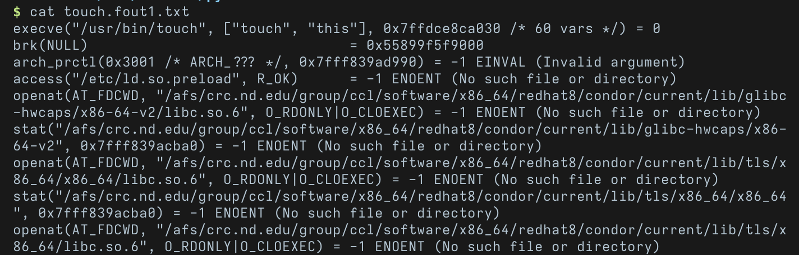
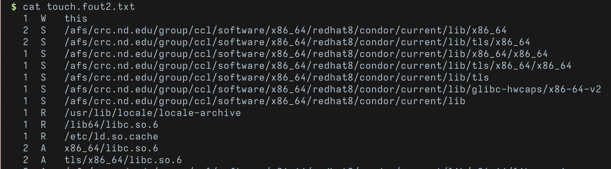
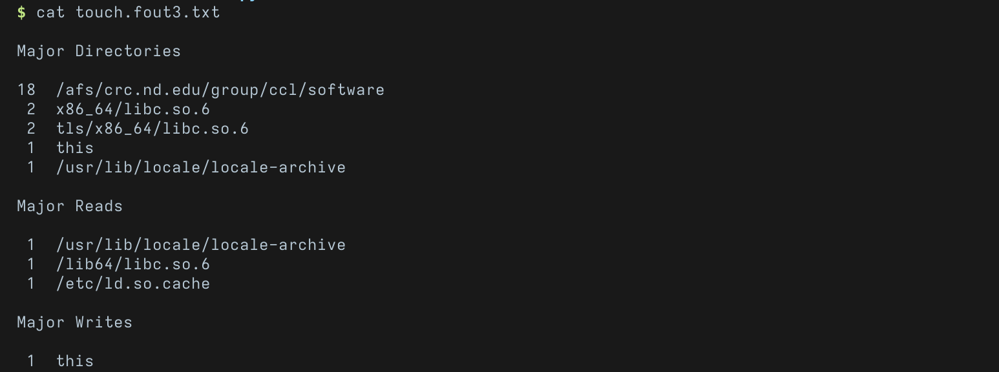

# File Trace

File trace is a command line tool that summarizes the output of the linux debug tool [strace](https://github.com/strace/strace) to help users view what files a program accesses and better understand a program's dependencies.

## Usage

File trace can be called directly from the command line using:

```sh
$ file_trace <command_to_excecute>
```

File trace also has optional command line flags:

* `-d <num>`  : how many levels deep to summarise
* `-t <num>`: only show the top \<num> of results on the summary page
* `--clean`: remove all file_trace files in the current directory

### Output files

* `<name>.fout1.txt`: the output of strace, the most verbose
* `<name>.fout2.txt`: a list of all the files accessed by the program with the number of times it was accessed and what action was performed
* `<name>.fout3.txt`: A summary of the actions performed, listed by directory

#### Action Legend

| Key  | meaning                                                      |
| ---- | ------------------------------------------------------------ |
| R    | file was opened with read only access                        |
| W    | file was opened with write only access                       |
| RW   | file was opened with both read and write access              |
| A    | there was an attempt to access the file but file was not found |
| S    | stat was run on the file                                     |

#### Note

Due to strace only being available on linux, file_trace is also works on linux

## Examples

### Using file trace on `touch`

file_trace can be run simply by typing `file_trace` before the command you would like to execute.

To see all the files `touch` accesses when creating a blank file named "this" we can use:

```sh
file_trace touch this
```


After running `file_trace` created the three file with different levels of verbosity







