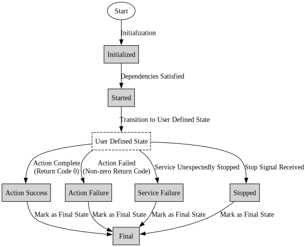

# Shepherd - Service Orchestration and Monitoring Tool

Shepherd is a service orchestration and monitoring tool system that launches and monitors applications according
to a specified configuration. It manages dependencies and synchronizes the startup of applications based on 
their interdependencies defined in a YAML configuration file. Shepherd is designed to handle complex dependency
relations among multiple processes, ensuring that each application starts only after its dependencies have reached
a specified state. 

## Key Features

- **Dependency Management:** Shepherd initiates applications based on the internal state of others.
It supports `any` and `all` dependency modes, allowing for flexible dependency configurations.

[//]: # (- **User Defined States:** Todo) 

- **State Monitoring:** Shepherd continuously monitors the internal state of each application by 
analyzing standard output and the contents of any specified files. It updates the state in real-time based 
on specific keywords found in these files.

- **Service as Task:** Shepherd treats long-running services as tasks with defined initial and final states, 
facilitating structured and predictable service management.

[//]: # (# Todo)

[//]: # (- Makes a workflow of services a task. Complicated workflow -> one task.)

[//]: # (- Add drone workflow)

- **Graceful Shutdown:** Shepherd provides three modes of shutdown: a predetermined maximum runtime, a stop signal 
file, and response to external interrupts, ensuring a controlled and safe cessation of services.

- **Success and Failure Reporting:** Shepherd allows for detailed definitions of success and failure conditions for 
each application and the overall workflow. It also provides configurable actions to be taken in specific failure 
scenarios.

## Program State Transition Overview

The Shepherd tool manages program execution through a series of defined states, ensuring dependencies are met and final 
states are recorded. Every program has default states (`Initialized`, `Started`, and `Final`) and can have optional 
user-defined states. Programs transition from `Initialized` to `Started` once dependencies are satisfied, then move through 
user-defined states. Actions return `Action Success` on a zero return code and `Action Failure` otherwise, while services 
transition to `Service Failure` if they stop unexpectedly. Any program receiving a stop signal is marked as `Stopped`, and 
all programs ultimately transition to a `Final` state, reflecting their execution outcome.




## Getting Started with Shepherd: A Hello World Example
Shepherd simplifies complex application workflows. Here’s a simple example to demonstrate how to use Shepherd for 
scheduling dependent programs.

#### 1. Create Sample Scripts

Create two shell scripts named `program1.sh` and `program2.sh` with the following content:

```shell
#!/bin/bash

echo "Starting program..."
sleep 5
echo "Program completed"
```

#### 2. Create a Shepherd Configuration File

Create a Shepherd configuration file to schedule `program2` to start only after` program1` has successfully completed its 
execution. Save the following content as` program-config.yml`:
```yaml
services:
  program1:
    command: "./program1.sh"
  program2:
    command: "./program2.sh"
    dependency:
      items:
        program1: "action_success"  # Start program2 only after program1 succeeds
output:
  state_times: "state_transition_times.json"
max_run_time: 60  # Optional: Limit total runtime to 60 seconds
```

#### 3. Run Shepherd

To run the configuration with Shepherd, use the following command:
```shell
<shepherd_executable> program-config.yml
```
If you are running the python source, then run

```shell
python3 shepherd.py program-config.yml
```

#### Understanding the workflow
With this simple configuration, Shepherd will:
1. Execute `program1.sh`.
2. Monitor the internal states of the program.
3. Start `program2.sh` only after `program1.sh `succeeds.
4. Create state_transition_times.json, which will look similar to this:

```json
{
  "program1": {
    "initialized": 0.246384859085083,
    "started": 0.24660515785217285,
    "success": 5.349443197250366,
    "final": 5.350545883178711
  },
  "program2": {
    "initialized": 0.2456510066986084,
    "started": 5.351618051528931,
    "success": 10.464960098266602,
    "final": 10.465446949005127
  }
}
```

## Monitoring User-Defined States in Shepherd
Shepherd has the ability to monitor standard output (stdout) or any other file to detect 
user-defined states. These states can then be used as dependencies for other programs. 
This feature allows you to define complex workflows based on custom application states.

#### Example Scenario: Dynamic Dependencies
Here’s an example shell script that simulates a program with different states. Save this script as `program1.sh`, 
`program2.sh`, and `program3.sh`:
```bash
#!/bin/bash
START_TIME=$(date +%s)
startup_delay=5

while true; do
  echo "$(date +%s) - program is booting up"
  sleep 0.5

  if [[ $(date +%s) -gt $((START_TIME + startup_delay)) ]]; then
    echo "$(date +%s) - program is ready"
    break
  fi
done

READY_TIME=$(date +%s)
run_duration=30

while true; do
  echo "$(date +%s) - program is running"
  sleep 0.5

  if [[ $(date +%s) -gt $((READY_TIME + run_duration)) ]]; then
    echo "$(date +%s) - program is completed"
    break
  fi
done

```
This script simulates a program that boots up, becomes ready, runs for a while, and then completes. Shepherd can use 
the log output to determine when the program is ready for the next step in your workflow.

#### Shepherd Configuration with user-defined states
Below is a sample Shepherd configuration that uses custom states defined in the application's stdout. The configuration 
specifies that program2 will start only after program1 is "ready" and program3 is "complete".

Save the following content as `program-config.yml`:

```yaml
services:
  program1:
    command: "./program1.sh"
    state:
      log:
        ready: "program is ready"
        complete: "program is completed"
  program2:
    command: "./program2.sh"
    state:
      log:
        ready: "program is ready"
        complete: "program is completed"
    dependency:
      mode: "all"
      items:
        program1: "ready"
        program3: "complete"
  program3:
    command: "./program3.sh"
    state:
      log:
        ready: "program is ready"
        complete: "program is completed"
output:
  state_times: "state_transition_times.json"
max_run_time: 120
```

#### How This Configuration Works
- program1: Starts immediately. Shepherd monitors its output for "program is ready" and "program is completed".
- program3: Also starts immediately. Shepherd monitors it similarly to program1.
- program2: Starts only after BOTH of these conditions are met:
  - program1 reaches the "ready" state.
  - program3 reaches the "complete" state

- And this will also create the following state transition data:
```json
{
  "program1": {
    "initialized": 0.2520601749420166,
    "started": 0.2529749870300293,
    "ready": 5.447847843170166,
    "complete": 36.73489499092102,
    "success": 36.781131982803345,
    "final": 36.781386852264404
  },
  "program3": {
    "initialized": 0.252730131149292,
    "started": 0.25317811965942383,
    "ready": 5.451045989990234,
    "complete": 36.72722291946411,
    "success": 36.80730319023132,
    "final": 36.80773401260376
  },
  "program2": {
    "initialized": 0.25133585929870605,
    "started": 36.72884702682495,
    "ready": 42.47040295600891,
    "complete": 73.59736275672913,
    "success": 73.61198306083679,
    "final": 73.612459897995
  }
}
```
## Other Configuration Options in Shepherd

Shepherd offers a variety of configuration options to tailor the execution and monitoring of 
your programs. These options include setting up dependencies, specifying output files, handling 
stop signals, and defining maximum run times. Here are some additional configuration options 
you can use in your Shepherd configuration file.

### Service vs Action
In Shepherd, there are two types of programs: **actions** and **services**. Actions are programs expected to end with a 
return code of 0 upon successful completion, transitioning to the `action_success` state. If they fail, they 
transition to the `action_failure` state with a non-zero return code. 

Services, on the other hand, are long-running programs that do not terminate unless a stop event is set.
When a stop event occurs, they transition to the `stopped` state. If they stop unexpectedly without a stop event, 
they transition to the `service_failure` state.

By default, programs are treated as actions unless specified otherwise in the configuration. Here is an example config 
demonstrating both actions and services:

```yaml
services:
  action1:
    type: "action"
    command: "./action1.sh"
  service1:
    type: "service"
    command: "./service1.sh"
...
```

### Setting Up Dependencies
Dependencies allow you to specify the conditions under which a program should start. 
Shepherd supports two dependency modes: all and any.

#### Dependency Modes
1. **All Mode:** The program will start only when all specified dependencies have been met.
2. **Any Mode:** The program will start when any one of the specified dependencies has been met.

Here is a configuration file demonstrating both all and any dependency modes:
```yaml
services:
  program1:
    ..
  program2:
    ...
  program3:
   ...
  program4:
    command: "./program4.sh"
    dependency:
      mode: "all"  # All specified dependencies must be met
      items:
        program1: "ready"
        program2: "complete"
  program5:
    command: "./program5.sh"
    dependency:
      mode: "any"  # Any one of the specified dependencies must be met
      items:
        program2: "ready"
        program3: "complete"
```
### Specifying User-defined States in File
Shepherd can monitor specific files to determine user-defined states. This allows you to control the flow based on 
custom conditions recorded in external files.

```yaml
services:
  program1:
    command: "./program1.sh"
    state:
      file:
        path: "/tmp/program1_state.log"
        states:
          ready: "program is ready"
          complete: "program is completed"
```
In this example, program1 will transition to the "ready" state when "program is ready" is found in 
`/tmp/program1_state.log`, and to the "complete" state when "program is completed" is found.

### Specifying Custom Stdout and Stderr Files
By default, Shepherd saves the stdout and stderr of each program to files named `<program_name>_stdout.log` and 
`<program_name>_stderr.log `respectively. These file names can be customized as needed.
```yaml
services:
  program1:
    command: "./program1.sh"
    stdout_path: "/tmp/log/custom_program1_out.log"
    stderr_path: "/tmp/log/custom_program1_error.log"
...
```
### Specifying Stop Conditions
Shepherd allows you to define various stop conditions to control the termination of the workflow. These conditions 
include specifying a stop file, defining a maximum run time, and setting success criteria.

#### 1. Specifying Stop File
Shepherd can monitor a specific file for stop signals. If this file is created, Shepherd will gracefully stop all 
running services.

```yaml
services:
  program1:
    ...
stop_signal: "/tmp/shepherd_stop"
```
In this configuration, if the file /tmp/shepherd_stop is created, Shepherd will initiate a controlled shutdown of all
services.

#### 2. Defining Maximum Run Times
You can set a maximum runtime for the entire set of services. If the total runtime exceeds this limit, Shepherd will 
stop all services.

```yaml
services:
  program1:
    ...
max_run_time: 120  # Maximum runtime in seconds
```

#### 3. Specifying Success Criteria
Shepherd allows you to define success criteria for multiple services. When these criteria are met, Shepherd will shut 
down all services. You can specify the success mode as either all or any.

- **All Mode:** All specified criteria must be met.
- **Any Mode:** Any one of the specified criteria must be met.

```yaml
services:
  program1:
    ...
  program2:
    ...
success_criteria:
  mode: "all"
  items:
    program1: "action_success"
    program2: "action_success"

```
In this example, the workflow will be considered successful and Shepherd will shut down all services when both program1
and program2 reach the "action_success" state.

